---
title: "Edge AI Deployment"
date: "2025-05-01"
author: "Rohith Behera"
readTime: 5
tags: ["Edge AI Deployment"]
---


# Edge AI Deployment: Complete Technical Reference

This document covers the full edge AI lifecycle from model optimization through production monitoring, targeting engineers who need systems-level mastery of on-device inference. It assumes working knowledge of transformer architectures, attention mechanisms, gradient-based optimization, and general ML systems engineering.

---

## Master Index

| Section | Topic | Key Subtopics | Key Concepts | Best Resources | Why It Matters |
|---------|-------|---------------|--------------|----------------|----------------|
| 1 | Edge AI Fundamentals | Latency budgets, memory bandwidth, thermal throttling, power envelopes, roofline model | Arithmetic intensity, compute-bound vs memory-bound, LPDDR5 bandwidth ceiling, sustained vs burst TDP | [Qualcomm NPU whitepaper](https://www.qualcomm.com/content/dam/qcomm-martech/dm-assets/documents/Unlocking-on-device-generative-AI-with-an-NPU-and-heterogeneous-computing.pdf), [Gimlet Labs: SRAM-centric inference](https://gimletlabs.ai/blog/sram-centric-chips) | Defines the physical constraints that every subsequent design decision must satisfy |
| 2 | Model Optimization Pipeline | Quantization (PTQ/QAT/GPTQ/AWQ/SmoothQuant), pruning, distillation, LoRA/QLoRA | Per-channel vs per-group scaling, Hessian-based weight ordering, activation-aware salience, NF4, CAR-LoRA | [GPTQ](https://arxiv.org/abs/2210.17323), [AWQ](https://arxiv.org/abs/2306.00978), [SmoothQuant](https://arxiv.org/abs/2211.10438), [PyTorch Quantization](https://pytorch.org/docs/stable/quantization.html), [INT4/INT8 edge quantization](https://lucaberton.com/blog/edge-ai-model-quantization-int4-int8/), [QLoRA](https://arxiv.org/abs/2305.14314), [CAR-LoRA](https://openreview.net/pdf?id=5GimteSrgW), [Distillation vs Quantization](https://tianpan.co/blog/2026-04-17-model-compression-quantization-distillation-on-device) | Determines whether a model fits on device at all and whether quality survives compression |
| 3 | Model Formats and Interoperability | GGUF, ONNX, TFLite, Core ML, TensorRT, LiteRT-LM, conversion pipelines, failure points | mmap-friendly layouts, opset coverage, QDQ nodes, K-quant block structures, delegate boundaries | [GGUF spec](https://github.com/ggerganov/llama.cpp/blob/master/ggml/include/gguf.h), [GGML architecture](https://readoss.com/en/ggml-org/llama.cpp/llama-cpp-architecture-map-of-the-codebase), [Core ML conversion](https://apple.github.io/coremltools/docs-guides/source/convert-to-ml-program.html), [Optimum ONNX export](https://huggingface.co/docs/optimum/onnxruntime/usage_guides/optimization) | Wrong format choice causes 2-10x performance loss or blocks deployment entirely |
| 4 | Compilation and Runtime Stack | Graph optimization passes, operator fusion, kernel selection, memory planning, TVM/TensorRT/XLA | Constant folding, layout transformation, GEMM dispatch tables, liveness-based buffer sharing, workspace pre-allocation | [TVM LLM tutorial](https://tvm.apache.org/docs/how_to/tutorials/optimize_llm.html), [TVM customization](https://tvm.apache.org/docs/how_to/tutorials/customize_opt.html), [TensorRT-LLM](https://docs.nvidia.com/tensorrt-llm/index.html), [ORT graph optimizations](https://onnxruntime.ai/docs/performance/model-optimizations/graph-optimizations.html), [TF Grappler](https://www.tensorflow.org/guide/graph_optimization) | Compilation stack transforms portable models into hardware-specific fast paths; misconfiguration leaves 3-10x performance on the table |
| 5 | Hardware Acceleration | Qualcomm Hexagon NPU, Apple Neural Engine, ARM KleidiAI, GPU compute shaders, DSP offload | Systolic arrays, INT8/INT4 MAC units, i8mm ISA extensions, heterogeneous scheduling, NPU memory hierarchy | [Hexagon AI accelerators](https://thechipletter.substack.com/p/qualcomms-hexagon-ai-accelerators), [Core ML Llama](https://machinelearning.apple.com/research/core-ml-on-device-llama), [KleidiAI on ARM](https://newsroom.arm.com/blog/gemma-4-on-arm-optimized-on-device-ai) | Hardware determines the performance ceiling; software can only approach it |
| 6 | LLM-Specific Challenges | KV cache management, speculative decoding, context length limits, attention memory scaling | Paged attention, quantized KV cache (hot/warm/cold zones), draft-verify paradigm, sliding window attention | [QuantSpec](https://proceedings.mlr.press/v267/tiwari25b.html), [Dynamic KV cache quantization](https://devtechtools.org/en/blog/dynamic-kv-cache-quantization-llm-inference-edge), [FlashAttention](https://arxiv.org/abs/2205.14135) | LLMs have unique memory/compute profiles that generic optimization misses |
| 7 | Inference Optimization | Prefill vs decode phases, FlashAttention variants, batching strategies, operator scheduling | IO-aware attention, tiling for SRAM, continuous batching, token-level parallelism, pipeline bubbles | [Prefill vs Decode](https://scalingthoughts.com/blog/scaling-foundation-model-inference/), [MPS Flash Attention](https://github.com/mpsops/mps-flash-attention), [CUDA Tile Flash Attention](https://developer.nvidia.com/blog/tuning-flash-attention-for-peak-performance-in-nvidia-cuda-tile/), [FlashAttention-2 in Triton](https://timashov.ai/blog/2026/flash-attention/) | Inference optimization directly determines user-perceived latency and throughput |
| 8 | Deployment Architectures | Hybrid cloud-edge routing, local-first fallback, model lifecycle management, split inference | Confidence-based routing, edge-cloud partitioning, progressive model loading, browser-based inference | [Hybrid cloud-edge LLM](https://tianpan.co/blog/2026-04-10-hybrid-cloud-edge-llm-inference-architecture), [Edge inference decision framework](https://tianpan.co/blog/2026-04-17-edge-inference-decision-framework-local-vs-cloud), [Splitwise](https://arxiv.org/abs/2512.23310v1), [Chrome built-in models](https://developer.chrome.com/docs/ai/understand-built-in-model-management) | Architecture choice determines reliability, cost structure, and privacy guarantees |
| 9 | Tooling Ecosystem | llama.cpp, LiteRT, MediaPipe, ONNX Runtime, Core ML, Optimum, framework integrations | Execution providers, delegate pattern, model sharding, runtime memory management, cross-compilation | [llama.cpp](https://github.com/ggerganov/llama.cpp), [LiteRT](https://ai.google.dev/edge/litert), [MediaPipe LLM](https://ai.google.dev/edge/mediapipe/solutions/genai/llm_inference), [ONNX Runtime](https://onnxruntime.ai/), [Core ML](https://developer.apple.com/documentation/coreml), [Optimum](https://huggingface.co/docs/optimum/en/onnxruntime/package_reference/optimization) | Tool selection locks in runtime characteristics, platform support, and maintenance burden |
| 10 | Production Monitoring | Thermal profiling, latency percentiles (TTFT/ITL/TPS), power measurement, quality regression | Sustained inference benchmarks, throttle detection, P95/P99 latency tracking, OOM prediction, drift detection | [Thermal benchmarks](https://arxiv.org/pdf/2603.23640), [LLMOps latency monitoring](https://oneuptime.com/blog/post/2026-01-30-llmops-latency-monitoring/view), [vLLM production monitoring](https://stackpulsar.com/blog/vllm-production-monitoring) | Without monitoring, edge deployments degrade silently under thermal throttling and memory pressure |
| 11 | Case Studies | On-device LLM production deployments, Gemma on Qualcomm QNN, mobile AI Edge SDK | Cost/latency/privacy trade-offs, NPU delegation, cross-platform deployment patterns | [On-device LLM production](https://tianpan.co/blog/2026-04-19-on-device-llm-inference-production), [Gemma 4 E2B on QNN](https://medium.com/google-developer-experts/bringing-multimodal-gemma-4-e2b-to-the-edge-a-deep-dive-into-litert-lm-and-qualcomm-qnn-4e1e06f3030c), [Gemma on mobile](https://developers.googleblog.com/gemma-3-on-mobile-and-web-with-google-ai-edge/) | Validates theory against production reality; reveals failure modes not visible in benchmarks |
| 12 | End-to-End Pipeline | Full workflow from model selection through production monitoring, integration patterns, rollback | Pipeline orchestration, A/B testing on device, model update delivery, graceful degradation strategies | All above resources as cross-references | Synthesizes individual techniques into a deployable system; exposes integration gaps |

---

## Section 1: Edge AI Fundamentals

### 1.1 Real Constraints

Edge AI operates within hard physical limits that cannot be engineered around, only accommodated. Four constraints dominate every design decision: latency, memory bandwidth, thermal dissipation, and power consumption. Each constraint interacts with the others -- optimizing for one often worsens another.

**Latency Budgets**

Conversational AI on mobile devices requires meeting three distinct latency thresholds simultaneously:

- Time to first token (TTFT): <500ms. This is the prefill phase duration -- processing the input prompt and generating the first output token. Users perceive delays beyond 500ms as system unresponsiveness. On flagship 2025-era phones, TTFT for a 512-token prompt on a 4B INT4 model ranges from 200-400ms.
- Inter-token latency (ITL): <50ms per token, corresponding to >20 tokens/second. This is the decode phase throughput. Human reading speed peaks around 250 words/minute (~5.5 tokens/second), so 20 tok/s provides comfortable streaming. Below 10 tok/s, users perceive stuttering.
- Total generation time: <5 seconds for typical responses (100-200 tokens). Beyond this threshold, UX studies consistently show users abandoning the interaction or assuming failure.

These are not aspirational targets. They are hard boundaries derived from user behavior research, and missing any one of them degrades the product regardless of model quality.

Latency breakdown for a typical on-device LLM query (4B INT4 model, 256-token prompt, 128-token response, flagship phone):

| Phase | Duration | Bottleneck | Optimization Lever |
|-------|----------|-----------|-------------------|
| Model load (cold start, first query) | 500-2000ms | Flash-to-DRAM bandwidth | mmap, warm cache, pre-load |
| Model load (warm, already mmap'd) | 0ms | N/A | Pages already resident |
| Tokenization | 1-5ms | CPU | Negligible |
| Prefill (256 tokens) | 150-300ms | NPU/GPU compute | Operator fusion, FlashAttention, batch size |
| Decode (128 tokens at ~20 tok/s) | ~6400ms | DRAM bandwidth | Quantization, weight caching, speculative decoding |
| Detokenization + display | <1ms | CPU | Negligible |
| **Total (warm)** | **~6.5-6.7s** | **Decode dominates** | |

The implication: decode optimization delivers the largest user-perceived improvement. Halving decode time (via INT4 quantization or speculative decoding) removes ~3.2 seconds from end-to-end latency. Halving prefill time saves ~150ms -- valuable but secondary.

**Memory Bandwidth**

Memory bandwidth is the single most important constraint for LLM decode on edge devices. The arithmetic is unforgiving:

- Flagship mobile LPDDR5/5X: 51.2 GB/s (Snapdragon 8 Gen 3, A17 Pro class)
- Mid-range mobile LPDDR5: 25.6 GB/s
- Desktop DDR5: 50-90 GB/s (dual channel)
- Datacenter HBM3: 800-1000 GB/s per GPU (A100: 2 TB/s, H100: 3.35 TB/s)

The bandwidth gap between mobile and datacenter is 20-60x. For autoregressive decode, every token generation requires loading the entire model weight tensor from DRAM (weights are used once per token, no reuse within a single decode step). The theoretical minimum decode latency per token:

```
7B model at INT4 = 3.5 GB weights
Minimum decode time = 3500 MB / 51200 MB/s = 68.4 ms per token
Theoretical max throughput = 1000 / 68.4 = 14.6 tok/s
```

This is a hard ceiling imposed by physics -- no software optimization can exceed it. In practice, actual throughput reaches 60-80% of this theoretical maximum due to memory access pattern inefficiencies, cache misses, and compute overhead. A realistic expectation for 7B INT4 on flagship mobile is 9-12 tok/s.

For a 4B model at INT4 (2 GB weights): 2000 / 51200 = 39 ms/token = ~25.6 tok/s theoretical, ~18-20 tok/s practical. This is why 4B-class models are the current sweet spot for mobile LLM deployment.

**Thermal Constraints**

Sustained inference is where most edge benchmarks lie. Short burst benchmarks (10-30 seconds) misrepresent real-world performance because they measure pre-throttle throughput:

- iPhone 16 Pro: initial inference throughput degrades by approximately 50% after 2 sustained inference iterations (each iteration being a full prompt-response cycle of ~5-10 seconds). The A18 Pro SoC has aggressive thermal management that prioritizes device safety over sustained compute.
- Samsung Galaxy S24 Ultra: the Snapdragon 8 Gen 3 GPU inference path hits thermal ceiling and hard-kills GPU workloads, forcing fallback to CPU. The Adreno 750 GPU is power-efficient at burst but cannot sustain high utilization.
- Pixel 9 Pro: Tensor G4 throttles NPU clock by 20-30% after ~3 minutes of continuous inference.

The thermal envelope on mobile is fundamentally different from datacenter. There is no active cooling, and the thermal mass of a phone (~200g aluminum/glass) saturates quickly. Heat dissipation rate is approximately 2-4W passive -- any sustained workload above this generates thermal accumulation.

**Power Envelopes**

| Platform | TDP Range | Sustained AI Budget | Cooling | Tok/Watt Target |
|----------|-----------|-------------------|---------|-----------------|
| Mobile phone | 5-15W peak | 2-5W sustained | Passive (chassis) | 4-10 tok/s/W |
| Tablet | 8-20W peak | 5-8W sustained | Passive (larger chassis) | 3-6 tok/s/W |
| Laptop | 15-65W peak | 10-35W sustained | Active (fan) | 1-3 tok/s/W |
| Desktop GPU | 65-350W | 65-350W sustained | Active (heatsink + fans) | 0.1-0.5 tok/s/W |
| Datacenter GPU | 300-700W per GPU | 300-700W sustained | Active (liquid/air) | 0.05-0.2 tok/s/W |

Edge models must deliver useful throughput within the 2-5W sustained envelope. This means the model, runtime, OS overhead, and display must all share 5-15W total device power. An LLM inference workload consuming 8W on a phone will drain a 4500mAh (17Wh) battery in approximately 2 hours of continuous use -- unacceptable for a background feature.

Energy per token is a more useful metric than throughput alone for mobile:

```
Energy per token = Power (W) * Time per token (s)
                 = Power (W) / Throughput (tok/s)

Example (4B INT4 on Snapdragon 8 Gen 3):
  NPU at 3W, 22 tok/s: 3/22 = 0.136 J/token
  GPU at 6W, 18 tok/s: 6/18 = 0.333 J/token
  CPU at 4W, 8 tok/s:  4/8  = 0.500 J/token
```

The NPU achieves 2.4x better energy efficiency than GPU and 3.7x better than CPU for this workload. This is why NPU delegation is critical for battery-constrained deployment, even when GPU or CPU achieve acceptable throughput.

**Interaction Between Constraints**

These four constraints form a coupled system:

1. Increasing clock speed to improve latency increases power consumption (cubic relationship: P ~ f^3 due to voltage scaling) and thermal output.
2. Thermal throttling reduces clock speed, increasing latency and reducing throughput during sustained workloads.
3. Larger models (better quality) require more memory bandwidth, which increases power consumption and thermal output.
4. Quantization reduces memory bandwidth requirement (improving latency and power), but degrades model quality.

The engineering challenge is finding the operating point that satisfies all four constraints simultaneously for the target use case.

### 1.2 Cloud vs Edge: Actual Bottlenecks

**Network Latency**

Cloud inference adds irreducible network overhead:

- Round-trip time (RTT) to nearest cloud region: 20-50ms on fiber, 50-150ms on LTE, 200-500ms on congested/rural connections
- TLS handshake: 1-2 RTTs additional for new connections (50-300ms)
- First token arrival: RTT + server queue time + prefill time + serialization. Best case: 300ms. Typical: 500-1500ms. Worst case on congested networks: 3-5 seconds.
- Token streaming: each chunk requires a network frame. At 50 tok/s server-side generation, network jitter of 20-50ms creates perceptible stuttering even when average throughput is sufficient.

On-device TTFT is 200-400ms (purely prefill compute), with zero network dependency. On-device decode has zero per-token network overhead.

**Data Residency and Regulatory Constraints**

This is not a soft preference -- it is a hard legal requirement in specific domains:

- GDPR (EU): processing personal data requires lawful basis. Transmitting health queries to cloud servers constitutes data transfer requiring explicit consent and adequate safeguards. On-device processing avoids this entirely.
- HIPAA (US healthcare): protected health information (PHI) transmitted to cloud inference requires a Business Associate Agreement with the inference provider. On-device inference eliminates the transmission.
- DPDPA (India): personal data processing must follow consent and purpose limitation. On-device processing simplifies compliance by keeping data local.
- Financial services: many jurisdictions prohibit transmitting customer financial data to third-party inference endpoints without explicit consent frameworks.

**Cost at Scale**

Cloud inference cost scales linearly with usage:

```
1M daily active users
x 50 queries/day average
x ~500 tokens/query (input + output)
x $0.001 per 1K tokens (aggressive pricing)
= $25,000/day = $750,000/month = $9M/year
```

On-device inference marginal cost: $0/day. The cost is amortized into the device silicon (already paid for by the user) and a one-time model download (50MB-4GB depending on model size and quantization).

The break-even calculation: if cloud inference costs $9M/year for 1M users, that is $9/user/year. If on-device inference requires 6 months of engineering effort (3 engineers x $200K/year = $300K), break-even occurs at ~33K users. Beyond that, every additional user is pure savings.

**Reliability and Availability**

Cloud inference availability depends on network connectivity, cloud provider uptime, and API service health. Real-world failure rates:

| Failure Mode | Frequency | Impact on User |
|-------------|-----------|---------------|
| Network unavailable (airplane, tunnel, rural) | 5-15% of usage time for mobile users | Complete feature outage |
| High latency (congested network, distant server) | 10-20% of requests | TTFT exceeds 2s, user abandons |
| Cloud rate limiting / capacity exhaustion | Spikes during high demand periods | 429 errors, degraded throughput |
| Cloud provider outage | 2-5 incidents/year per provider | Hours of complete outage |

On-device inference availability: 100% (constrained only by device power and storage). The model is always available, always at consistent latency. This deterministic behavior is often more valuable than higher average quality from cloud models with variable availability.

### 1.3 Memory Hierarchy Deep Dive

The memory hierarchy determines where data can live and how fast it can be accessed. Every edge AI optimization is fundamentally about keeping the right data in the fastest memory tier.

| Level | Typical Size | Bandwidth | Latency | Edge Example |
|-------|-------------|-----------|---------|--------------|
| L1 Cache | 32-64 KB per core | 1-4 TB/s | <1 ns | ARM Cortex-X4 (64KB I + 64KB D) |
| L2 Cache | 256 KB - 2 MB | 200-500 GB/s | ~3 ns | Shared across core cluster (e.g., 2MB per Cortex-X4) |
| L3 / SLC | 4-16 MB | 100-200 GB/s | ~10 ns | System-level cache (Snapdragon: 6-12MB SLC) |
| NPU SRAM | 1-4 MB | 10-50 TB/s internal | <1 ns | Qualcomm Hexagon tensor processor local memory |
| DRAM (LPDDR5) | 8-24 GB | 25-51.2 GB/s | ~80 ns | Main system memory, shared across CPU/GPU/NPU |
| Flash (UFS 4.0) | 256 GB - 1 TB | 4-8 GB/s sequential | ~100 us | Model storage, initial load only |

Key implications:

- **NPU SRAM is the critical resource.** At 1-4 MB with TB/s internal bandwidth, operations that fit entirely within NPU SRAM execute at near-zero memory cost. The NPU compiler's primary job is tiling computations to maximize SRAM residency.
- **DRAM is the bottleneck.** The 80ns latency and 25-51 GB/s bandwidth of LPDDR5 is where decode-phase performance is capped. Every weight byte must transit through DRAM for each token during decode.
- **Flash-to-DRAM loading** determines cold start time. A 4GB INT4 model on UFS 4.0 takes ~500ms to load sequentially. With mmap (memory-mapped IO), only accessed pages are loaded on demand, reducing initial latency at the cost of page fault overhead during early inference.
- **SLC (System Level Cache)** is shared between CPU, GPU, and NPU. Contention from concurrent workloads (UI rendering, background services) reduces effective cache available for inference. This is a source of variance in real-world benchmarks vs isolated tests.

The SRAM-centric design philosophy recognizes that moving data between DRAM and compute units dominates energy consumption. A 45nm DRAM access costs ~640x the energy of an integer multiply. At 7nm, the ratio is lower but still >100x. Keeping weights and activations in SRAM whenever possible is the single highest-leverage optimization for edge power efficiency.

**Energy Cost of Data Movement**

| Operation | Energy (pJ, 7nm) | Relative to INT8 MAC |
|-----------|------------------|---------------------|
| INT8 multiply-accumulate | 0.2 | 1x |
| FP16 multiply-accumulate | 1.0 | 5x |
| FP32 multiply-accumulate | 3.7 | 18.5x |
| SRAM read (1 byte) | 5 | 25x |
| DRAM read (1 byte) | 20-40 | 100-200x |
| Flash read (1 byte) | 200-500 | 1000-2500x |

The implication: a single DRAM access costs 100-200x the energy of the INT8 MAC that uses the fetched data. A model that computes 2 TFLOPs but transfers 100 GB from DRAM spends >95% of its energy on data movement. This is why quantization (reducing bytes transferred) and tiling (keeping data in SRAM) dominate edge AI energy optimization.

**Practical Memory Budget Allocation**

On a device with 8 GB total DRAM (common flagship phone), the available memory for ML inference is substantially less than 8 GB:

| Consumer | Typical Usage |
|----------|--------------|
| OS kernel + services | 1.5-2.0 GB |
| System UI + compositor | 0.5-1.0 GB |
| Active app (non-ML portion) | 0.3-1.0 GB |
| Background apps (compressed) | 1.0-2.0 GB |
| **Available for ML inference** | **3.0-4.5 GB** |
| Safety margin (avoid OOM killer) | 0.5-1.0 GB |
| **Practical ML budget** | **2.0-3.5 GB** |

This is why a 7B INT4 model (3.5 GB weights + KV cache + activations = ~5 GB peak) is on the edge of feasibility for 8 GB devices and why 4B INT4 models (2 GB weights + ~1 GB overhead = ~3 GB peak) are the practical limit. Exceeding the available budget triggers the OS low-memory killer, which terminates background apps (degrading user experience) or the inference process itself.

### 1.4 Roofline Model for Transformers

The roofline model characterizes performance as a function of arithmetic intensity: the ratio of compute operations (FLOPs) to bytes transferred from memory.

```
Arithmetic Intensity (AI) = FLOPs / Bytes Transferred
Attainable Performance = min(Peak Compute, Peak Bandwidth x AI)
```

The ridge point is where the compute ceiling meets the bandwidth ceiling. Operations with AI below the ridge point are memory-bandwidth-bound; operations above are compute-bound.

**Prefill Phase (Prompt Processing)**

During prefill, the model processes all input tokens simultaneously as a batch. For a sequence length S and model dimension D:

- Q, K, V projections: matrix multiplication of shape (S, D) x (D, D). FLOPs = 2 x S x D^2 per projection, three projections.
- Attention scores: (S, D_head) x (D_head, S) per head. FLOPs = 2 x S^2 x D_head x num_heads.
- FFN: two linear layers of shape (S, D) x (D, 4D) and (S, 4D) x (4D, D). FLOPs = 2 x S x D x 4D x 2.

Weight reuse is proportional to S. Each weight column participates in S multiply-accumulate operations. For S=512, D=4096, the Q projection has AI = (2 x 512 x 4096^2) / (4096^2 x bytes_per_weight + 512 x 4096 x bytes_per_activation). With INT4 weights (0.5 bytes) and FP16 activations (2 bytes), AI is approximately 200-500 FLOPs/byte. This is well above the ridge point on mobile hardware, making prefill **compute-bound**.

**Decode Phase (Token Generation)**

During decode, the model generates one token at a time. The effective batch size is 1 (or very small with speculative decoding). For a single token:

- Q, K, V projections: matrix-vector multiplication of shape (1, D) x (D, D). FLOPs = 2 x D^2 per projection.
- Bytes transferred: D^2 x bytes_per_weight (entire weight matrix loaded from DRAM).
- AI = 2 x D^2 / (D^2 x bytes_per_weight) = 2 / bytes_per_weight.

For INT4 weights: AI = 2 / 0.5 = 4 FLOPs/byte. For FP16 weights: AI = 2 / 2 = 1 FLOP/byte. Both are far below the ridge point (typically 50-200 FLOPs/byte on mobile NPUs), making decode **memory-bandwidth-bound**.

This asymmetry explains a counterintuitive observation: prefill can process 512 tokens faster than decode generates 50 tokens, despite doing far more total computation. Prefill is limited by how fast the hardware can compute; decode is limited by how fast it can load weights from DRAM.

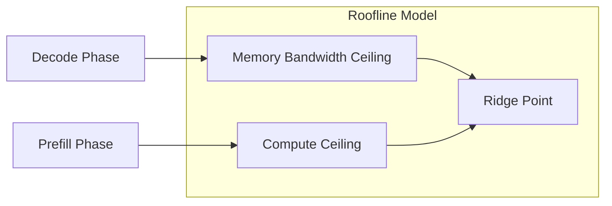

**Implications for optimization:**
- Prefill optimization: increase compute throughput (use NPU tensor cores, maximize parallelism, fuse operations to reduce kernel launch overhead).
- Decode optimization: increase effective memory bandwidth (quantize weights to reduce bytes per weight, use weight caching in SLC, prefetch next layer while computing current layer).
- The two phases require fundamentally different optimization strategies, and many runtimes treat them as separate execution paths with different kernel selections.

**Numerical Example: Roofline Analysis for Gemma 4B INT4**

Device: Snapdragon 8 Gen 3 (NPU peak: ~73 TOPS INT8, ~36 TOPS INT4 effective; LPDDR5X: 51.2 GB/s)

Ridge point: 73 TOPS / 51.2 GB/s = 1425 ops/byte. Operations with arithmetic intensity below 1425 are memory-bound.

Prefill (S=512, D=3072, INT4 weights, FP16 activations):
- Single linear layer FLOPs: 2 x 512 x 3072 x 3072 = 9.66 GFLOPs
- Bytes loaded: weights (3072 x 3072 x 0.5 = 4.7 MB) + input (512 x 3072 x 2 = 3.1 MB) = 7.8 MB
- AI = 9.66 GFLOPs / 7.8 MB = 1238 ops/byte. Near ridge point -- approaching compute-bound.
- Expected throughput: min(73 TOPS, 51.2 GB/s x 1238) = min(73, 63.4) = 63.4 TOPS effective.

Decode (S=1, same layer):
- FLOPs: 2 x 1 x 3072 x 3072 = 18.9 MFLOPs
- Bytes loaded: weights (4.7 MB) + input (3072 x 2 = 6 KB) = 4.7 MB
- AI = 18.9 MFLOPs / 4.7 MB = 4.0 ops/byte. Deeply memory-bound.
- Expected throughput: min(73 TOPS, 51.2 GB/s x 4.0) = min(73, 0.205 TOPS) = 0.205 TOPS.
- Time for this layer: 18.9 MFLOPs / 0.205 TOPS = 0.092 ms.
- Full model (28 layers, ~6 linear ops per layer): 28 x 6 x 0.092 = ~15.5 ms/token = ~64 tok/s theoretical.

Practical decode throughput is 40-60% of this theoretical maximum (cache misses, non-GEMM overhead, KV cache access), yielding 25-40 tok/s. This aligns with observed benchmarks for 4B INT4 on flagship hardware.

---

## Section 2: Model Optimization Pipeline

Model optimization is the process of transforming a trained model into a form that satisfies edge deployment constraints while preserving acceptable quality. The three primary techniques -- quantization, pruning, and distillation -- operate on different axes (numeric precision, parameter count, and architecture size respectively) and are often composed.

### 2.1 Quantization

Quantization reduces the numerical precision of model weights and/or activations from floating-point (FP32/FP16) to lower-bit representations (INT8, INT4, or custom formats). The fundamental operation is:

```
x_q = round(x / scale) + zero_point
x_dequant = (x_q - zero_point) * scale
```

The quantization error per element is bounded by scale/2. The aggregate effect on model quality depends on weight distribution, layer sensitivity, and calibration quality.

#### PTQ vs QAT Decision Framework

| Criterion | Post-Training Quantization (PTQ) | Quantization-Aware Training (QAT) |
|-----------|----------------------------------|-----------------------------------|
| Time budget | Hours (forward passes on calibration set) | Days (full or partial training with simulated quantization) |
| Compute required | Single GPU, calibration dataset (128-1024 samples) | Training infrastructure, full or representative dataset |
| Accuracy target vs FP16 | <1% quality metric loss: PTQ usually sufficient | 1-3% loss on PTQ: QAT recovers most of the gap |
| When PTQ fails (>3% loss) | QAT required, or use mixed-precision PTQ | QAT is the primary recourse |
| Model size | >1B parameters: PTQ works reliably (weight distributions are well-behaved at scale) | <100M parameters: weight distributions are less uniform, QAT often needed for aggressive quantization |
| Hardware target | W4A16 (INT4 weights, FP16 activations) most common on mobile | W8A8 (INT8 weights and activations) requires kernel support for INT8 GEMM on both operands |
| Deployment urgency | Ship this week: PTQ | Ship next month: evaluate QAT if PTQ quality is marginal |

#### Precision Format Comparison

| Format | Bytes/Weight | Memory (7B) | Speedup vs FP32 | Quality Loss (perplexity) | Hardware Support |
|--------|-------------|-------------|------------------|---------------------------|------------------|
| FP32 | 4.0 | 28 GB | 1x (baseline) | None | Universal |
| FP16 / BF16 | 2.0 | 14 GB | ~2x | Negligible (<0.1%) | Most GPUs, Apple Neural Engine, modern NPUs |
| FP8 (E4M3 / E5M2) | 1.0 | 7 GB | ~2.5x | <0.3% perplexity increase | NVIDIA Hopper+, AMD MI300+ |
| INT8 | 1.0 | 7 GB | ~2-3x | <1% perplexity increase | Broad: x86 VNNI, ARM i8mm/dotprod, most NPUs |
| INT4 | 0.5 | 3.5 GB | ~3-4x | 0.5-2% perplexity increase | Growing: GPTQ/AWQ software kernels, Qualcomm Hexagon, Apple ANE (iOS 18+) |
| INT2 | 0.25 | 1.75 GB | ~4-6x theoretical | 5-15% perplexity increase | Research-stage; quality degradation generally too severe for production |

Note: speedup figures are approximate and depend heavily on hardware kernel availability. INT4 on hardware without native INT4 MAC units may only achieve 1.5-2x speedup over FP16 due to unpacking overhead.

#### Per-Channel vs Per-Tensor vs Per-Group Quantization

**Per-tensor quantization:** a single scale and zero_point for the entire weight tensor. Simplest scheme. Metadata overhead: 2 values (scale + zero_point) per tensor. Works when weight values are uniformly distributed across the tensor. Fails when inter-channel variance is high, which is common in transformer linear layers where different output channels learn features at different magnitude scales.

**Per-channel quantization:** one scale and zero_point per output channel (row of the weight matrix for linear layers). Captures per-channel variance. Metadata overhead: 2 x num_channels values per tensor. Standard for convolutions. Increasingly used for linear layers in LLMs.

**Per-group quantization (e.g., group_size=128):** within each channel, weights are divided into groups of 128 (or 32, 64, 256). Each group has its own scale and zero_point. This captures intra-channel variance. GPTQ and AWQ use this scheme. Metadata overhead: 2 x (num_weights / group_size) values per tensor.

Trade-off: smaller group sizes yield better accuracy (finer-grained scaling) at the cost of more metadata bytes. For Q4_K with group_size=32, metadata overhead is approximately 0.5 bits per weight, bringing effective bits-per-weight from 4.0 to 4.5. For group_size=128, overhead is ~0.125 bits per weight.

**Failure mode:** applying per-tensor quantization to a model with high inter-channel weight variance (common in transformer FFN layers) can cause 5-10x higher quantization error than per-channel, resulting in 3-5% perplexity degradation instead of <1%. Always benchmark per-channel or per-group before accepting per-tensor results.

#### Calibration Methods

Calibration determines the scale and zero_point parameters for activation quantization by running representative data through the model and observing activation distributions.

| Method | Mechanism | Best For | Failure Case |
|--------|-----------|----------|-------------|
| MinMax | Sets scale to cover observed [min, max] range | Uniform distributions, quick calibration | Outlier activations stretch the range, wasting precision for the majority of values |
| Percentile | Clips at 99.99th percentile, ignoring extreme outliers | Models with occasional activation spikes | May clip important signal in models where outliers carry semantic meaning (e.g., attention logits) |
| MSE (Mean Squared Error) | Searches for scale that minimizes L2 error between FP and quantized outputs | General-purpose, best default choice | Slower calibration (grid search or optimization per tensor), may not minimize task-specific metrics |
| Histogram / Entropy (KL Divergence) | Bins activation values, finds clipping threshold that minimizes KL divergence between original and quantized distributions | Complex multimodal distributions | Computationally expensive calibration, requires sufficient calibration samples to build accurate histograms |

Calibration dataset requirements: 128-1024 representative samples are typical. Using out-of-distribution calibration data causes the calibrated scales to be mismatched with actual inference activations, leading to clipping or underutilization of the quantized range. For LLMs, a diverse subset of the training distribution (e.g., RedPajama, C4) works well.

Pseudocode for PTQ calibration:

```
def calibrate(model, calibration_data, method="mse"):
    stats = {}
    for name, module in model.named_modules():
        if is_quantizable(module):
            stats[name] = ActivationObserver(method)

    for batch in calibration_data:
        model(batch)  # forward pass populates observers

    for name, module in model.named_modules():
        if is_quantizable(module):
            scale, zero_point = stats[name].compute_qparams()
            module.weight = quantize(module.weight, scale, zero_point)

    return model
```

#### GPTQ: Hessian-Based Post-Training Quantization

GPTQ (Frantar et al., 2022) performs layer-by-layer weight quantization using second-order information to minimize output error.

Core algorithm:

1. For each layer, compute the approximate inverse Hessian H^{-1} of the layer's output error with respect to the weights. The Hessian is approximated using a small calibration set (128 samples typical).
2. Quantize weights in order of the Hessian diagonal (columns with smallest diagonal entry first -- these are least sensitive to quantization error).
3. After quantizing each weight column, compensate by adjusting the remaining unquantized columns using the Hessian inverse to minimize the change in layer output.
4. The update rule: for quantizing column j, the adjustment to remaining columns is delta_W = -(w_j - quant(w_j)) / [H^{-1}]_{jj} * H^{-1}_{j,:}

This Hessian-guided compensation is what distinguishes GPTQ from naive round-to-nearest quantization. The result: 3-4 bit quantization with <0.5 perplexity increase on LLMs with >1B parameters.

Configuration: group_size=128 is the standard trade-off. Smaller groups (32, 64) improve accuracy slightly at the cost of more scale metadata. Quantization time: ~10-30 minutes for 7B model on single GPU. Output is a quantized weight tensor with per-group scales.

#### AWQ: Activation-Aware Weight Quantization

AWQ (Lin et al., 2023) makes a critical observation: not all weight channels are equally important for model quality. Approximately 1% of weight channels (termed "salient channels") have disproportionate impact on output quality. Crucially, salience is determined by activation magnitude, not weight magnitude.

Algorithm:

1. Run calibration data and record per-channel activation magnitudes.
2. Identify salient channels: those with high average activation magnitude.
3. Apply per-channel scaling: multiply salient weight channels by a factor s > 1 before quantization. This increases their quantization granularity (more integer levels allocated to the important range).
4. Apply inverse scaling to the preceding layer's output (or equivalently, fold into the layer's input scaling) to maintain mathematical equivalence.
5. Quantize the scaled weights using standard round-to-nearest.

Result: 4-bit quantization quality matching GPTQ with faster quantization (no Hessian computation). AWQ is particularly effective when combined with group quantization (group_size=128).

#### SmoothQuant: Migrating Quantization Difficulty

SmoothQuant (Xiao et al., 2022) solves a specific problem: activation outliers make W8A8 quantization fail. Transformer activations often have channels with values 10-100x larger than the median, making per-tensor activation quantization extremely lossy.

The key insight is a mathematically equivalent transformation:

```
Y = X * W
Y = (X * diag(s)^{-1}) * (diag(s) * W)
```

where s is a per-channel smoothing factor. By choosing s proportional to the activation magnitude per channel, the transformation:
- Divides activations by their per-channel magnitude (smoothing outliers)
- Multiplies weights by the same factor (making weights slightly harder to quantize)

The smoothing factor is typically: s_j = max(|X_j|)^alpha / max(|W_j|)^(1-alpha), where alpha in [0.5, 0.75] balances difficulty between activations and weights.

Result: enables W8A8 quantization (INT8 for both weights and activations) on models where naive W8A8 fails. This unlocks INT8 GEMM hardware (which is far more widely available than INT4 GEMM hardware), achieving 2-3x speedup with <1% quality loss.

#### Error Propagation and Mixed-Precision Strategy

Quantization error in layer l is: e_l = W_l^q * x_l - W_l * x_l = (W_l^q - W_l) * x_l

This error propagates through subsequent layers. For a network with L layers, the output error is approximately:

```
e_output ~ sum_{l=1}^{L} (prod_{k=l+1}^{L} ||W_k||) * ||e_l||
```

The product of weight norms amplifies early-layer errors more than late-layer errors. Combined with the observation that:

- **Embedding layers** map discrete token IDs to continuous representations. Quantization error here affects every subsequent computation. Keeping embeddings at FP16 costs little memory (vocab_size x dim x 2 bytes, e.g., 32K x 4096 x 2 = 256MB for a 7B-class model) relative to the total model.
- **LM head (output projection)** maps final hidden states to logit space. Quantization error here directly distorts token probabilities. High sensitivity.
- **Attention layers** are more sensitive than FFN layers in most architectures, because attention weights encode precise positional and relational information that is less tolerant of quantization noise.
- **FFN layers** constitute ~2/3 of total parameters and are generally more tolerant of aggressive quantization due to their role as learned nonlinear transformations with inherent redundancy.

Production mixed-precision strategy for 7B model targeting mobile:
- Embedding + LM head: FP16 (adds ~512MB, critical for quality)
- Attention Q/K/V/O projections: INT4 with group_size=128
- FFN up/gate/down projections: INT4 with group_size=128
- Layer norms: FP32 (negligible size, high sensitivity)
- Total: ~3.5-4GB effective model size

**Failure mode:** quantizing embedding and LM head layers to INT4 can cause 3-5x the perplexity degradation of quantizing FFN layers to the same precision. This is the single most common mistake in edge LLM quantization.

**Quantization-Aware Training (QAT) Details**

When PTQ fails to meet quality targets, QAT inserts fake quantization nodes into the training graph that simulate quantization error during forward passes while maintaining full-precision gradients for backpropagation.

The straight-through estimator (STE) is used to propagate gradients through the non-differentiable rounding operation:

```
Forward: x_q = round(x / scale) * scale  (quantized)
Backward: dx = dx_q  (gradient passes through as if rounding were identity)
```

QAT training procedure:
1. Start from a pre-trained FP32/FP16 model
2. Insert fake quantization observers on weights and activations at each quantizable layer
3. Calibrate observers for initial scale/zero_point (same as PTQ calibration)
4. Fine-tune for 1-5% of original training steps with quantization simulation active
5. Freeze quantization parameters and export the quantized model

QAT typically recovers 50-80% of the quality gap between FP16 and aggressively quantized (INT4) PTQ. For a model where PTQ INT4 loses 2.0 perplexity points, QAT INT4 typically loses 0.4-1.0 points.

Trade-off: QAT requires access to training data (or a representative subset), training infrastructure (GPUs), and 1-5 days of compute. For models larger than 13B parameters, the compute cost of QAT often exceeds the benefit, because PTQ quality at INT4 is already sufficient for most applications.

**Mixed-Precision Quantization Search**

For maximum quality at minimum size, automated mixed-precision search determines the optimal bit-width per layer:

```
def mixed_precision_search(model, target_size_mb, calibration_data):
    sensitivities = {}
    for layer in model.layers:
        for bits in [4, 8, 16]:
            error = measure_output_error(model, layer, bits, calibration_data)
            sensitivities[(layer, bits)] = error

    # Solve: minimize sum(sensitivity) subject to sum(layer_size(bits)) <= target_size
    allocation = knapsack_solve(sensitivities, target_size_mb)
    return allocation  # {layer_name: bit_width}
```

This produces allocations like: embedding=FP16, layers[0:2]=INT8, layers[2:28]=INT4, layers[28:30]=INT8, lm_head=FP16. The non-uniform allocation captures the varying sensitivity across the model depth.

Practical simplification: most practitioners use a fixed recipe (embedding/head at FP16, everything else at INT4 with group_size=128) rather than running full sensitivity analysis. The fixed recipe captures 80-90% of the benefit of automated search at zero search cost.

### 2.2 Pruning

Pruning removes parameters from the model to reduce size and (potentially) computation.

#### Structured vs Unstructured Pruning

| Aspect | Structured Pruning | Unstructured Pruning |
|--------|-------------------|---------------------|
| Granularity | Removes entire channels, attention heads, or layers | Removes individual weight elements |
| Resulting tensor shape | Dense, physically smaller dimensions | Sparse, same shape with zero entries |
| Hardware acceleration | Direct: smaller dense GEMM with reduced dimensions | Requires sparse hardware (e.g., NVIDIA 2:4 structured sparsity) or sparse kernels |
| Achievable sparsity | 30-50% typical before significant quality loss | 80-95% possible with careful methods |
| Speedup on standard hardware | Proportional to sparsity (50% pruned = ~50% smaller GEMM) | Zero speedup without sparse kernel support (zeros still loaded and multiplied) |
| LLM-applicable methods | Layer removal, attention head pruning, width reduction | SparseGPT, Wanda, magnitude pruning |

Critical insight: unstructured pruning at 50% sparsity provides **zero speedup** on standard GPUs, NPUs, and CPUs. The sparse weight tensor is still stored in dense format and processed with dense GEMM kernels. The zeros occupy memory and consume bandwidth identically to nonzero values. Only two exceptions exist:

1. **N:M structured sparsity** (e.g., 2:4 on NVIDIA Ampere+): hardware enforces exactly N zeros per M consecutive elements. The Sparse Tensor Core skips zero computations, achieving ~2x speedup at 50% sparsity. This is a hardware-supported middle ground between structured and unstructured.
2. **Dedicated sparse accelerators**: some research chips and specialized hardware can exploit arbitrary sparsity patterns. Not available on any current mobile SoC.

**SparseGPT** (Frantar and Alistarh, 2023): applies the same Hessian-based framework as GPTQ but for pruning instead of quantization. Prunes weights in order of a score combining weight magnitude and inverse Hessian sensitivity. Achieves 50-60% unstructured sparsity with <1% perplexity loss on LLMs. Can be combined with quantization: prune to 50% sparse, then quantize remaining weights to INT4.

**Wanda** (Sun et al., 2023): prunes weights based on the product of weight magnitude and input activation norm: score(w_{ij}) = |w_{ij}| * ||x_j||_2. No Hessian computation required, making it significantly faster than SparseGPT. Achieves comparable sparsity-quality trade-offs for unstructured pruning.

For edge deployment, structured pruning (removing entire attention heads or FFN dimensions) provides guaranteed speedup. A practical approach: identify low-importance attention heads via attention entropy or gradient-based importance scores, remove them, and fine-tune briefly. Removing 25% of heads in a 32-head model reduces attention computation by 25% with typically <0.5% quality loss after fine-tuning.

**Combining Pruning and Quantization**

The most aggressive compression pipelines compose pruning and quantization:

```
Original model: 7B params, FP16 = 14 GB
Step 1: Structured pruning (remove 25% of heads + 20% FFN width) = ~4.8B params, FP16 = 9.6 GB
Step 2: Fine-tune pruned model for 1000 steps to recover quality
Step 3: GPTQ INT4 quantization with group_size=128 = ~4.8B params, INT4 = 2.7 GB
Result: 5.2x compression with <1.5% perplexity increase
```

The ordering matters: pruning first allows the model to adapt its remaining parameters to compensate for removed capacity before quantization introduces additional noise. Quantizing first, then pruning, compounds two sources of error without recovery.

**Failure mode with unstructured pruning on edge:** a model reported as "50% sparse, 4-bit quantized" sounds like 16x compression, but on standard edge hardware, the sparse zeros still occupy memory (stored as 4-bit zeros in the same dense tensor). Actual memory savings: 4x from quantization only. The sparsity provides zero additional memory or speed benefit without sparse hardware support. Always verify that the claimed compression translates to actual memory reduction on the target hardware.

### 2.3 Knowledge Distillation

Distillation trains a smaller "student" model to approximate a larger "teacher" model's behavior. The student is trained on a combination of:

- Hard labels: ground truth targets (standard cross-entropy loss)
- Soft labels: teacher model's output probability distribution (KL divergence loss with temperature scaling)
- Intermediate representations: alignment of student and teacher hidden states or attention patterns (optional, adds complexity)

**When to use distillation vs quantization:**

| Scenario | Recommended Approach | Rationale |
|----------|---------------------|-----------|
| Same architecture, need smaller memory footprint | Quantization | Preserves architecture, hours to implement, no training data needed |
| Need fundamentally smaller model (70B to 3B) | Distillation | Architecture change required; quantization cannot bridge 20x size gap |
| Maximum quality at smallest possible size | Distillation then quantization | Distill to small architecture, then quantize the distilled model |
| Limited compute for optimization | Quantization (PTQ) | Distillation requires training infrastructure and days of GPU time |
| Proprietary teacher, no training data access | Distillation with synthetic data | Generate training data from teacher API, train student on it |

Production pipeline example: GPT-4-class teacher (>100B parameters) generates training data and soft labels. Phi-3 Mini 3.8B student trained on this data for 2-5 days on 8 GPUs. Student then quantized to INT4 via GPTQ (30 minutes on 1 GPU). Final artifact: 1.9GB model deployable on mid-range phones.

Trade-off: distillation requires significant engineering effort (data curation, training infrastructure, hyperparameter search) but produces models purpose-built for edge constraints. Quantization is faster but cannot change the architecture.

**Distillation Loss Functions**

The distillation loss combines hard label loss and soft label loss:

```
L_total = alpha * L_hard(student_logits, ground_truth)
        + (1 - alpha) * T^2 * KL(softmax(teacher_logits/T) || softmax(student_logits/T))
```

where T is the temperature parameter (typically 2-20) that softens the probability distributions, and alpha balances between mimicking the teacher and fitting ground truth. Higher temperature exposes more of the teacher's learned inter-class relationships (dark knowledge). Standard values: alpha=0.5, T=4 for general distillation; alpha=0.1, T=20 for maximum teacher imitation.

**Failure mode in distillation:** capacity gap. If the student is too small relative to the teacher (e.g., 100M student from 70B teacher), the student cannot represent the teacher's learned distribution regardless of training duration. Empirically, a 10-20x parameter ratio (teacher/student) is the practical limit. Beyond this, intermediate distillation (70B -> 7B -> 1B) outperforms direct distillation (70B -> 1B).

### 2.4 LoRA / QLoRA for Edge Adaptation

**LoRA (Low-Rank Adaptation):** freezes the pretrained weight matrix W and trains two small matrices A (d x r) and B (r x d) such that the adapted weight is W + A * B. Rank r is typically 8-64, making the adapter 0.1-1% the size of the base model.

- 7B model: ~14GB in FP16. LoRA adapter at rank 16: ~20MB. The adapter can be distributed, swapped, and merged independently of the base model.
- Merging: W_adapted = W + A * B. This is a one-time matrix addition. The merged model has identical architecture and inference cost to the original. For single-task edge deployment, always merge.

**QLoRA (Quantized LoRA):** the base model is quantized to NF4 (4-bit NormalFloat, a data type with quantization levels matched to normal distribution of pretrained weights). Adapters are trained in FP16/BF16 on top of the frozen NF4 base. This enables fine-tuning a 7B model on a single 24GB consumer GPU (base model occupies ~3.5GB in NF4, leaving headroom for activations and optimizer states).

NF4 quantization: unlike uniform INT4, NF4 places quantization levels at the quantiles of a standard normal distribution. Since pretrained neural network weights are approximately normally distributed, NF4 minimizes expected quantization error for this distribution family.

**CAR-LoRA (Compression-Aware Recomposable LoRA, ICLR 2026):** addresses the problem that LoRA adapters trained on FP16 base weights are not compatible with INT4 or INT8 quantized versions of the same base model. CAR-LoRA trains adapters that are robust to multiple quantization schemes by incorporating quantization noise during adapter training. Benefit: train one adapter, deploy it across devices with different quantization capabilities (INT4 on low-end, INT8 on high-end) without retraining.

**Edge deployment patterns:**

1. **Merged deployment (single-task):** merge adapter into base weights before quantization and export. Zero runtime overhead. Model file is self-contained.
2. **Adapter swapping (multi-task):** ship a quantized base model and multiple small adapters (20-50MB each). At runtime, swap adapters by loading A and B matrices and performing W_effective = W_base + A * B (or keeping them separate and computing the additional matmul). Trade-off: adds one matmul per adapted layer per forward pass. For rank 16 on a 4096-dim model, this is 2 x 4096 x 16 = 131K FLOPs per layer -- negligible compared to the main 2 x 4096^2 = 33.5M FLOPs, but the memory access for loading A and B adds latency.
3. **On-device fine-tuning:** train LoRA adapters directly on the device using user data. Requires backpropagation support in the runtime (not available in most edge runtimes). Memory requirement: base model + adapter gradients + optimizer states + activations. For a 4B model with rank-8 LoRA: ~2GB base + ~100MB adapter training overhead. Feasible on 8GB+ devices.

**Failure mode:** deploying unmerged adapters on memory-bandwidth-constrained devices adds a per-layer matmul that is itself memory-bandwidth-bound (loading A and B from DRAM for each token during decode). For a model with 32 layers and rank-16 adapters, this adds 32 x 2 small DRAM reads per token. Always merge for single-task deployment.

**Edge Adapter Deployment Decision Matrix**

| Scenario | Strategy | Adapter Storage | Runtime Overhead | Complexity |
|----------|----------|----------------|-----------------|------------|
| Single task, one model | Merge into base, export single file | 0 (embedded) | 0 | Lowest |
| 2-3 tasks, infrequent switching | Merge each, store separate model files | N x model_size | Model reload time on switch | Low |
| 5+ tasks, frequent switching | Shared base + separate adapter files | base + N x adapter_size | 1 extra matmul/layer (if unmerged) | Medium |
| User personalization (per-user adapter) | Shared base + tiny per-user adapter (rank 4-8) | base + N_users x 5-20 MB | 1 extra matmul/layer | High |
| On-device learning | QLoRA training on device | base + adapter + optimizer states | Training-time overhead only | Highest |

For the adapter-swapping pattern, the swap latency is dominated by loading the new adapter from flash to DRAM. A rank-16 adapter for a 4B model is approximately 20 MB. On UFS 4.0 (4 GB/s sequential): 20 / 4000 = 5 ms load time. This is fast enough for interactive task switching.

---

## Section 3: Model Formats and Interoperability

The choice of model serialization format determines which runtimes can execute the model, which hardware can be targeted, and what performance characteristics are achievable. Format conversion is a frequent source of silent accuracy degradation and deployment failures.

### 3.1 Format Comparison

| Format | Extension | Primary Runtime | Quantization Support | Platform | Strengths | Limitations |
|--------|-----------|----------------|---------------------|----------|-----------|-------------|
| PyTorch | .pt / .pth / .safetensors | PyTorch, torch.compile | Via torchao (INT8/INT4/FP8) | All (with PyTorch runtime) | Maximum flexibility, dynamic graphs, full Python ecosystem | Large runtime footprint, not directly deployable on mobile |
| ONNX | .onnx | ORT, TensorRT, OpenVINO, others | INT8/INT4 via QDQ nodes | Cross-platform | Portable IR, broad runtime support, vendor-neutral | Op coverage gaps for new architectures (custom attention, rotary embeddings pre-opset 20) |
| TFLite | .tflite | TFLite / LiteRT | INT8/FP16 built-in, INT4 emerging | Android, iOS, embedded, microcontrollers | Tiny runtime (<1 MB), extensive mobile deployment track record | Limited dynamic shape support, control flow constraints |
| Core ML | .mlmodel / .mlpackage | Core ML | FP16, INT8, weight palettization, INT4 (iOS 18+) | Apple only (iOS, macOS, watchOS, visionOS) | Direct Neural Engine access, system-level optimization | Apple ecosystem lock-in, no cross-platform path |
| GGUF | .gguf | llama.cpp, ollama, LM Studio | INT2 through INT8, FP16, K-quants, IQ-quants | CPU, GPU (CUDA/Metal/Vulkan/OpenCL) | mmap-friendly, self-contained (weights + tokenizer + metadata), no framework dependency | LLM-only (decoder-only transformers), no encoder-decoder support |
| TensorRT | .engine / .plan | TensorRT runtime | INT8, FP8, INT4 | NVIDIA GPU only | Fastest inference on NVIDIA hardware, automatic kernel selection | Hardware-locked (SM version specific), must rebuild per GPU architecture, not portable |
| LiteRT-LM | .litertlm | LiteRT-LM runtime | INT4/INT8 native, FP16 | Android, iOS, desktop | Google production runtime for on-device LLMs, NPU/GPU delegation | Newer ecosystem, fewer community models |

### 3.2 Conversion Pipelines

The following diagram shows the primary conversion paths between formats. Each arrow represents a toolchain or script that performs the conversion.

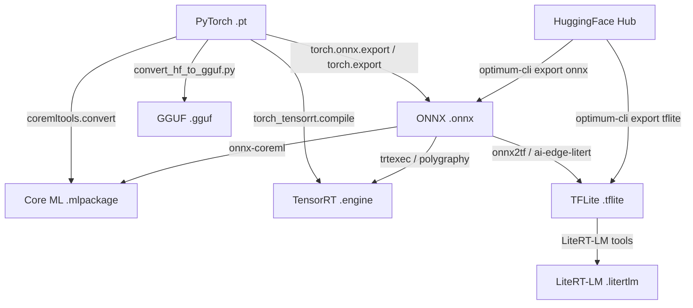

Format selection decision process:

1. **Target Apple devices exclusively?** Use Core ML. Neural Engine access requires it. No alternative.
2. **Target NVIDIA GPU exclusively?** Use TensorRT. Unmatched performance. Accept the portability cost.
3. **Target mobile (Android + iOS) with LLM?** Use GGUF (via llama.cpp) or LiteRT-LM. GGUF has broader model coverage; LiteRT-LM has tighter Google ecosystem integration.
4. **Target cross-platform with non-LLM model?** Use ONNX with ONNX Runtime. Broadest execution provider support.
5. **Target embedded / microcontroller?** Use TFLite. Smallest runtime, most deployment experience at the edge.

### 3.3 Failure Points in Conversion

Format conversion is not lossless. Each conversion path has known failure modes that can silently degrade quality or crash at runtime.

**ONNX Export Failures**

The most common failure: custom operators not present in the ONNX opset. Examples:
- Rotary position embeddings (RoPE): not natively in ONNX opset <20. Workaround: decompose into supported ops (sin, cos, slice, multiply, add) during export via custom symbolic functions.
- Custom attention variants (e.g., Grouped Query Attention, sliding window attention): require manual decomposition or registration of custom ONNX ops.
- Dynamic control flow: torch.cond and data-dependent branching have limited ONNX support. Workaround: trace with all branches materialized.

Detection: always run `onnxruntime.InferenceSession(model_path)` after export and compare outputs on test inputs against the PyTorch model. Numerical divergence >1e-4 (FP32) or >1e-2 (FP16) indicates conversion error.

**TFLite Conversion Failures**

- Dynamic shapes: partially supported via dynamic_shape flag, but many ops require static shape specialization. Models with variable sequence lengths require either padding to max length or multiple TFLite models for different shape buckets.
- Control flow: tf.while_loop and tf.cond have limited TFLite support. Complex control flow requires the Flex delegate, which bundles a subset of the TensorFlow runtime (~20MB), defeating the purpose of TFLite's small footprint.
- Custom ops: any op not in the TFLite built-in op set requires either a custom implementation registered with the interpreter or Flex delegate fallback.

**Core ML Conversion Failures**

- INT4 weight quantization: only available on iOS 18+ / macOS 15+. Deploying INT4 models on older OS versions requires FP16 fallback, doubling model size.
- Stateful models (KV cache management): requires iOS 18+ state API. On older versions, KV cache must be managed externally by the application, passing cache tensors as model inputs and receiving updated cache as outputs. This works but adds application-level complexity and prevents certain Neural Engine optimizations.
- Encoder-decoder architectures: Core ML handles these but requires careful attention to the conversion of cross-attention and decoder autoregressive loops.

**GGUF Limitations**

- Architecture support: GGUF is a container format designed for llama.cpp, which supports decoder-only transformer variants (LLaMA, Mistral, Gemma, Phi, Qwen, GPT-NeoX, and others). Encoder-decoder models (T5, BART, Whisper) require separate handling or custom llama.cpp forks.
- Tokenizer embedding: GGUF embeds tokenizer configuration (vocabulary, merge rules, special tokens) in the file metadata. Tokenizer mismatches between the original model and the GGUF conversion script cause silent decoding errors (wrong tokens generated). Always validate tokenizer round-trip: encode then decode a test string and verify identity.

**TensorRT Portability**

TensorRT engines are serialized GPU kernels compiled for a specific CUDA compute capability (SM version). An engine built on an RTX 4090 (SM 8.9) will not load on an RTX 3090 (SM 8.6) or an A100 (SM 8.0). Cross-GPU deployment requires rebuilding the engine on each target architecture, which takes minutes to hours depending on model size and optimization level. This is a fundamental design choice: TensorRT trades portability for maximum performance.

**Conversion Validation Checklist**

Every format conversion should be validated before deployment. Silent numerical errors are the most dangerous failure mode because they produce plausible but degraded outputs.

| Validation Step | Method | Threshold |
|----------------|--------|-----------|
| Output numerical comparison | Max absolute error vs reference (PyTorch FP32) | FP32: <1e-5, FP16: <1e-2, INT8: <0.1 |
| Perplexity comparison | Evaluate on held-out text (WikiText-2, C4 subset) | <0.5 perplexity increase vs reference |
| Task-specific metric | Run target benchmark (MMLU, HellaSwag, etc.) | <2% accuracy drop vs reference |
| Tokenizer round-trip | Encode then decode 1000 diverse strings | 100% identity (zero tokenizer errors) |
| Edge case inputs | Empty input, max-length input, special tokens, unicode | No crashes, reasonable outputs |
| Memory profiling | Measure peak RSS during inference | Within device memory budget |
| Latency profiling | Measure TTFT and ITL on target device | Meets latency requirements from Section 1.1 |

### 3.4 GGUF Deep Dive

GGUF (GGML Unified Format) is the successor to GGML's original format, designed for self-contained, mmap-friendly model storage. Its structure is optimized for the access patterns of autoregressive LLM inference.

**File Structure:**

```
+------------------+
| Header           |  Magic: 0x46475547 ("GGUF"), version (3), tensor count, metadata KV count
+------------------+
| Metadata KV      |  Architecture type, context length, embedding dim, head count, vocab size,
|                  |  quantization type, tokenizer type, BOS/EOS token IDs, RoPE config, etc.
+------------------+
| Tensor Infos     |  Per-tensor: name (string), n_dims, shape, dtype enum, data offset
+------------------+
| Alignment Padding|  Pad to alignment boundary (default 32 bytes)
+------------------+
| Tensor Data      |  Contiguous, aligned tensor data in declared dtypes
+------------------+
```

**mmap Semantics:** the tensor data section is designed for memory-mapped IO. The OS maps the file directly into the process address space without copying. Pages are loaded from flash storage on demand (page fault driven). Benefits:
- Cold start: only pages actually accessed during the first inference are loaded. A 4GB model may only touch 2-3GB of pages during a short interaction.
- Memory sharing: multiple processes can mmap the same file, sharing physical pages (useful for multi-instance serving).
- Memory pressure: the OS can evict mmap'd pages under memory pressure without explicit application logic. Pages are simply re-loaded from flash on next access.

**Quantization Types:**

GGUF supports a rich set of quantization schemes, each encoding weights differently within contiguous blocks:

| Type | Bits/Weight | Block Structure | Accuracy (relative) |
|------|-------------|-----------------|---------------------|
| Q4_0 | 4.0 | 32 weights, 1 FP16 scale, 16 bytes data | Baseline |
| Q4_1 | 4.5 | 32 weights, 1 FP16 scale, 1 FP16 min, 16 bytes data | Slightly better (asymmetric) |
| Q5_0 | 5.0 | 32 weights, 1 FP16 scale, 20 bytes data | Better |
| Q5_1 | 5.5 | 32 weights, 1 FP16 scale, 1 FP16 min, 20 bytes data | Better (asymmetric) |
| Q8_0 | 8.0 | 32 weights, 1 FP32 scale, 32 bytes data | Near-FP16 quality |
| Q2_K | 2.625 | Super-block of 256, sub-block scales, 2-bit weights | Low quality, very small |
| Q3_K | 3.4375 | Super-block of 256, 3-bit weights + sub-block scales | Usable for large models (>30B) |
| Q4_K | 4.5 | Super-block of 256, 4-bit weights + FP16 scale/min + sub-block scales | Standard quality/size trade-off |
| Q5_K | 5.5 | Super-block of 256, 5-bit weights + scales | High quality |
| Q6_K | 6.5625 | Super-block of 256, 6-bit weights + scales | Near-FP16 quality |
| IQ2_XXS | 2.06 | Importance-matrix guided 2-bit quantization | Research-grade, significant quality loss |
| IQ3_S | 3.44 | Importance-matrix guided 3-bit, small block | Better than Q3_K at same bits |

**K-quant Block Structure (Q4_K example):**

Each super-block encodes 256 weights:
- 1 x FP16 super-block scale (2 bytes)
- 1 x FP16 super-block minimum (2 bytes)
- 12 bytes of sub-block scales and minimums (6-bit scales for 8 sub-blocks of 32 weights each)
- 128 bytes of 4-bit quantized weight data (256 weights x 4 bits / 8 bits per byte)
- Total: 144 bytes for 256 weights = 4.5 bits per weight effective

The sub-block structure allows finer-grained scaling within the super-block, improving accuracy over flat Q4_0 (which uses a single scale per 32 weights) while maintaining efficient SIMD processing. The 32-weight sub-blocks align with common SIMD register widths (256-bit AVX2 = 32 x 8-bit or 16 x 16-bit).

**IQ (Importance-Quantized) variants:** use a learned importance matrix (computed from calibration data) to allocate more quantization precision to weights that matter most. IQ2_XXS achieves usable quality at 2 bits per weight for >30B parameter models where the large parameter count provides inherent redundancy.

**GGUF Quantization Selection Guide**

Choosing the right GGUF quantization depends on model size, device memory, and quality requirements:

| Model Size | Device RAM | Recommended Quant | Effective BPW | Model File Size | Expected Quality |
|------------|-----------|-------------------|---------------|-----------------|-----------------|
| 1-3B | 4 GB | Q8_0 | 8.0 | 1-3 GB | Near-FP16, best quality for small models |
| 1-3B | 3 GB | Q4_K_M | 4.8 | 0.6-1.5 GB | Good, minor degradation |
| 4-8B | 8 GB | Q4_K_M | 4.8 | 2.5-5 GB | Standard recommendation, good quality/size balance |
| 4-8B | 6 GB | Q3_K_M | 3.9 | 2-4 GB | Noticeable degradation on reasoning tasks |
| 13-30B | 16 GB | Q4_K_M | 4.8 | 8-18 GB | Higher capacity model compensates for quant loss |
| 30-70B | 32 GB+ | Q3_K_M or Q2_K | 2.6-3.9 | 10-35 GB | Large models tolerate aggressive quantization |

The "K_M" (medium) variants balance sub-block scale overhead against accuracy. K_S (small) uses fewer scale bits for smaller files; K_L (large) uses more scale bits for better accuracy at slightly larger files.

### 3.5 ONNX QDQ Representation

ONNX represents quantized models using QuantizeLinear and DequantizeLinear (QDQ) nodes inserted around each quantizable operation. The graph retains float-type edges between QDQ nodes, allowing the runtime to fuse QDQ pairs with the intervening compute operation into a single quantized kernel.

```
FP32 input --> QuantizeLinear --> INT8 --> DequantizeLinear --> FP32 --> MatMul --> FP32
```

At runtime, the execution provider recognizes the QDQ+MatMul pattern and replaces it with a single INT8 MatMul kernel:

```
INT8 input --> INT8 MatMul --> INT32 accumulator --> rescale --> INT8 output
```

The QDQ approach decouples the quantization representation (which ops are quantized, with what parameters) from the execution (which kernels are used). This allows the same quantized ONNX model to run on different backends (CPU VNNI, CUDA INT8, NPU) with each backend selecting its own optimal kernel.

**Failure mode:** QDQ node placement must be compatible with the execution provider's fusion patterns. Placing QDQ nodes on operations that the EP cannot fuse results in actual quantize-dequantize round-trips at runtime (quantize to INT8, then immediately dequantize back to FP32 before a float computation), which is slower than the original FP32 path. ONNX Runtime's quantization tool handles this automatically for supported EPs, but custom quantization scripts can produce suboptimal QDQ placement.

### 3.6 Core ML Model Packages

Core ML .mlpackage format is a directory-based archive containing:
- model.mlmodel: the model specification (architecture, weights, metadata)
- weights/: weight files in Apple's compressed format
- metadata.json: model description, author, license

Two program types exist:
- **Neural Network** (legacy): layer-by-layer specification. Limited to ops available in the NeuralNetwork spec.
- **ML Program** (modern): uses MIL (Model Intermediate Language) operations. Required for GPU and Neural Engine compute units on recent hardware. Supports more operations and optimization opportunities.

For LLM deployment on Apple hardware, ML Program format with FP16 precision is the baseline. iOS 18+ adds:
- Stateful models: KV cache as persistent state managed by Core ML runtime, avoiding per-token state copying overhead.
- INT4 weight quantization with palettization: weights stored as 4-bit indices into a learned lookup table, combining the benefits of quantization and weight sharing.
- Grouped quantization: per-group scale/bias similar to GPTQ group quantization.

Neural Engine delegation requires the model to use only ANE-supported operations. Unsupported operations fall back to GPU or CPU, causing tensor copies between compute units that add 0.5-2ms per boundary crossing.

---

## Section 4: Compilation and Runtime Stack

The compilation stack transforms a portable model representation (ONNX, TorchScript, saved weights) into hardware-specific executable code. The quality of this transformation determines how much of the hardware's theoretical peak performance is actually realized. A well-optimized compilation stack achieves 60-80% of hardware peak; a naive one achieves 5-15%.

### 4.1 Graph Optimizations

All major compilers and runtimes apply a standard set of graph-level optimization passes before generating hardware-specific code. These passes are generally safe (semantics-preserving) and provide significant performance gains by reducing memory traffic and kernel launch overhead.

**Operator Fusion**

Fusion combines multiple sequential operations into a single kernel, eliminating intermediate tensor materializations to DRAM.

Without fusion (Conv + BatchNorm + ReLU):
1. Conv: read input from DRAM, compute, write output to DRAM
2. BatchNorm: read Conv output from DRAM, compute, write output to DRAM
3. ReLU: read BN output from DRAM, compute, write output to DRAM
Total DRAM traffic: 6 tensor reads/writes

With fusion (fused Conv-BN-ReLU kernel):
1. Read input from DRAM, compute Conv+BN+ReLU in registers/SRAM, write final output to DRAM
Total DRAM traffic: 2 tensor reads/writes (3x reduction)

Common fusion patterns in transformer models:
- MatMul + Bias + GELU/SiLU: fused GEMM with activation. Eliminates 2 intermediate writes.
- LayerNorm fusion: reduction (mean/variance computation) + element-wise normalization in single kernel.
- Multi-head attention: Q/K/V projections + scaled dot-product attention + output projection can be fused into a single FlashAttention-style kernel, keeping intermediate Q, K, V, and attention score matrices entirely in SRAM.
- Residual connection + LayerNorm: add skip connection output to layer output, then normalize -- single kernel instead of two.

The performance impact scales with model depth: a 32-layer transformer with 5 fusible patterns per layer eliminates approximately 320 unnecessary DRAM round-trips per forward pass.

**Constant Folding**

Pre-computes operations on constant inputs at compile time, replacing runtime computation with pre-computed values:
- Static reshape/transpose chains on weight tensors (resolved to final layout at compile time)
- Arithmetic on constant scalars (e.g., 1/sqrt(d_head) computed once)
- Embedding table lookups for fixed prompt prefixes (system prompts)

**Dead Code Elimination**

Removes operations whose outputs are never consumed by any downstream node. Common after graph transformations create orphaned subgraphs. Also removes unused model outputs (e.g., auxiliary training losses left in the exported graph).

**Layout Optimization**

Data layout determines how tensor dimensions map to memory addresses. Different hardware prefers different layouts:

| Layout | Memory Order | Preferred By | Rationale |
|--------|-------------|--------------|-----------|
| NCHW (channels first) | batch, channels, height, width | x86 AVX (historical), CUDA (partial) | Contiguous channel data enables vectorized per-channel operations |
| NHWC (channels last) | batch, height, width, channels | ARM NEON, most NPUs, TFLite, CUDA (modern) | Adjacent pixels across channels are contiguous, better for depthwise convolutions and quantized compute |
| Custom blocked | e.g., NCHWc (channels blocked by c) | Intel oneDNN, specific NPUs | SIMD-width-aligned channel blocks |

Layout transforms at delegate boundaries (e.g., CPU subgraph in NCHW hands off to NPU subgraph in NHWC) require explicit transpose operations that consume memory bandwidth. The compiler's layout optimization pass minimizes these boundary transforms by propagating the preferred layout through the graph and only inserting transforms where unavoidable.

**ONNX Runtime Optimization Levels**

| Level | Name | Optimizations Applied | When to Use |
|-------|------|----------------------|-------------|
| 1 | Basic | Constant folding, redundant node elimination, semantics-preserving rewrites (e.g., identity removal, unsqueeze elimination) | Always safe. Default for all models. |
| 2 | Extended | Complex node fusions: attention fusion (Q/K/V + softmax + matmul), GELU fusion, LayerNorm fusion, skip-layer-norm fusion, bias-GELU fusion | Transformer models. Provides 1.5-3x speedup on transformer architectures. |
| 99 | Layout | Data layout optimizations (NCHW to NHWC transformation). Hardware-specific. | When targeting hardware that prefers NHWC (most ARM, NPU). May slow down x86 inference if hardware prefers NCHW. |

Failure mode: Level 2 (Extended) fusions include pattern-matching heuristics that can misidentify subgraphs in non-standard architectures. A fused attention pattern that assumes standard scaled-dot-product will produce incorrect results for models with custom attention modifications (e.g., ALiBi, log-attention). Always validate numerical output after enabling Level 2 optimizations.

### 4.2 Compiler Comparison

**Apache TVM (Relax + TensorIR)**

TVM is an open-source compiler framework that generates optimized code for diverse hardware targets from a single model representation.

Architecture:
1. **Frontend import**: model ingested from PyTorch, ONNX, or TensorFlow into TVM's IR.
2. **Relax (graph-level IR)**: high-level representation where each node is a tensor operation. Relax applies fusion, rewrite rules, and high-level optimizations analogous to ORT Level 1-2.
3. **TensorIR (tensor-level IR)**: represents individual fused kernels as loop nests with explicit memory hierarchy (shared memory, registers, global memory). This is where hardware-specific optimization happens.
4. **MetaSchedule (auto-tuning)**: explores the space of valid TensorIR schedules (tiling sizes, vectorization widths, unrolling factors, thread binding configurations) to find the fastest variant for the target hardware. Uses a cost model trained on measurements from the target device.
5. **Code generation**: the best schedule is compiled to target-specific code (ARM assembly, CUDA PTX, Vulkan SPIR-V, etc.) and linked into a deployable shared library.

Trade-off: TVM achieves the highest performance ceiling via auto-tuning (often matching or exceeding vendor libraries) but requires significant engineering effort. Auto-tuning a full LLM can take 4-24 hours on the target device. The tuning results are hardware-specific and must be regenerated for each target.

**XLA (Accelerated Linear Algebra)**

XLA is the compiler backend for JAX, TensorFlow, and PyTorch/XLA. It operates on HLO (High-Level Optimizer) IR.

Key optimizations:
- Automatic operator fusion (similar to graph-level fusion but applied at the HLO level)
- Buffer assignment: determines which tensors can share buffers based on liveness analysis
- Layout assignment: selects optimal data layout per operation and target hardware
- Algebraic simplification: strength reduction, constant propagation

XLA is primarily optimized for Google TPUs and NVIDIA GPUs. Its ARM CPU and mobile codegen is less mature than TVM or vendor-specific compilers. For edge deployment, XLA is most relevant when the deployment target is a Google TPU-based edge device (e.g., Edge TPU) or when using JAX-based models that need conversion to another format.

**TensorRT / TensorRT-LLM**

TensorRT is NVIDIA's production inference compiler, and TensorRT-LLM extends it with LLM-specific optimizations.

Core capabilities:
- Automatic precision calibration: FP32 model is profiled, and layers are selectively converted to FP16, INT8, or FP8 based on sensitivity analysis. User specifies target precision; TensorRT determines per-layer precision to minimize quality loss.
- Kernel auto-tuning: for each operation, TensorRT profiles multiple kernel implementations (cuBLAS, cuDNN, custom CUTLASS kernels) and selects the fastest for the specific problem shape and data type.
- LLM-specific (TensorRT-LLM): in-flight batching (continuous batching with iteration-level scheduling), paged KV cache (virtual memory for KV cache to eliminate fragmentation), speculative decoding integration, CUDA graph capture for decode loop.

Trade-off: TensorRT achieves unmatched performance on NVIDIA hardware. For H100 serving: up to 2-3x throughput improvement over naive PyTorch. For edge NVIDIA hardware (Jetson Orin): 3-5x over unoptimized inference. The cost is complete NVIDIA lock-in: engines are not portable across GPU architectures (SM versions), and the entire stack is proprietary.

**Compiler Performance Comparison**

Realistic performance comparison for 7B decoder-only transformer, single-batch decode on representative hardware:

| Compiler/Runtime | Target Hardware | Relative Throughput | Optimization Time | Portability |
|-----------------|----------------|--------------------|--------------------|-------------|
| PyTorch eager | Any GPU | 1.0x (baseline) | 0 (no compilation) | High |
| torch.compile (inductor) | CUDA GPU | 1.3-1.8x | Minutes (JIT) | CUDA + CPU |
| TVM (Relax + auto-tuned TensorIR) | ARM CPU | 2.0-3.5x vs PyTorch CPU | Hours (auto-tuning) | Any TVM target |
| TVM (Relax + auto-tuned TensorIR) | CUDA GPU | 1.5-2.5x | Hours | Any TVM target |
| TensorRT | NVIDIA GPU | 2.0-3.0x | Minutes (build time) | NVIDIA only |
| TensorRT-LLM | NVIDIA GPU | 2.5-4.0x (with batching) | Minutes | NVIDIA only |
| XLA | TPU | 2.0-3.0x | Minutes (JIT) | TPU + GPU (limited) |
| ONNX Runtime (optimized) | CPU/GPU/NPU | 1.3-2.0x | Seconds (graph opt) | Cross-platform |

These numbers are illustrative; actual performance depends heavily on model architecture, sequence length, batch size, and specific hardware SKU. The key takeaway is that compilation can recover 1.5-4x performance that naive execution leaves on the table, with the highest gains coming from hardware-specific compilers (TensorRT, TVM auto-tuned) at the cost of portability or engineering effort.

### 4.6 Delegate and Execution Provider Architecture

Most edge runtimes use a delegation or execution provider pattern to dispatch subgraphs to specialized hardware.

**TFLite/LiteRT Delegate Pattern:**

```
function partition_graph(graph, available_delegates):
    for delegate in priority_order(available_delegates):
        supported_nodes = delegate.get_supported_nodes(graph)
        if len(supported_nodes) > min_partition_size:
            subgraph = extract_subgraph(graph, supported_nodes)
            delegate_subgraphs.append((delegate, subgraph))
            graph = graph.remove_nodes(supported_nodes)
    
    cpu_fallback = graph  # remaining nodes run on CPU
    return delegate_subgraphs, cpu_fallback
```

Common delegate priority order on Android: GPU delegate > NNAPI delegate (routes to NPU/DSP) > XNNPACK delegate (optimized CPU) > default CPU. Each delegate boundary requires tensor format conversion and synchronization, adding latency.

**ONNX Runtime Execution Providers:**

| Execution Provider | Target Hardware | Key Optimizations | Edge Relevance |
|-------------------|----------------|-------------------|----------------|
| CPU (default) | Any CPU | MLAS optimized kernels, thread pool | Universal fallback |
| XNNPACK | ARM/x86 CPU | Optimized for mobile CPU, FP16/INT8 | Primary for CPU-only Android |
| CUDA | NVIDIA GPU | cuBLAS, cuDNN, kernel fusion | Jetson, NVIDIA edge devices |
| TensorRT | NVIDIA GPU | Max performance on NVIDIA | Jetson Orin |
| CoreML | Apple Neural Engine/GPU/CPU | ANE delegation | iOS/macOS |
| NNAPI | Android NPU/GPU/DSP | Hardware abstraction layer | Broad Android support |
| QNN | Qualcomm Hexagon NPU | Direct NPU access | Qualcomm SoCs |
| DirectML | Windows GPU | Direct3D 12 compute | Windows laptops/desktops |

**Failure mode with delegates:** partial delegation (only some operations supported by the accelerator) can be slower than full CPU execution due to delegate boundary overhead. If a 30-layer model has 28 layers delegated to NPU and 2 layers falling back to CPU, each CPU-fallback layer requires: NPU output -> DRAM -> CPU input conversion -> CPU compute -> CPU output -> DRAM -> NPU input conversion. These boundary crossings can add 1-5ms each, potentially negating the NPU speedup.

Rule of thumb: if less than 80% of compute operations are delegated to the accelerator, benchmark full-CPU execution as an alternative. Sometimes the consistent, cache-friendly CPU execution path outperforms a fragmented delegate path.

### 4.7 Ahead-of-Time vs Just-in-Time Compilation

| Aspect | AOT (Ahead-of-Time) | JIT (Just-in-Time) |
|--------|---------------------|-------------------|
| Compilation time | Build time (offline) | First inference (online) |
| Cold start latency | None (pre-compiled) | Seconds to minutes for first run |
| Optimization quality | Can spend hours on tuning | Limited by latency budget |
| Portability | Target-specific binary | Source IR portable, target-specific codegen |
| Model update | Requires recompilation and redistribution | Recompile on device (automatic) |
| Examples | TensorRT .engine, TVM compiled .so | torch.compile, XLA JIT, Core ML on-device compilation |

For edge deployment, AOT compilation is preferred for production (deterministic startup, maximum optimization) while JIT is useful for development and testing (faster iteration, device-adaptive).

Core ML uses a hybrid approach: the .mlpackage contains a device-agnostic MIL program that is compiled to device-specific code on first load. The compiled version is cached for subsequent loads. This balances portability (ship one model package for all Apple devices) with performance (compiled code is optimized for the specific chip).

### 4.8 Profiling the Compilation Stack

Identifying performance bottlenecks requires layer-by-layer profiling. Key metrics:

```
function profile_inference(model, input, num_warmup=5, num_runs=50):
    for _ in range(num_warmup):
        model(input)  # warmup: JIT compilation, cache warming

    layer_times = defaultdict(list)
    for _ in range(num_runs):
        for layer in model.layers:
            start = high_resolution_timer()
            layer(input)
            synchronize()  # ensure GPU/NPU complete before timing
            layer_times[layer.name].append(high_resolution_timer() - start)

    for name, times in layer_times.items():
        report(name, mean=avg(times), p95=percentile(times, 95),
               pct_of_total=sum(times)/total_time * 100)
```

What to look for in profiling output:

1. **Outlier layers:** if one layer takes 3-5x longer than similar layers, it likely uses a fallback kernel or has a delegate boundary crossing.
2. **Synchronization gaps:** time spent waiting for accelerator completion indicates pipeline bubbles where CPU and accelerator could overlap.
3. **Memory allocation spikes:** runtime malloc calls during inference indicate insufficient memory planning. These appear as latency jitter (high P95 vs P50).
4. **Compute utilization:** if GPU/NPU utilization is <50% during inference, the workload is likely memory-bandwidth-bound (expected for decode) or has excessive kernel launch overhead (fixable with CUDA graphs or operator fusion).

### 4.3 Kernel Selection

At runtime, the inference engine must select the optimal GEMM (General Matrix Multiply) kernel for each operation based on problem shape, data type, and available hardware features. This selection has outsized performance impact because GEMM operations constitute 80-90% of transformer inference time.

```
function select_kernel(M, N, K, dtype, hardware):
    if hardware.has_tensor_cores and dtype in [FP16, INT8, FP8]:
        if M * N * K > threshold:
            return CUTLASS_TENSOR_CORE_GEMM
        else:
            return CUTLASS_SIMT_GEMM
    elif hardware.is_arm:
        if dtype == INT8 and hardware.has_i8mm:
            return KLEIDIAI_I8MM_GEMM
        elif dtype == INT8 and hardware.has_dotprod:
            return NEON_SDOT_GEMM
        else:
            return NEON_SGEMM
    elif hardware.is_x86:
        if hardware.has_amx:
            return AMX_TILE_GEMM
        elif hardware.has_avx512_vnni:
            return AVX512_VNNI_GEMM
        else:
            return AVX2_FMA_GEMM
```

**Shape-dependent dispatch** is the critical subtlety. LLM decode generates matrix-vector products (M=1), which have fundamentally different optimal tiling than square matrix multiplications (M=N=K=4096):

- **Square GEMM (prefill):** large tiles (128x128 or 256x128), maximize data reuse in L1/registers. Compute-bound, so maximizing arithmetic throughput is key. CUTLASS and cuBLAS tile configurations optimized for this regime.
- **Skinny GEMM / GEMV (decode, M=1):** the weight matrix must be loaded from DRAM regardless, and there is no batch dimension to amortize the load cost. Optimal strategy: maximize memory bandwidth utilization by reading weights in large sequential bursts and performing the multiply-accumulate in-place. Specialized GEMV kernels differ significantly from GEMM kernels.
- **Medium batch (speculative decoding, M=4-8):** a middle regime where some data reuse is possible but tiles are small. Neither pure GEMV nor full GEMM kernels are optimal; dedicated kernels for this regime provide 20-50% improvement.

Runtimes maintain dispatch tables keyed by (shape_class, dtype, hardware_features). These tables are populated at initialization by profiling or pre-computed based on hardware identification.

**ARM-specific kernel landscape:**

- **KleidiAI i8mm kernels:** ARM's i8mm ISA extension provides 8-bit integer matrix multiply instructions that compute 2x8 x 8x2 = 2x2 output blocks per instruction. KleidiAI's optimized kernels achieve 5.5x speedup over naive NEON INT8 GEMM, closing the gap between CPU and NPU for quantized inference.
- **NEON SDOT (signed dot product):** available on ARMv8.2+. Computes 4-element dot products of INT8 vectors, accumulating to INT32. Standard for INT8 inference on pre-i8mm ARM cores.
- **SVE/SVE2 (Scalable Vector Extension):** variable-width SIMD (128-2048 bits). Available on ARM V9 cores (Cortex-X3+). Enables vector-length-agnostic code that automatically benefits from wider implementations.

### 4.4 Memory Planning

Memory planning determines the allocation of physical memory for all tensors in the execution graph. The goal is to minimize peak memory usage while avoiding runtime allocation (malloc/free during inference is unacceptable on edge devices due to latency variance and fragmentation).

**In-place computation:** when an operation's output can overwrite its input buffer without affecting correctness. Requirements:
- Output tensor has the same size and alignment as input
- Input tensor has no other consumers after this operation
- The operation computes output[i] from input[i] only (element-wise), or the operation processes elements in order such that already-consumed inputs can be overwritten

Common in-place operations: ReLU, GELU (element-wise), dropout mask application, residual addition (when one input is consumed).

**Buffer sharing (liveness-based):** tensors whose lifetimes do not overlap can share the same physical allocation. The compiler performs liveness analysis on the execution graph:

1. Compute the lifetime of each tensor: from its producing operation to its last consuming operation.
2. Build an interval graph where tensors are nodes and edges connect tensors with overlapping lifetimes.
3. Color the interval graph: tensors with the same color share a buffer. Minimum colors = minimum distinct allocations.

For a 32-layer transformer, activations from layer 1 are fully consumed by layer 2 and can share buffers with activations from layer 3. This reduces peak activation memory from O(L * D) to approximately O(2 * D) (double-buffering), where L is layer count and D is the activation tensor size.

**Workspace allocation:** many GEMM implementations require scratch memory for internal tiling, transposition, or packing operations. This workspace must be pre-allocated to a worst-case size to avoid runtime allocation. Typical workspace requirement: 1-16 MB depending on GEMM kernel and problem size.

**Peak memory formula:**

```
Peak Memory = model_weights
            + max_concurrent_activations
            + kv_cache (for LLMs)
            + workspace
            + runtime_overhead
```

For a 7B INT4 model with 2K context:
- Model weights: 3.5 GB
- KV cache (32 layers, 2K context, 128 dim per head, 32 heads, FP16): 32 x 2 x 2048 x 4096 x 2 bytes = 1.07 GB
- Peak activations: ~200 MB (during prefill with 512 token input)
- Workspace: ~16 MB
- Runtime overhead: ~50 MB
- **Total peak: ~4.84 GB**

This is why 7B models require 6-8 GB device RAM (accounting for OS and other application memory) and why 4B models are the practical limit for 4-6 GB devices.

### 4.5 Execution Graph Lifecycle

The journey from model file to executing inference traverses a pipeline of transformations, each of which can introduce performance issues or outright failures.

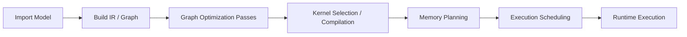

**Stage-by-stage failure modes:**

| Stage | Common Failure | Symptom | Mitigation |
|-------|---------------|---------|------------|
| Import | Unsupported operator in target format | Runtime error or silent fallback to reference CPU implementation | Check op coverage before format selection; decompose custom ops into supported primitives |
| IR Build | Shape inference failure on dynamic dimensions | Compilation error or incorrect buffer sizes | Provide concrete shape hints; use shape specialization for known input sizes |
| Graph Optimization | Incorrect fusion pattern matching | Numerical divergence (wrong outputs) | Validate output against reference on test inputs after each optimization level |
| Kernel Selection | No optimized kernel for shape/dtype combination | Fallback to generic kernel (10-100x slower) | Profile per-layer latency; identify layers using fallback kernels; add custom kernel or change quantization |
| Memory Planning | Calculated peak exceeds device RAM | OOM crash during first inference | Profile peak memory before deployment; reduce context length, batch size, or model size |
| Execution Scheduling | Suboptimal operator ordering creates unnecessary data dependencies | Pipeline bubbles, underutilized compute units | Profile execution timeline; rearrange independent ops for parallelism (e.g., overlap data loading with computation) |

**Runtime execution optimizations:**

- **CUDA Graphs / Metal Command Buffers:** capture the entire decode loop (kernel launches, memory copies, synchronizations) as a single replayable graph. Eliminates per-kernel CPU-side launch overhead (5-15 microseconds per kernel), which compounds across 100+ kernels per transformer layer. On GPU, this can improve decode throughput by 10-30%.
- **Double buffering:** while layer N computes on GPU/NPU, layer N+1 weights are being loaded from DRAM into cache/SRAM. Hides memory latency behind compute latency. Effective when compute time per layer exceeds weight loading time per layer.
- **Thread pool management:** on CPU inference (llama.cpp, ONNX Runtime CPU EP), the thread pool size must match the number of performance cores. Using efficiency cores for GEMM wastes time; using hyperthreads for compute-bound work causes cache thrashing. Optimal: thread count = number of physical performance cores.

**Thread Affinity on big.LITTLE Architectures**

Modern mobile SoCs use heterogeneous CPU clusters (ARM big.LITTLE or DynamIQ):

| Cluster | Example Cores | Purpose | GEMM Performance |
|---------|--------------|---------|-----------------|
| Performance (big) | Cortex-X4, 1-2 cores | Peak single-thread performance | 1x (baseline) |
| Balance (medium) | Cortex-A720, 3-4 cores | Multi-threaded throughput | 0.4-0.6x per core |
| Efficiency (LITTLE) | Cortex-A520, 2-4 cores | Background tasks, power saving | 0.1-0.2x per core |

For LLM decode (memory-bandwidth-bound, single-batch): pin to 1-2 performance cores. More cores do not help because the bottleneck is DRAM bandwidth, which is shared across all cores. Adding threads increases cache contention without increasing useful throughput.

For prefill (compute-bound, batch processing): use all performance + balance cores. The parallel matrix multiplication benefits from multi-core compute. Avoid efficiency cores -- their lower clock speed and smaller caches make them net-negative for compute-bound work.

llama.cpp configuration: `--threads N` sets the thread count, but does not control affinity. On Android, explicit thread affinity via `pthread_setaffinity_np` or the `taskset` command is needed to pin to performance cores. Many production deployments use `sched_setaffinity` in the inference wrapper to ensure correct core selection.

**End-to-End Compilation Pipeline Example**

Converting a HuggingFace model to optimized on-device format (GGUF path):

```
# Step 1: Download model
huggingface-cli download google/gemma-3-4b-it --local-dir ./gemma-4b

# Step 2: Convert to GGUF (FP16 baseline)
python convert_hf_to_gguf.py ./gemma-4b --outfile gemma-4b-f16.gguf --outtype f16

# Step 3: Quantize to Q4_K_M
./llama-quantize gemma-4b-f16.gguf gemma-4b-Q4_K_M.gguf Q4_K_M

# Step 4: Validate
./llama-perplexity -m gemma-4b-Q4_K_M.gguf -f wiki.test.raw
# Expected: perplexity within 0.3-0.8 of FP16 baseline

# Step 5: Benchmark on target device
./llama-bench -m gemma-4b-Q4_K_M.gguf -p 512 -n 128 -t 4
# Reports: prefill tok/s, decode tok/s, memory usage
```

Each step has a measurable quality/performance gate. If perplexity degrades beyond threshold at Step 4, fall back to Q5_K_M or Q6_K. If latency exceeds budget at Step 5, consider a smaller model or more aggressive quantization (Q3_K_M).
## 5. Hardware Awareness

### 5.1 Mobile Processors

#### CPU (ARM Cortex-A/X Series)

Modern mobile SoCs use heterogeneous CPU clusters under ARM's DynamIQ (successor to big.LITTLE) architecture. Performance cores (Cortex-X4, Cortex-A720) handle burst compute with wide out-of-order pipelines; efficiency cores (Cortex-A520) sustain background workloads at minimal power.

**SIMD and Matrix Extensions:**

| Extension | Vector Width | Key Operations | INT8 Throughput (per core) | Availability |
|-----------|-------------|----------------|---------------------------|--------------|
| NEON | 128-bit | SMLAL, SMULL, MLA | 4x FP32 or 16x INT8 per cycle | Universal on ARMv8+ |
| SVE/SVE2 | 128-2048 bit (scalable) | Predicated ops, gather/scatter | Scales with VL implementation | Cortex-X2+, Neoverse V1+ |
| i8mm | 128-bit (NEON encoding) | SMMLA, USMMLA (2x2 outer product) | 2x dot-product throughput | Cortex-X2+, A710+ |
| SME | Streaming SVE + matrix tiles | FMOPA (outer product accumulate) | Tile-based matrix ops | Cortex-X4+ (limited mobile) |

**i8mm in detail:** The SMMLA instruction computes a 2x2 outer product of 8-element INT8 vectors, accumulating into INT32. This doubles INT8 matmul throughput compared to SDOT (dot-product) instructions because it produces 4 results per instruction vs 2 effective results from paired SDOT calls.

**KleidiAI:** ARM's open-source micro-kernel library providing hand-optimized GEMM routines for each ISA level. Performance hierarchy:

```
KleidiAI i8mm kernel:     5.5x speedup vs naive INT8 GEMM
KleidiAI NEON dot-product: 3.2x speedup vs naive INT8 GEMM
XNNPACK (pre-KleidiAI):   2.8x speedup vs naive INT8 GEMM
```

KleidiAI is integrated into llama.cpp (via ggml), MediaPipe LLM Inference API, and XNNPACK. It dispatches at runtime based on CPUID feature detection (FEAT_I8MM, FEAT_DotProd, FEAT_SVE2).

#### GPU (Mobile)

| GPU Family | Vendor | Primary API | Compute Capability | Architecture Notes |
|-----------|--------|-------------|-------------------|-------------------|
| Adreno 700+ | Qualcomm | Vulkan 1.3 / OpenCL 3.0 | FP16/INT8 compute shaders, wave64 | Tightly coupled with Hexagon NPU via shared memory |
| Mali-G700+ | ARM | Vulkan 1.2 / OpenCL 2.0 | FP16 compute, INT8 dot-product | Valhall architecture, 4 execution engines per shader core |
| PowerVR BXS | Imagination | Vulkan 1.3 | FP16/INT8, ray tracing | TBDR architecture, used in select Samsung/Google SoCs |
| Apple GPU | Apple | Metal 3 | FP16/FP32, unified memory | Tile-based deferred rendering, 32-wide SIMD groups |

**Mobile GPU inference characteristics:**
- LLM inference via Vulkan compute shaders (llama.cpp Vulkan backend) or OpenCL (LiteRT GPU delegate)
- Performance range: 2-5x over CPU for models exceeding ~500M parameters where parallelism offsets dispatch overhead
- Power consumption: 2-4W active (vs 0.5-1W CPU-only), limits sustained inference to 3-5 minutes before thermal throttling
- Memory: shares system DRAM with CPU. No dedicated VRAM. Bandwidth typically 50-100 GB/s LPDDR5/5X
- Dispatch overhead: each GPU kernel launch costs 50-200us. Small operations (LayerNorm, element-wise) may be slower on GPU than CPU due to launch cost exceeding compute time

**When GPU beats CPU for LLM inference:**
- Large matrix multiplications (hidden_dim >= 2048) where parallelism saturates GPU ALUs
- FP16 inference (GPU has native FP16 at full throughput; CPU FP16 requires conversion overhead)
- Batch prefill phase (many tokens processed in parallel)

**When CPU wins:**
- INT4/INT8 decode phase with optimized micro-kernels (KleidiAI) — memory-bandwidth-bound, GPU dispatch overhead dominates
- Small models (< 500M params) where matrices are too small to fill GPU wavefronts
- Sustained inference where thermal headroom is critical

#### NPU (Neural Processing Unit)

| NPU | Vendor | Architecture | Peak INT8 TOPS | Typical Power | On-chip SRAM | Key Constraint |
|-----|--------|-------------|---------------|---------------|-------------|----------------|
| Hexagon (Gen 3) | Qualcomm | Scalar + Vector + Tensor | 45 (Snapdragon 8 Gen 3) | 3-5W | 4MB | Requires QNN SDK, limited op support |
| Apple Neural Engine | Apple | 16-core matrix multiply array | 38 (M4) / 35 (A17 Pro) | 2-5W | ~4MB | CoreML only, no direct programming |
| Exynos NPU | Samsung | Dual-core NPU | 34.7 (Exynos 2400) | 3-4W | 2MB | ENN SDK, limited public documentation |
| MediaTek APU 790 | MediaTek | 6-core heterogeneous AI | 46 (Dimensity 9300) | 3-5W | 3.5MB | NeuroPilot SDK, INT4 native support |
| Google Tensor TPU | Google | Custom edge TPU | ~10 (Tensor G4) | 2-3W | 2MB | AICore API only, Google-controlled |

**NPU execution model:**

NPUs operate on a static computational graph compiled ahead of time. The compiler (QNN Compiler, Core ML Converter, etc.) maps supported operations to hardware-native instructions and tiles large tensors across on-chip SRAM banks.

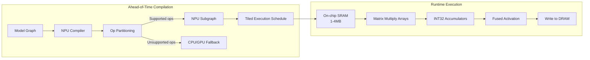

**Partial subgraph acceleration:**
When an NPU encounters unsupported operations (custom activations, dynamic shapes, certain attention patterns), the graph is split:
- Supported subgraphs execute on NPU
- Unsupported ops fall back to CPU or GPU
- Data transfers at partition boundaries add latency: DRAM write from NPU + DRAM read from CPU = 2x bandwidth cost per boundary
- Each partition boundary typically adds 0.5-2ms latency on mobile

Failure mode: a model with many unsupported ops (e.g., custom RoPE implementations, dynamic KV cache indexing) may partition into dozens of small subgraphs. The overhead from boundaries can make NPU execution slower than pure CPU inference.

#### Delegates and Acceleration APIs

| API | Platform | Supported Accelerators | Status (2025) | Migration Notes |
|-----|----------|----------------------|---------------|-----------------|
| NNAPI | Android | CPU/GPU/NPU via vendor HAL | Deprecated from Android 15 | Migrate to LiteRT GPU delegate or AICore |
| AICore (Google) | Android 14+ (Pixel/Samsung) | Pixel TPU, Samsung NPU | Active, limited device support | Only Google-approved models, automatic updates |
| Core ML | iOS 15+ / macOS 12+ | CPU/GPU/Neural Engine | Active, MLProgram format preferred | Stateful prediction in iOS 18+ reduces KV cache realloc |
| QNN SDK | Qualcomm SoCs | Hexagon NPU/Adreno GPU/Kryo CPU | Active | Direct hardware access, bypasses NNAPI |
| XNNPACK | Cross-platform | CPU (optimized microkernels) | Active | Default CPU delegate for LiteRT, auto-detects ISA |
| Metal Performance Shaders | Apple | GPU (Apple Silicon) | Active | Used by MLX, llama.cpp Metal backend |
| Samsung ENN | Samsung Exynos | Exynos NPU | Active, limited docs | Samsung-only, One UI integration |
| NeuroPilot | MediaTek Dimensity | MediaTek APU | Active | MediaTek devices only |

**NNAPI deprecation impact:** Apps targeting Android 15+ cannot rely on NNAPI for NPU access. The migration path depends on target hardware:
- Qualcomm devices: QNN SDK for direct Hexagon access
- Google Pixel: AICore for managed inference
- Generic Android: XNNPACK (CPU) or LiteRT GPU delegate (Vulkan/OpenCL)
- Cross-vendor NPU access without NNAPI remains fragmented

### 5.2 Desktop Processors

#### x86 SIMD Evolution

| Extension | Register Width | Key LLM Instructions | INT8 Throughput | Year Introduced | Availability |
|-----------|---------------|---------------------|-----------------|-----------------|--------------|
| SSE4.2 | 128-bit (XMM) | PMADDWD, PMADDUBSW | 4 INT32 MACs/cycle | 2008 | All modern x86 |
| AVX2 + FMA3 | 256-bit (YMM) | VPMADDWD, VPMADDUBSW, VFMADD231PS | 8 INT32 MACs/cycle | 2013 | Intel Haswell+ / AMD Zen+ |
| AVX-512 + VNNI | 512-bit (ZMM) | VPDPBUSD, VPDPWSSD | 64 INT8 ops/cycle (16 INT32 MACs) | 2019 | Intel Ice Lake+ / AMD Zen 5 |
| AVX-512 BF16 | 512-bit | VDPBF16PS | 32 BF16 MACs/cycle | 2021 | Intel Cooper Lake+ / AMD Zen 5 |
| AMX | Tiles (8x 1KB) | TDPBSSD, TDPBF16PS | 2048 INT8 ops/cycle | 2023 | Intel Sapphire Rapids+ (server only) |

**Practical implications for edge LLM inference:**

llama.cpp GEMM kernel dispatch hierarchy:
1. AMX (if available): tile-based INT8 matmul, highest throughput. Server/workstation only.
2. AVX-512 VNNI: VPDPBUSD computes 4x INT8 dot-products per 512-bit lane. 4x throughput over AVX2.
3. AVX2 + VNNI (Alder Lake+): 256-bit VNNI without full AVX-512 support.
4. AVX2: baseline for all modern inference runtimes.
5. SSE4.2: fallback for legacy hardware, 4x slower than AVX2 for quantized models.

Runtime detection: llama.cpp calls CPUID at startup to select the optimal GEMM backend. ONNX Runtime uses similar dispatch. No recompilation needed.

#### AMD Ryzen AI (Example: Ryzen 7 8840HS)

| Component | Specification | LLM Relevance |
|-----------|--------------|---------------|
| CPU | 8C/16T Zen 4, 5.1 GHz boost | AVX-512 support, primary inference path for llama.cpp |
| iGPU | Radeon 780M, RDNA 3, 12 CUs, 2.7 GHz | Vulkan compute for GPU offload, ~3.5 TFLOPS FP16 |
| NPU | XDNA (Ryzen AI), 16 NPU cores | ~10 TOPS INT8, Windows Copilot Runtime |
| Memory | LPDDR5-6400, dual-channel | 51.2 GB/s bandwidth, shared across all compute units |
| TDP | 28-45W configurable | Determines sustained clock under load |

**Practical performance (Gemma 4 E2B, INT4-quantized, ~1.5GB):**
- CPU-only (AVX-512, 8 threads): 10-18 tok/s decode
- CPU + Vulkan GPU offload (24/26 layers on GPU): 18-28 tok/s decode
- NPU via ONNX Runtime (if model converted): 12-20 tok/s but frees CPU
- Prefill (512 tokens): 150-300ms CPU, 80-150ms with GPU offload

Memory bandwidth is the primary bottleneck during decode. At 51.2 GB/s and a 1.5GB INT4 model, theoretical max decode rate = 51.2 / 1.5 = ~34 tok/s. Actual achieved rate is 50-80% of theoretical due to KV cache reads, attention overhead, and memory controller efficiency.

#### Apple M-Series

**Unified Memory Architecture (UMA):**

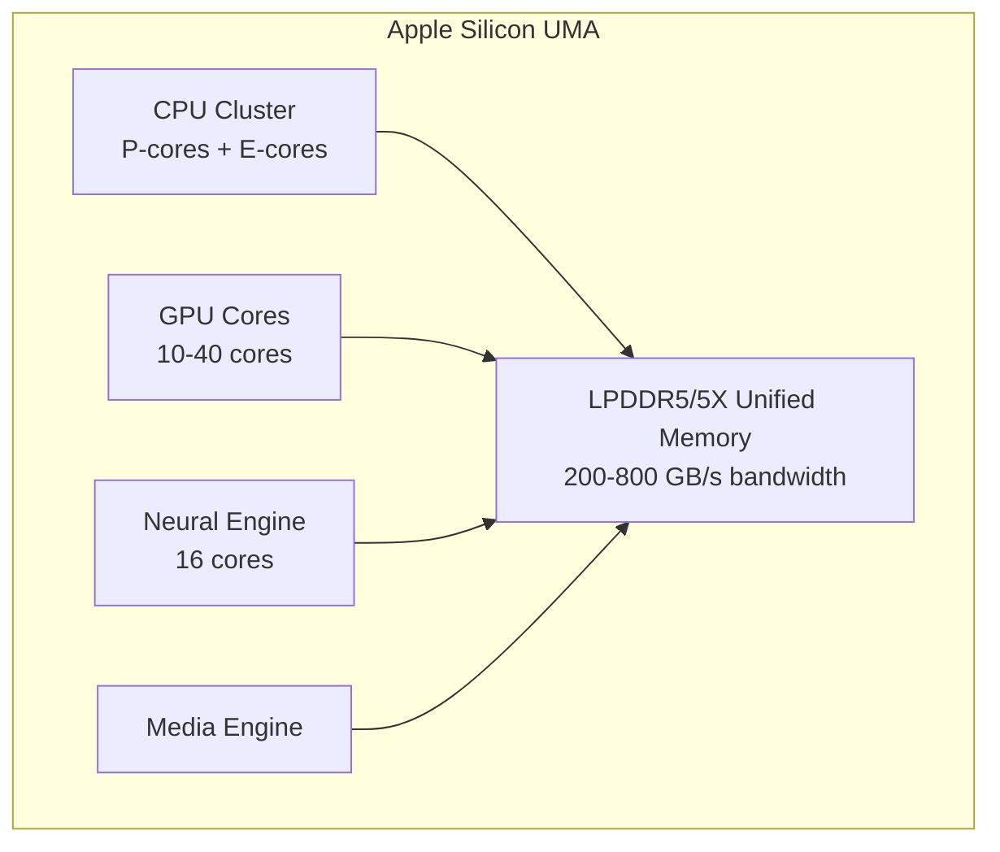

Key advantage: zero-copy sharing between compute units. Model weights loaded once into unified memory are directly accessible by CPU, GPU, and Neural Engine without PCIe/DMA transfers. This eliminates the largest overhead in discrete GPU systems (CPU-to-GPU weight transfer).

| Chip | GPU Cores | Memory BW | Neural Engine TOPS | Practical LLM Decode (8B INT4) |
|------|-----------|-----------|-------------------|-------------------------------|
| M1 | 8 | 68 GB/s | 11 | ~15 tok/s (MLX, GPU) |
| M1 Max | 32 | 400 GB/s | 11 | ~33 tok/s (MLX, GPU) |
| M2 Ultra | 76 | 800 GB/s | 32 | ~65 tok/s (MLX, GPU) |
| M3 Pro | 18 | 150 GB/s | 18 | ~22 tok/s (MLX, GPU) |
| M4 | 10 | 120 GB/s | 38 | ~18 tok/s (MLX, GPU) |
| M4 Max | 40 | 546 GB/s | 38 | ~55 tok/s (MLX, GPU) |

**MLX framework characteristics:**
- Lazy evaluation: operations build a compute graph, executed only when results are needed
- Metal GPU kernels: hand-tuned for Apple GPU architecture (tile-based, SIMD groups of 32)
- Unified memory: no explicit device-to-host copies
- Quantization support: INT4, INT8, NF4 via mlx.nn.quantize
- Performance: within 5-15% of llama.cpp Metal backend, with significantly simpler code

**Core ML for LLM (iOS/macOS):**
- MLProgram format supports stateful operations (iOS 18+): KV cache as model state, no reallocation per token
- Compute unit selection: CPU_AND_GPU, CPU_AND_NE, ALL
- Neural Engine: highest energy efficiency but limited to supported op set and static shapes
- Limitation: dynamic sequence lengths require padding or multiple compiled model variants

### 5.3 Embedded Platforms

#### Platform Comparison

| Platform | Compute Engine | Peak Performance | Memory | Power Envelope | LLM Feasibility |
|----------|---------------|-----------------|--------|---------------|-----------------|
| NVIDIA Jetson Orin NX 16GB | Ampere GPU (32 Tensor Cores) + ARM A78AE | 100 TOPS INT8 | 16GB LPDDR5 (102 GB/s) | 10-25W | 7B INT4 at 25-35 tok/s |
| NVIDIA Jetson Orin Nano 8GB | Ampere GPU (20 Tensor Cores) + ARM A78AE | 40 TOPS INT8 | 8GB LPDDR5 (68 GB/s) | 7-15W | 3B INT4 at 20-30 tok/s |
| Raspberry Pi 5 | Cortex-A76 quad-core, VideoCore VII | ~0.5 TOPS INT8 (CPU only) | 4-8GB LPDDR4X (34 GB/s) | 5-12W | E2B INT4 at 2-4 tok/s |
| Hailo-8L | Dataflow NPU | 13 TOPS INT8 | External (host RAM) | 1.5-2.5W | Vision models, not LLMs |
| Hailo-10H | LLM-optimized NPU | 40 TOPS INT8 | External (host RAM) | 1.5-2W active | 6.9 tok/s sustained, near-zero variance |
| Coral Edge TPU | Fixed-function INT8 | 4 TOPS INT8 | External | 2W | Small classification only, no LLM |
| Qualcomm QCS6490 | Hexagon DSP + Adreno 643 | 12 TOPS | 8GB LPDDR5 | 6-12W | E2B INT4 at 8-12 tok/s |

#### Hailo-10H: Purpose-Built Edge LLM Accelerator

The Hailo-10H represents a new category of embedded NPU designed specifically for sustained LLM inference at minimal power:
- Dataflow architecture: weights stream through processing elements, maximizing compute/memory ratio
- Deterministic performance: 6.9 tok/s with <2% variance over hours of continuous inference
- No thermal throttling: 1.5-2W power means no heat accumulation requiring clock reduction
- Form factor: M.2 module, integrates into Raspberry Pi 5 via HAT+ or any PCIe-equipped SBC

Compared to phone NPUs that achieve higher peak throughput (15-30 tok/s) but throttle to 60-70% within 30 seconds of sustained inference, the Hailo-10H maintains consistent performance indefinitely.

#### NVIDIA Jetson Orin: The Edge GPU Reference

Jetson Orin NX provides the most capable embedded LLM platform:
- Full CUDA support: runs the same inference code as datacenter GPUs (TensorRT-LLM, llama.cpp CUDA)
- Tensor Cores: FP16/INT8/INT4 matrix acceleration at hardware level
- 16GB unified memory: sufficient for 7B INT4 models with full 4K context
- JetPack SDK: includes TensorRT, cuDNN, CUDA — production-grade tooling

Practical deployment: TensorRT-LLM compiled Gemma 4 E2B achieves 60+ tok/s on Orin NX at 15W. This is 10x the throughput of a Raspberry Pi 5 at only 2x the power.

#### Power vs Performance Analysis

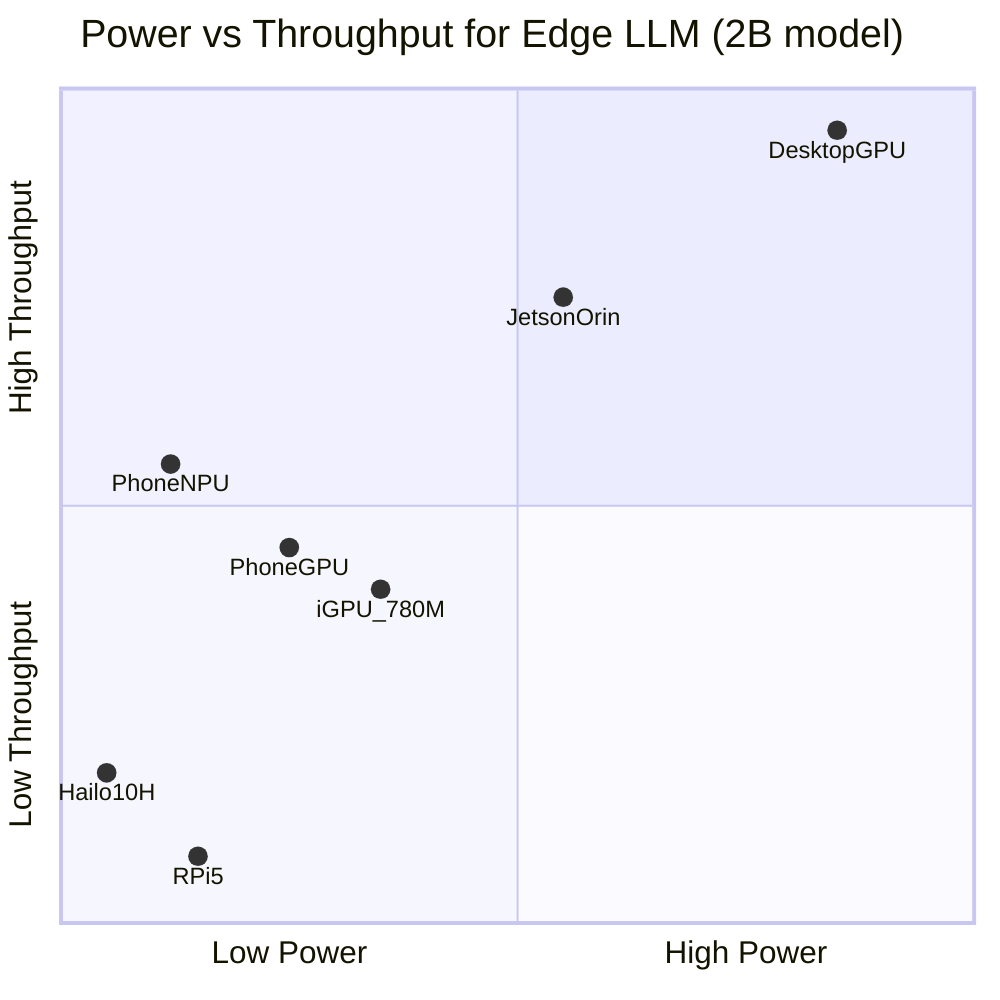

**Interpretation and design implications:**
- **Battery-powered, always-on:** Hailo-10H profile. Sustained inference at minimal power. Ideal for IoT assistants, edge servers on solar.
- **Interactive mobile:** Phone NPU profile. High peak for responsive UX, but thermal limits duration. Ideal for short conversational bursts (<30s continuous generation).
- **Plugged-in edge compute:** Jetson Orin profile. High throughput at moderate power. Ideal for kiosks, vehicles, industrial applications with reliable power.
- **Maximum throughput:** Desktop GPU profile. Highest tok/s but 150-350W. Only for edge servers or workstations.

#### Thermal Envelope and Sustained Performance

Sustained inference degrades performance as silicon heats:

| Platform | Peak tok/s (t=0) | Sustained tok/s (t=60s) | Sustained tok/s (t=300s) | Throttle Factor |
|----------|-----------------|------------------------|-------------------------|-----------------|
| Phone NPU (Snapdragon 8 Gen 3) | 28 | 20 | 16 | 0.57x |
| Phone GPU (Adreno 740) | 22 | 14 | 10 | 0.45x |
| Jetson Orin NX (15W mode) | 35 | 33 | 32 | 0.91x |
| Hailo-10H | 6.9 | 6.9 | 6.9 | 1.0x |
| Ryzen 8840HS (28W) | 25 | 22 | 20 | 0.80x |
| M4 MacBook Air (fanless) | 18 | 15 | 13 | 0.72x |
| M4 Pro MacBook Pro (fan) | 30 | 29 | 28 | 0.93x |

Design rule: for applications requiring >60s continuous generation, use sustained throughput numbers, not peak. Mobile apps should implement generation length limits or progressive quality reduction to maintain UX quality as thermal state degrades.

---

## 6. LLM-Specific Edge Challenges

### 6.1 KV Cache Growth

The KV cache stores projected key and value tensors from all previous tokens in the autoregressive sequence. During decode, the attention mechanism for generating token t requires keys and values from tokens 0 through t-1. Without caching, each new token would require recomputing attention over the entire history (O(n^2) total compute for n tokens).

**Memory formula:**

```
KV_cache_bytes = 2 * num_layers * num_kv_heads * head_dim * seq_len * bytes_per_element
```

The factor of 2 accounts for both keys and values. For GQA models, `num_kv_heads` is the number of KV heads (typically fewer than query heads).

**Concrete calculations:**

| Model | Layers | KV Heads | Head Dim | Seq Len | Dtype | KV Cache Size |
|-------|--------|----------|----------|---------|-------|---------------|
| Gemma 4 E2B (2.3B) | 26 | 4 | 256 | 512 | FP16 | 54 MB |
| Gemma 4 E2B (2.3B) | 26 | 4 | 256 | 2048 | FP16 | 218 MB |
| Gemma 4 E2B (2.3B) | 26 | 4 | 256 | 8192 | FP16 | 872 MB |
| Gemma 4 E4B (4.3B) | 34 | 8 | 256 | 2048 | FP16 | 571 MB |
| Llama 3.2 3B | 28 | 8 | 128 | 2048 | FP16 | 230 MB |
| Llama 3.1 8B | 32 | 8 | 128 | 4096 | FP16 | 536 MB |
| Phi-3 Mini (3.8B) | 32 | 8 | 96 | 4096 | FP16 | 402 MB |

**Per-token KV cache cost:**

```
bytes_per_token = 2 * num_layers * num_kv_heads * head_dim * bytes_per_element
```

For Gemma 4 E2B: 2 * 26 * 4 * 256 * 2 = 106,496 bytes = ~104 KB per token (FP16)
For Gemma 4 E2B: 2 * 26 * 4 * 256 * 1 = 53,248 bytes = ~52 KB per token (INT8 KV)

**Memory budget analysis for a 4GB device:**

```
Total RAM:                          4096 MB
- OS + system services:            -1500 MB
- App runtime (JVM/ART, buffers):   -300 MB
- Model weights (E2B INT4):        -1200 MB
- Inference workspace (activations): -200 MB
= Available for KV cache:            796 MB

Max tokens at FP16 KV: 796 MB / 104 KB = ~7,650 tokens
Max tokens at INT8 KV: 796 MB / 52 KB  = ~15,300 tokens
Max tokens at INT4 KV: 796 MB / 26 KB  = ~30,600 tokens
```

This analysis explains why KV cache quantization is not optional on memory-constrained devices -- it directly determines the usable context window.

### 6.2 Dynamic KV Cache Quantization

Not all cached tokens contribute equally to attention. Empirical observation: attention scores follow a power-law distribution where recent tokens and the first few tokens ("attention sinks") receive disproportionate attention weight, while intermediate tokens receive minimal attention.

**Tiered quantization architecture:**

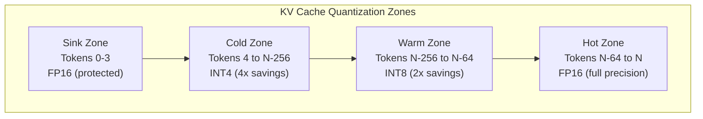

**Zone definitions and rationale:**

| Zone | Token Range | Precision | Memory vs FP16 | Rationale |
|------|-------------|-----------|----------------|-----------|
| Sink | First 4 tokens | FP16 | 1x (baseline) | Attention sinks: all layers attend disproportionately to initial tokens regardless of content. Quantizing these degrades all subsequent predictions. |
| Cold | Token 4 to N-256 | INT4 (group-wise, group=32) | 0.25x | Low aggregate attention score. Information is encoded in the overall pattern, not individual precision. |
| Warm | Token N-256 to N-64 | INT8 (per-channel) | 0.5x | Moderate attention scores. INT8 preserves sufficient precision for contextual reference. |
| Hot | Last 64 tokens | FP16 | 1x | Highest attention scores. Directly influences next-token distribution. |

**Effective compression for a 2048-token sequence:**

```
Baseline FP16:  2048 tokens * 104 KB = 213 MB
Tiered:         4*104KB + 1724*26KB + 192*52KB + 64*104KB = 0.4 + 44.8 + 10.0 + 6.7 = 61.9 MB
Compression ratio: 3.4x
```

**Implementation: zone transition during generation:**

```
def update_kv_cache_zones(kv_cache, new_token_kv, config):
    kv_cache.append(new_token_kv)  // FP16, enters hot zone
    seq_len = kv_cache.length
    
    // Promote hot->warm boundary
    if seq_len > config.hot_size:
        token_idx = seq_len - config.hot_size - 1
        if token_idx >= config.sink_size + config.warm_size:
            // Token exits warm zone, enters cold zone
            kv_cache.quantize_token(token_idx - config.warm_size, INT4)
        if token_idx >= config.sink_size:
            // Token exits hot zone, enters warm zone
            kv_cache.quantize_token(token_idx, INT8)
```

**Quality impact measurement:**

| Task | FP16 KV (baseline) | Tiered KV | Perplexity Increase |
|------|--------------------|-----------|--------------------|
| WikiText-2 perplexity | 8.42 | 8.47 | +0.6% |
| MMLU 5-shot | 62.1% | 61.8% | -0.3pp |
| HumanEval pass@1 | 41.5% | 40.9% | -0.6pp |
| Long-context retrieval (1024 tokens) | 94.2% | 93.1% | -1.1pp |
| Long-context retrieval (4096 tokens) | 87.6% | 84.3% | -3.3pp |

Trade-off: quality degradation is minimal for short-to-medium contexts but increases for long-context tasks where cold zone tokens carry critical information. Applications requiring faithful long-context retrieval should use less aggressive cold zone quantization (INT8 instead of INT4).

### 6.3 Context Window Limits on Edge

**Available memory calculation:**

```
available_for_kv = total_ram - os_overhead - model_weights - app_memory - activation_workspace
max_seq_len = available_for_kv / bytes_per_token_kv
```

**Practical limits by device class:**

| Device Class | Total RAM | Available for KV | Max Context (FP16 KV) | Max Context (INT8 KV) | Max Context (INT4 KV) |
|-------------|-----------|-----------------|----------------------|----------------------|----------------------|
| Budget phone (4GB) | 4 GB | ~800 MB | ~7,700 tokens | ~15,400 tokens | ~30,800 tokens |
| Mid-range phone (6GB) | 6 GB | ~2.5 GB | ~24,000 tokens | ~48,000 tokens | ~96,000 tokens |
| Flagship phone (8GB) | 8 GB | ~4 GB | ~38,400 tokens | ~76,800 tokens | Full model context |
| Flagship phone (12GB) | 12 GB | ~7.5 GB | Full context | Full context | Full context |
| Laptop (16GB) | 16 GB | ~12 GB | Full context | Full context | Full context |

**Context management strategies:**

1. **Sliding window**: Discard oldest tokens when cache exceeds budget. Simple but loses early context entirely.
2. **Sink + window**: Keep first K tokens (sinks) + last N tokens. Preserves attention sink stability.
3. **Eviction by attention score**: Periodically score all cached tokens, evict lowest-attention entries. Higher quality but O(n) scoring overhead.
4. **Summarization cascade**: When approaching limit, summarize oldest chunk into a shorter representation that replaces it. Requires an extra inference pass.
5. **Hierarchical cache**: Multiple resolution levels -- full precision for recent, compressed summaries for distant context.

**Failure mode -- silent context truncation:**
If an application silently truncates context without informing the user, the model will generate responses that ignore earlier conversation turns. This manifests as:
- Contradicting earlier stated preferences
- Asking questions already answered
- Losing track of multi-turn task state

Mitigation: expose context usage to the application layer. When approaching limits, either notify the user or trigger a summarization pass.

### 6.4 Token Latency Decomposition

LLM inference has two distinct computational phases with fundamentally different hardware bottlenecks:

**Prefill (prompt encoding):**

| Characteristic | Detail |
|---------------|--------|
| Input | Full prompt (N tokens simultaneously) |
| Compute pattern | Large batch GEMM: [N, hidden_dim] x [hidden_dim, hidden_dim] |
| Bottleneck | Compute-bound (FLOPS limited) |
| Parallelism | Full data parallelism across N tokens |
| Output | KV cache populated, first output token logits |
| Metric | Time To First Token (TTFT) |

**Decode (autoregressive generation):**

| Characteristic | Detail |
|---------------|--------|
| Input | Single new token + full KV cache |
| Compute pattern | Thin GEMM: [1, hidden_dim] x [hidden_dim, hidden_dim] |
| Bottleneck | Memory-bandwidth-bound (loading weights for 1 token) |
| Parallelism | Only across hidden dimension (no batch parallelism) |
| Output | One new token per forward pass |
| Metric | Inter-Token Latency (ITL) = 1 / tokens_per_second |

**Roofline analysis for decode:**

```
arithmetic_intensity = FLOPS_per_token / bytes_loaded_per_token

For E2B INT4 decode:
  FLOPS_per_token ~= 2 * 2.3B * 2 = 9.2 GFLOPS (approx, counting each weight multiply-add)
  bytes_loaded = model_weights + kv_cache_read ~= 1.2GB + kv_bytes
  
  At 1.2GB weights, 50 GB/s bandwidth:
  min_decode_time = 1.2GB / 50 GB/s = 24ms per token = 41 tok/s theoretical max
  
  Actual: 60-80% of theoretical due to KV cache reads, non-GEMM ops, scheduling overhead
  Expected: 25-33 tok/s on 50 GB/s memory system
```

**Total latency formula:**

```
total_latency = TTFT + (num_output_tokens - 1) * ITL
```

For a typical mobile interaction (256-token prompt, 128-token response, E2B on phone NPU):
```
TTFT = 350ms (prefill 256 tokens)
ITL  = 45ms (22 tok/s decode)
Total = 350ms + 127 * 45ms = 350ms + 5715ms = 6.065s
```

The decode phase dominates (94% of total time). This is why decode optimization (weight quantization, KV cache compression, speculative decoding) has outsized impact on user-perceived latency.

### 6.5 Streaming Inference

Streaming delivers tokens to the user interface as they are generated rather than waiting for the complete response. This is critical for perceived responsiveness.

**Implementation architecture:**

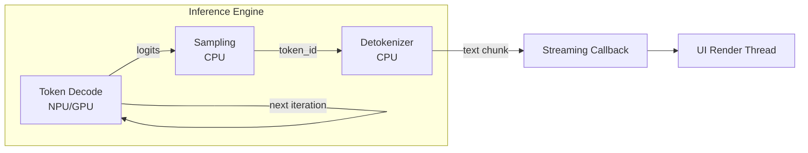

**Pipeline overlap:** While the NPU/GPU computes the next token prediction, the CPU concurrently:
1. Detokenizes the previous token ID into text
2. Delivers the text chunk via callback to the UI thread
3. Updates the KV cache metadata

This pipelining hides detokenization and UI update latency entirely within the next decode step.

**Perceived responsiveness thresholds:**

| Tokens/second | User Perception | Suitable For |
|--------------|-----------------|--------------|
| > 10 tok/s | Faster than reading speed, excellent | All use cases |
| 5-10 tok/s | Comfortable reading pace | Conversational, extraction |
| 3-5 tok/s | Acceptable, slightly slow | Most tasks with streaming UI |
| 2-3 tok/s | Noticeable lag, tolerable | Background tasks, non-interactive |
| < 2 tok/s | Frustratingly slow | Not suitable for interactive use |

**Tokenizer boundary handling:**
Some token IDs map to partial UTF-8 sequences or partial words. The streaming callback must buffer until a complete displayable unit is available:

```
def streaming_callback(token_id, detokenizer):
    detokenizer.add_token(token_id)
    displayable = detokenizer.flush_displayable()  // returns text only when valid UTF-8 boundary
    if displayable:
        ui.append_text(displayable)
```

Failure mode: naive per-token rendering can display mojibake (broken characters) when a multi-byte character is split across tokens. Always use incremental detokenization with boundary detection.

### 6.6 Speculative Decoding on Edge

**Standard speculative decoding:**

A small draft model generates K candidate tokens autoregressively (fast, low quality). The larger target model then verifies all K candidates in a single forward pass (using them as a "batch" in the attention computation). Tokens are accepted from left to right until the first rejection; the target model's distribution is used to sample the corrective token at the rejection point.

Expected speedup:
```
speedup = K * acceptance_rate / (1 + K * (draft_time / target_time))
```

For edge: if draft model takes 10ms/token and target takes 45ms/token, with K=4 and 85% acceptance:
```
tokens_generated = 1 + (K * acceptance_rate) = 1 + (4 * 0.85) = 4.4 expected tokens
time = draft_time * K + target_time = 10*4 + 45 = 85ms
effective_speed = 4.4 / 85ms = 51.8 tok/s vs 22.2 tok/s (target alone) = 2.3x speedup
```

**Memory problem on edge:**
Two separate models require storing both sets of weights simultaneously:
- Target (E2B INT4): ~1.2 GB
- Draft (0.5B INT4): ~0.3 GB
- Total: 1.5 GB for weights alone, reducing KV cache budget

**Self-speculative decoding (QuantSpec approach):**

Instead of two different models, use the same model at different quantization levels:
- Draft phase: run forward pass using INT4 weights (faster due to less memory traffic)
- Verify phase: run forward pass using FP16 weights (slower but higher quality)
- Shared KV cache: both phases use the same KV cache (generated at FP16 quality during verify)

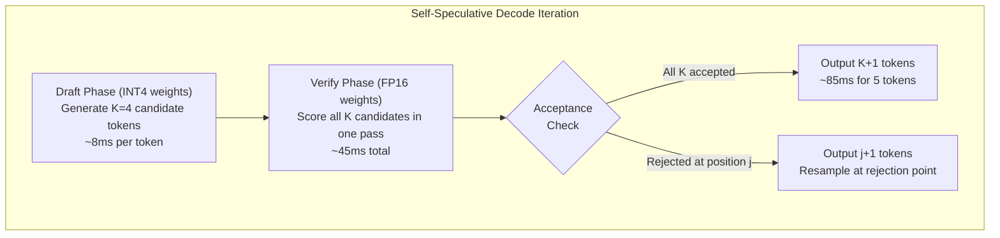

**Advantages over two-model speculative decoding:**
- Zero additional memory for draft model weights (reuses same weights at different precision)
- Higher acceptance rate (same architecture, just precision difference) -- typically >90% vs 80-85% for different architectures
- No need to train/find a compatible draft model
- KV cache remains single instance

**Trade-offs and failure modes:**
- Works best when INT4 quantization is well-calibrated (minimal distribution shift from FP16)
- Acceptance rate drops on:
  - Mathematical reasoning (precision of intermediate calculations matters)
  - Code generation (exact token sequences, syntax sensitivity)
  - Low-entropy predictions where small logit differences change the argmax
- Overhead of switching between quantization levels: need both INT4 and FP16 weight copies in memory, OR dynamic dequantization (compute-bounded conversion)
- Net memory: if storing both INT4 and FP16 weights: 1.2GB + 4.6GB = 5.8GB for E2B. Alternative: store INT4, dequantize to FP16 on-the-fly for verify (compute cost replaces memory cost)

**Practical implementation on mobile:**
- Store weights in INT4 format only
- Draft: INT4 matmul (optimized path via KleidiAI/XNNPACK)
- Verify: dequantize INT4 to FP16 in-kernel, perform FP16 matmul (single kernel, no extra memory)
- Net cost: verify is ~2x slower than pure FP16 (dequant overhead) but uses INT4 memory footprint
- Result: 1.5-2x decode speedup with no memory overhead beyond single INT4 model

---

## 7. Inference Optimization Techniques

### 7.1 Prefill vs Decode Optimization

These phases have opposing optimization requirements:

| Dimension | Prefill | Decode |
|-----------|---------|--------|
| Compute intensity | High (O(N * d^2) for N tokens) | Low (O(d^2) per token) |
| Memory access pattern | Sequential, large blocks | Random KV cache reads + full weight scan |
| Hardware bottleneck | FLOPS (compute-bound) | Memory bandwidth (bandwidth-bound) |
| Batch size | N (prompt length) | 1 (single token) |
| Optimization target | Reduce TTFT | Increase tok/s |
| Key technique | Fused attention, maximize occupancy | Weight quantization, reduce memory traffic |
| Parallelism strategy | Data parallelism across tokens | None (inherently sequential) |

**Prefill optimization techniques:**

1. **Chunked prefill**: Process prompt in segments of C tokens to bound peak activation memory:
   - Peak activation memory = O(C * d) instead of O(N * d)
   - KV cache accumulates across chunks
   - Trade-off: C too small means underutilized compute units (not enough parallelism); C too large causes OOM
   - Optimal C: largest value that fits within activation memory budget (typically 256-1024 on mobile)

2. **Fused QKV projection**: Single kernel computes Q, K, V projections from input:
   - Standard: 3 separate GEMMs + 3 DRAM writes + 3 DRAM reads
   - Fused: 1 concatenated GEMM + 1 DRAM write. Reduces memory traffic by ~67% for this operation.

3. **Flash Attention during prefill**: O(N) memory instead of O(N^2) for attention computation. Critical when N > 1024 where the N^2 attention matrix would exceed available memory.

**Decode optimization techniques:**

1. **Weight quantization (INT4/INT8)**: Directly proportional decode speedup:
   - INT4 vs FP16: 4x less memory to load per token = up to 4x faster (in bandwidth-bound regime)
   - Actual: 2-3x speedup due to dequantization compute cost and non-GEMM operations

2. **KV cache quantization**: Reduces attention phase memory traffic:
   - INT8 KV: 2x less bandwidth for KV reads per attention layer
   - Impact scales with sequence length (more tokens in cache = more bandwidth saved)

3. **Grouped Query Attention (GQA)**: Architectural choice that reduces KV cache size:
   - Standard MHA: num_kv_heads = num_q_heads (e.g., 32 KV heads)
   - GQA: num_kv_heads < num_q_heads (e.g., 8 KV heads with 32 Q heads)
   - 4x fewer KV heads = 4x smaller KV cache = 4x less attention bandwidth per layer
   - Gemma 4 E2B uses 4 KV heads vs 8 Q heads (GQA ratio 2:1)

4. **Speculative decoding**: Amortizes target model cost across multiple tokens (covered in Section 6.6)

### 7.2 Cache Locality and Tensor Layout

**Data layout impact on performance:**

The physical arrangement of tensor elements in memory determines whether vector loads (NEON, AVX) access contiguous data or require gather operations:

| Layout | Contiguous Dimension | Optimal For | Hardware Preference |
|--------|---------------------|-------------|-------------------|
| NCHW | Width (innermost), then Height | Channel-wise convolutions | Intel AVX (historical), some CUDA kernels |
| NHWC | Channels (innermost) | Point-wise ops, NPU tensor cores | ARM NEON, all mobile NPUs, TFLite, Apple Neural Engine |

For LLM inference (no spatial dimensions), the relevant layouts are:
- **Row-major** [seq_len, hidden_dim]: contiguous across hidden dimension. Standard for most LLM operations.
- **Column-major** [hidden_dim, seq_len]: contiguous across sequence. Useful for some attention patterns.
- **Blocked/tiled** [seq_len/Bs, hidden_dim/Bh, Bs, Bh]: block-interleaved for cache efficiency.

**L1/L2 cache tiling for GEMM:**

Matrix multiplication C = A * B can be decomposed into tiles that fit entirely in cache:

```
// Tiled GEMM: C[M,N] = A[M,K] * B[K,N]
// Choose tile sizes Tm, Tn, Tk such that:
//   Tm * Tk + Tk * Tn + Tm * Tn <= L1_cache_size / element_bytes

For L1 = 64KB, FP16 (2 bytes):
  Budget = 65536 / 2 = 32768 elements across 3 tiles
  If Tm = Tn = Tk = T: 3*T^2 <= 32768 => T <= 104
  Practical choice: Tm=64, Tn=64, Tk=128 (fits in 64KB L1 with margin)
  
For L2 = 512KB, FP16:
  Budget = 262144 / 2 = 131072 elements
  Practical: Tm=256, Tn=256, Tk=256 (L2-level tiling)
```

**Hierarchical tiling strategy:**
```
for l2_tile in L2_tiles(M, N, K):        // Tiles fit in L2 cache
    for l1_tile in L1_tiles(l2_tile):     // Sub-tiles fit in L1 cache
        for reg_tile in register_tiles(l1_tile):  // Micro-tiles in SIMD registers
            compute_micro_kernel(reg_tile)  // NEON/AVX fused multiply-add
```

**Failure modes:**
- Tiles too large: L1 thrashing, 3-10x slowdown from repeated cache misses
- Tiles too small: insufficient arithmetic intensity, vector units idle waiting for memory
- Misaligned tiles: cross cache-line boundaries, causing partial line loads (2x effective bandwidth cost)
- Non-power-of-2 dimensions: padding required, wastes compute on zero elements

**KleidiAI and XNNPACK solve this:** These libraries implement platform-specific micro-kernels with optimal tile sizes for each cache hierarchy. Application developers should not hand-tune tiles -- use these libraries via LiteRT or llama.cpp.

### 7.3 Flash Attention on Edge

**Problem with standard attention:**

Standard scaled dot-product attention:
```
Attention(Q, K, V) = softmax(Q * K^T / sqrt(d_k)) * V
```

For sequence length N and head dimension d:
- Q * K^T produces an [N, N] matrix: O(N^2) memory
- For N=2048, d=256, FP16: attention matrix = 2048^2 * 2 bytes = 8MB per head per layer
- With 8 heads and 26 layers: 8 * 26 * 8MB = 1.6 GB just for attention matrices
- This exceeds available memory on most edge devices for moderate sequence lengths

**Flash Attention algorithm (conceptual):**

```
def flash_attention(Q, K, V, block_size):
    N = Q.shape[0]
    output = zeros(N, d)
    row_max = full(N, -inf)  // running max for numerical stability
    row_sum = zeros(N)       // running sum for softmax denominator
    
    for j in range(0, N, block_size):  // iterate over KV blocks
        K_block = K[j:j+block_size]
        V_block = V[j:j+block_size]
        
        scores = Q @ K_block.T / sqrt(d)  // [N, block_size] -- fits in SRAM
        
        // Online softmax update (Milakov-Gimelshein algorithm)
        block_max = scores.max(dim=-1)
        new_max = maximum(row_max, block_max)
        
        // Rescale previous accumulator
        scale_old = exp(row_max - new_max)
        scale_new = exp(block_max - new_max)
        
        row_sum = scale_old * row_sum + scale_new * scores.exp().sum(dim=-1)
        output = scale_old.unsqueeze(-1) * output + scale_new.unsqueeze(-1) * (softmax(scores) @ V_block)
        row_max = new_max
    
    return output / row_sum.unsqueeze(-1)
```

The key insight: by processing KV in blocks and maintaining running statistics (online softmax), the algorithm never materializes the full N x N attention matrix. Peak memory is O(N * block_size) instead of O(N^2).

**Edge implementations:**

| Platform | Implementation | Memory Reduction | Speedup vs Standard | Constraints |
|----------|---------------|-----------------|--------------------|----|
| Apple Metal (M-series) | MPSGraph Flash Attention | O(N) | 1.8-4x | Requires Metal 3, iOS 17+ |
| NVIDIA Jetson (CUDA) | Custom Tensor Core kernels | O(N) | 2.26x at seq_len=2048 | Requires SM 8.0+ (Ampere) |
| Qualcomm (QNN) | Vendor fused attention op | O(N) | Integrated in delegate | Not user-configurable, QNN SDK only |
| ARM CPU | Not available as fused kernel | O(N^2) standard | N/A | Must use standard attention or custom tiling |
| Vulkan (mobile GPU) | Compute shader implementation | O(N) possible | 1.2-2x (dispatch overhead) | Complex shader, not widely available |

**Why Flash Attention is harder on edge than datacenter:**
- No shared memory (SRAM) directly programmable on NPUs -- vendor must implement internally
- Mobile GPUs have smaller register files and less shared memory per workgroup than datacenter GPUs
- ARM CPUs lack the hardware atomic operations that enable efficient parallel softmax reduction
- Result: Flash Attention benefits are vendor-dependent and often only available through opaque delegates

**Register-level softmax optimization (advanced CUDA):**

On NVIDIA hardware with direct PTX access (Jetson Orin with CUDA):
- Standard Flash Attention: softmax accumulators in shared memory (48KB per SM)
- Register-optimized: softmax accumulators in register file (256KB per SM on Ampere)
- Eliminates shared memory bank conflicts and synchronization barriers
- Achieves ~58% of theoretical Tensor Core throughput (vs ~35% for shared-memory version)
- Practical: 136 TFLOPS FP16 on RTX 5080 consumer GPU using this technique

Trade-off: register-optimized implementation requires manual register allocation at PTX level, making it non-portable and extremely difficult to maintain. Only justified for production inference engines (TensorRT-LLM, vLLM).

### 7.4 Operator-Level Optimizations

#### Fused GEMM Kernels

Each unfused operation requires a round-trip to DRAM:
```
Standard:  input --[read]--> MatMul --[write]--> temp1 --[read]--> BiasAdd --[write]--> temp2 --[read]--> SiLU --[write]--> output
Memory ops: 6 DRAM accesses for 3 operations

Fused:     input --[read]--> MatMul+Bias+SiLU --[write]--> output  
Memory ops: 2 DRAM accesses for same computation
```

For a layer with hidden_dim=2048, FP16:
- Each intermediate tensor: 2048 * 2 bytes = 4KB per token
- 4 intermediate writes eliminated per fused kernel: 16KB saved per token per fused op
- At 50 GB/s bandwidth: 16KB / 50 GB/s = 0.32us saved per token per fused operation
- Across all layers and fused operations: 5-15% total decode latency reduction

**Common fusion patterns in LLM inference:**

| Fusion | Operations Combined | Benefit |
|--------|-------------------|---------|
| QKV projection | 3 MatMuls into 1 concatenated MatMul | 3x fewer kernel launches, 67% less intermediate memory |
| Gate + Up projection | 2 MatMuls for MLP gate and up + element-wise multiply | Eliminates large intermediate tensor write |
| MatMul + Bias + Activation | Linear + bias + GELU/SiLU | Eliminates 2 intermediate writes |
| LayerNorm + Linear | Normalize then project in single pass | Eliminates normalized intermediate write |
| RoPE + Attention | Rotary embedding applied within attention kernel | Eliminates position-encoded Q/K intermediate |

#### In-Place LayerNorm with Welford's Algorithm

Standard LayerNorm requires two passes:
```
Pass 1: mean = sum(x) / N          // read all elements
Pass 2: var = sum((x - mean)^2) / N // read all elements again  
Output: (x - mean) / sqrt(var + eps) * gamma + beta  // read once more
Total memory reads: 3N elements
```

Single-pass Welford's online algorithm:
```
def fused_layernorm(x, gamma, beta, eps):
    mean = 0.0
    M2 = 0.0
    for i, val in enumerate(x):
        delta = val - mean
        mean += delta / (i + 1)
        M2 += delta * (val - mean)
    variance = M2 / len(x)
    
    inv_std = 1.0 / sqrt(variance + eps)
    for i in range(len(x)):
        x[i] = (x[i] - mean) * inv_std * gamma[i] + beta[i]
    return x
```

Memory traffic reduction: 2N reads + N writes (standard) vs N reads + N writes (fused). For bandwidth-bound decode, this 33% reduction in LayerNorm memory traffic directly translates to faster per-layer execution.

#### Quantized MatMul with On-the-Fly Dequantization

The dominant operation in LLM decode is matrix-vector multiplication: y = W * x, where W is [hidden_dim, hidden_dim] and x is [1, hidden_dim].

With INT4 quantization (group-wise, group_size=32):
```
def quantized_matvec(x_fp16, w_int4, scales, zeros, group_size=32):
    // w_int4 shape: [out_dim, in_dim/2] (two INT4 values packed per byte)
    // scales shape: [out_dim, in_dim/group_size]
    // zeros shape:  [out_dim, in_dim/group_size]
    
    output = zeros(out_dim, dtype=fp16)
    
    for tile_row in range(0, out_dim, TILE_M):
        for tile_col in range(0, in_dim, TILE_K):
            group_idx = tile_col / group_size
            scale = scales[tile_row:tile_row+TILE_M, group_idx]
            zero = zeros[tile_row:tile_row+TILE_M, group_idx]
            
            // Dequantize in registers (never written to DRAM)
            w_tile = unpack_int4(w_int4[tile_row:tile_row+TILE_M, tile_col/2:(tile_col+TILE_K)/2])
            w_dequant = (w_tile.to_fp16() - zero) * scale
            
            // Accumulate in FP16/FP32
            x_tile = x_fp16[tile_col:tile_col+TILE_K]
            output[tile_row:tile_row+TILE_M] += w_dequant @ x_tile
    
    return output
```

**Memory traffic analysis:**
- FP16 weights: load out_dim * in_dim * 2 bytes per token
- INT4 weights: load out_dim * in_dim * 0.5 bytes + scales/zeros overhead (~2% extra)
- Effective reduction: 4x less weight data loaded from DRAM per token
- Dequantization cost: ~5-10% compute overhead (INT4-to-FP16 conversion in registers)
- Net speedup: 2.5-3.5x for decode phase (bandwidth-bound operation)

### 7.5 Chunked Prefill for Memory-Constrained Devices

**Problem statement:**

Processing a prompt of N tokens requires storing intermediate activations for all N tokens simultaneously during the forward pass. For a transformer layer with hidden_dim=2048:
- Attention: Q, K, V projections = 3 * N * 2048 * 2 bytes (FP16)
- Attention scores (if not using Flash Attention): N * N * 2 bytes
- FFN intermediate: N * (4 * 2048) * 2 bytes (typical 4x expansion)
- Total per layer: ~50KB * N (excluding attention matrix)
- For N=2048, 26 layers: ~2.6 GB peak activation memory

On a 4GB device with 1.2GB model weights and 1.5GB OS: only ~1.3GB available. Cannot process 2048 tokens at once.

**Chunked prefill algorithm:**

```
def chunked_prefill(prompt_tokens, model, chunk_size=512):
    kv_cache = initialize_empty_cache()
    
    for i in range(0, len(prompt_tokens), chunk_size):
        chunk = prompt_tokens[i:i+chunk_size]
        
        // Forward pass for this chunk only
        // Attention sees full KV cache built so far + this chunk's KV
        hidden_states = model.embed(chunk)
        
        for layer in model.layers:
            q, k, v = layer.qkv_proj(hidden_states)
            kv_cache[layer.idx].append(k, v)
            
            // Attention over full cache (causal: this chunk attends to all prior + self)
            attn_out = layer.attention(q, kv_cache[layer.idx])
            hidden_states = layer.ffn(layer.norm(attn_out + hidden_states))
        
        // Activations for this chunk can now be freed
        del hidden_states, q, k, v, attn_out
    
    // KV cache now contains entries for all prompt tokens
    return kv_cache
```

**Memory profile with chunking:**

| Chunk Size | Peak Activation Memory (26-layer, 2048 hidden) | Prefill Speed (relative) |
|-----------|------------------------------------------------|--------------------------|
| Full (2048) | ~2.6 GB | 1.0x (fastest) |
| 1024 | ~1.3 GB | ~1.05x slower |
| 512 | ~650 MB | ~1.1x slower |
| 256 | ~325 MB | ~1.2x slower |
| 128 | ~165 MB | ~1.4x slower |

**Trade-offs:**
- Smaller chunks: lower peak memory, but slower prefill due to repeated overhead and reduced parallelism within each chunk
- Attention computation grows: chunk i must attend to all tokens 0..i*chunk_size + chunk_size, so later chunks do more attention work
- Optimal chunk size: largest value where peak_activations + model_weights + kv_cache + os_overhead < total_ram
- Dynamic adjustment: start with large chunk, reduce if OOM detected (requires graceful OOM handling)

### 7.6 Continuous Batching vs Sequential Inference

**Server-side continuous batching (context):**

In datacenter deployments, multiple concurrent requests share GPU resources:
- In-flight batching: new requests join an existing batch mid-decode
- PagedAttention (vLLM): KV cache stored in non-contiguous 16KB pages, allocated on demand
- Eliminates KV cache fragmentation that wastes 60-80% of GPU memory in naive allocation
- Throughput optimization: maximize tokens/second across all concurrent users

**Edge inference: fundamentally different assumptions:**

| Aspect | Server (Batched) | Edge (Sequential) |
|--------|-----------------|-------------------|
| Concurrent requests | 10-1000+ | 1 (single user) |
| Batch size during decode | Dynamic (num_active_sequences) | Always 1 |
| Memory allocation | PagedAttention, dynamic pages | Single contiguous KV buffer |
| Optimization target | Throughput (total tok/s across all requests) | Latency (tok/s for single request) |
| Memory fragmentation | Critical problem (many variable-length sequences) | Non-issue (single sequence) |
| Scheduling | FCFS with preemption, fairness | Immediate execution |
| GPU utilization | 40-90% (high batch sizes) | 5-20% (batch=1 underutilizes compute) |

**Why PagedAttention is unnecessary on edge:**
- Single sequence: no fragmentation between multiple sequences
- Contiguous allocation: one sequence grows linearly, no gaps
- Overhead: page table lookup adds latency per attention operation
- Simplicity: direct buffer with realloc/preallocation is optimal for single sequence

**Exception -- multi-app NPU sharing (AICore):**

When a system-level service (like Android AICore) serves multiple applications:
```
App A: "Summarize this email"     -> queued
App B: "Extract form fields"      -> queued  
App C: "Smart reply suggestions"  -> queued
```

In this scenario, basic request queuing and priority scheduling apply:
- Priority levels: foreground app > visible app > background
- Preemption: higher-priority request can interrupt background inference
- KV cache isolation: each app's cache is separate (security boundary)
- But still no batching benefit: each request runs sequentially on NPU

### 7.7 Weight Sharing and Model Compression for Multi-Model Deployments

When multiple models coexist on-device (e.g., LLM + vision encoder + speech model):

**Shared embedding strategies:**
- Common tokenizer vocabulary: embed once, share across models (saves ~50MB for 256K vocab at FP16)
- Shared backbone: distilled models can share lower transformer layers if architecturally compatible

**Memory-mapped weight sharing:**
```
// Multiple processes can mmap the same model file
// OS deduplicates physical pages automatically
Process A (Chat app):    mmap("gemma4_e2b.bin") -> virtual addr 0x1000
Process B (Email app):   mmap("gemma4_e2b.bin") -> virtual addr 0x5000
// Both map to same physical pages in RAM -- only 1 copy exists
```

This is how AICore achieves efficiency: one model copy serves all apps, with per-app KV caches isolated in separate memory regions.

---

## 8. Deployment Architectures

### 8.1 Fully Offline

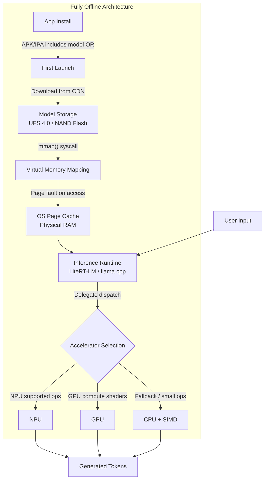

#### Model Distribution Strategies

| Strategy | Initial Download | App Store Size | Time-to-First-Use | Update Mechanism | Risk |
|----------|-----------------|---------------|-------------------|-----------------|------|
| Bundled in APK (Android AAB) | 0 bytes | +1-2 GB | Immediate | App update required | Play Store 4GB limit, review friction |
| Bundled in IPA (iOS) | 0 bytes | +1-2 GB | Immediate | App update required | App Store review, cellular download warnings |
| First-run CDN download | 1-2 GB | Small (~50MB) | 1-5 min on WiFi | Background model update | Requires initial connectivity, user abandonment |
| On-demand (lazy) download | Per-feature | Small | Delayed per feature | Granular updates | Complex state management, partial functionality |
| System-level (AICore/CoreML model catalog) | 0 (pre-installed) | 0 | Immediate | OS-managed | Vendor-controlled, limited model choice |
| Progressive/chunked download | Segmented | Small | Partial availability | Per-chunk updates | Incomplete model unusable, complex integrity checks |

#### Memory-Mapped Loading (mmap)

The `mmap()` system call maps a file directly into the process's virtual address space without copying data into a heap-allocated buffer:

```
// Conceptual flow:
fd = open("model.gguf", O_RDONLY)
weights_ptr = mmap(NULL, file_size, PROT_READ, MAP_PRIVATE, fd, 0)
// weights_ptr is now valid -- but no data loaded yet

// First access to weights_ptr[offset] triggers:
// 1. Page fault (hardware trap)
// 2. OS reads 4KB page from flash storage into page cache
// 3. Virtual page table updated to point to physical page
// 4. Instruction retries, succeeds

// Subsequent accesses to same page: direct physical memory read (~80ns)
// After memory pressure: OS evicts page, next access re-reads from flash
```

**Advantages for LLM weights:**
- Instant "load" time: mmap returns immediately, actual I/O is demand-paged
- No double-buffering: file data goes directly to page cache, accessible by inference engine
- OS manages memory pressure: if RAM is needed, model pages are evicted (clean pages, no writeback needed)
- Sequential scan pattern during decode: weights accessed layer-by-layer, enabling OS read-ahead prefetching
- GGUF and LiteRT flatbuffer formats align tensor data to page boundaries for optimal mmap behavior

**Performance characteristics on mobile storage:**

| Storage Type | Sequential Read | Random 4KB Read | Implication |
|-------------|----------------|-----------------|-------------|
| UFS 4.0 (flagship) | 4.2 GB/s | ~150K IOPS (600 MB/s) | First-access cold pages: ~7us per page |
| UFS 3.1 (mid-range) | 2.1 GB/s | ~80K IOPS (320 MB/s) | First-access: ~12us per page |
| eMMC 5.1 (budget) | 400 MB/s | ~15K IOPS (60 MB/s) | First-access: ~67us per page |
| NVMe SSD (laptop) | 7 GB/s | ~1M IOPS (4 GB/s) | First-access: ~1us per page |

After the first full decode pass, all weight pages are in the page cache (assuming sufficient RAM). Subsequent decode iterations run at DRAM speed, not flash speed. Cold start penalty applies only to the first few tokens.

#### Failure Modes and Mitigations

| Failure | Symptom | Mitigation |
|---------|---------|-----------|
| Insufficient storage for download | Silent failure, partial file | Check available space before download, require 2x model size (temp + final) |
| Model corruption on flash | Crash at load time, garbage output | SHA-256 checksum verification before mmap, re-download on mismatch |
| OS evicts model pages under pressure | Sudden latency spike mid-generation (page faults) | Pin critical pages with mlock() (requires elevated privileges), reduce context to lower memory pressure |
| Flash wear (frequent model updates) | Storage degradation over years | Minimize model update frequency, use append-only delta updates |
| App killed by OOM killer | Generation interrupted, no result | Serialize partial generation state, resume on restart |
| Device encryption overhead | 10-30% slower flash reads | Account for in performance estimates, no user mitigation |

### 8.2 Hybrid Edge + Cloud

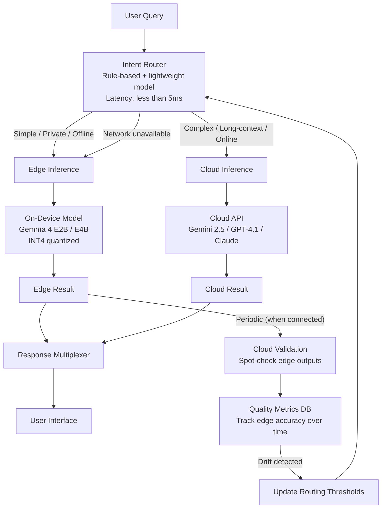

#### Three-Stage Cascaded Routing

**Stage 1: Intent Classification (< 5ms)**

Determines the broad category of the query using minimal computation:

| Method | Latency | Accuracy | Maintenance |
|--------|---------|----------|-------------|
| Rule-based (regex + keyword) | < 1ms | 75-85% | Manual rule updates required |
| TF-IDF + logistic regression | 1-3ms | 85-90% | Periodic retraining on labeled data |
| Tiny transformer (DistilBERT 6-layer, quantized) | 3-8ms | 90-95% | Model update with new categories |
| LLM self-classification (edge model) | 50-200ms | 95%+ | No maintenance (uses same model) |

For production: rule-based as first filter (catches obvious cases at near-zero cost), with tiny classifier as fallback for ambiguous inputs.

**Stage 2: Complexity Estimation**

Scores the query on dimensions that predict edge model success or failure:

```
def estimate_complexity(query, intent):
    scores = ComplexityScores()
    
    scores.input_length = count_tokens(query)
    scores.output_estimate = estimate_output_length(intent, query)
    scores.reasoning_depth = classify_reasoning(query)  // SINGLE_HOP, MULTI_HOP, CHAIN
    scores.domain_match = check_domain_coverage(query, edge_model_domains)
    scores.factuality_requirement = needs_current_facts(query)
    scores.language_complexity = assess_linguistic_difficulty(query)
    
    return scores
```

| Dimension | Edge-Suitable | Cloud-Required |
|-----------|--------------|----------------|
| Input tokens | < 512 | > 2048 |
| Expected output | < 256 tokens | > 1024 tokens |
| Reasoning depth | Single-hop extraction/classification | Multi-hop reasoning, planning |
| Domain | Trained domain (general knowledge) | Specialized/technical/current events |
| Factuality | Opinion, creative, extraction | Requires up-to-date factual accuracy |
| Language | Common languages (EN, ES, FR, etc.) | Low-resource languages |

**Stage 3: Cost-Aware Scheduling**

Runtime state factors that override complexity-based routing:

```
def route_query(query, device_state, network_state, policy):
    intent = classify_intent(query)
    complexity = estimate_complexity(query, intent)
    
    // Hard constraints (override everything)
    if policy.privacy_required(query):
        return EDGE  // sensitive data never leaves device
    if not network_state.is_available():
        return EDGE  // no choice
    if network_state.latency_ms > 2000:
        return EDGE  // cloud would be too slow
    
    // Soft constraints (cost optimization)
    if device_state.thermal_state == CRITICAL:
        if complexity.can_defer():
            return DEFER  // wait for cooldown
        return CLOUD  // offload to avoid throttling
    
    if device_state.battery_percent < 15 and not device_state.is_charging:
        return CLOUD  // preserve battery
    
    // Complexity-based routing
    if complexity.reasoning_depth > SINGLE_HOP:
        return CLOUD
    if complexity.input_length > policy.edge_context_limit:
        return CLOUD
    if complexity.factuality_requirement and complexity.domain_match < 0.7:
        return CLOUD
    
    return EDGE
```

#### Quality Monitoring and Drift Detection

Edge model outputs must be periodically validated against a stronger cloud model to detect quality drift:

```
def quality_monitoring_loop(edge_results_queue, cloud_client, config):
    sample_rate = config.validation_sample_rate  // e.g., 5% of edge responses
    
    for edge_result in edge_results_queue:
        if random() > sample_rate:
            continue
        if not network_available():
            buffer_for_later(edge_result)
            continue
        
        cloud_judgment = cloud_client.evaluate(
            query=edge_result.query,
            edge_response=edge_result.response,
            criteria=["factual_accuracy", "completeness", "coherence"]
        )
        
        metrics_db.record(
            timestamp=now(),
            intent=edge_result.intent,
            edge_score=cloud_judgment.score,
            failure_mode=cloud_judgment.failure_type
        )
        
        // Detect drift: if rolling accuracy drops below threshold
        rolling_accuracy = metrics_db.rolling_mean(window=100, intent=edge_result.intent)
        if rolling_accuracy < config.accuracy_threshold:
            alert_and_adjust_routing(edge_result.intent, rolling_accuracy)
```

### 8.3 Splitwise: Learned Edge-Cloud Partitioning

Beyond binary routing (full-edge or full-cloud), Splitwise (arXiv:2311.18677) partitions individual model layers between edge and cloud devices.

**Core concept:**

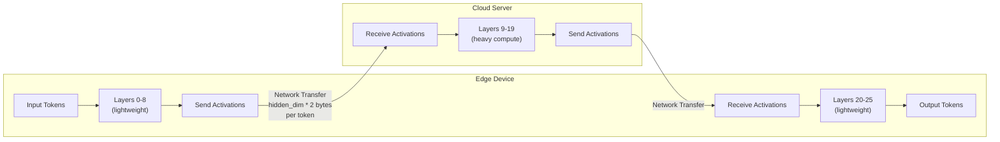

**How the partition is determined:**
- Each layer has measurable compute cost (FLOPS) and produces intermediate activations of known size
- Network bandwidth between edge and cloud is measured/estimated
- Optimization problem: minimize total latency = edge_compute + transfer_time + cloud_compute
- Solved via Lyapunov-assisted deep reinforcement learning that adapts to changing network conditions

**Activation transfer overhead:**
```
transfer_per_boundary = hidden_dim * dtype_bytes * num_tokens_in_flight
For Gemma 4 E2B (hidden_dim=2048, FP16): 2048 * 2 = 4KB per token per boundary
For single token decode with 2 boundaries: 8KB per decode step
At 10 Mbps bandwidth: 8KB / (10 Mbps / 8) = 6.4ms per decode step overhead
At 100 Mbps bandwidth: 0.64ms per decode step overhead
```

**Performance characteristics:**

| Network Condition | Full Edge (E2B) | Full Cloud (Gemini Flash) | Splitwise | Best Choice |
|-------------------|----------------|--------------------------|-----------|-------------|
| WiFi (100 Mbps, 10ms RTT) | 22 tok/s | 45 tok/s (after 30ms TTFT) | 35 tok/s | Cloud or Splitwise |
| 4G (20 Mbps, 50ms RTT) | 22 tok/s | 20 tok/s (high RTT) | 28 tok/s | Splitwise |
| 5G (200 Mbps, 15ms RTT) | 22 tok/s | 50 tok/s | 40 tok/s | Cloud |
| Poor connectivity (2 Mbps) | 22 tok/s | 3 tok/s | 15 tok/s | Edge or Splitwise |
| Offline | 22 tok/s | N/A | N/A | Edge |

**Trade-offs:**
- Requires persistent low-latency connection (>20 Mbps, <50ms RTT for benefit)
- Activation data crossing network boundary is unencrypted intermediate representations -- potential privacy concern (partial model inversion attacks possible)
- Complexity: runtime must manage network monitoring, fallback to full-edge on disconnect, re-partitioning on bandwidth change
- Not suitable for offline-first architectures
- Energy savings (up to 41%): heavy layers offloaded to cloud reduce on-device compute and thermal load

### 8.4 Real-Time vs Background Inference

| Dimension | Real-Time Inference | Background Inference |
|-----------|-------------------|---------------------|
| Trigger | User action (message sent, voice query) | System event (new email, document opened, scheduled) |
| Latency SLA | TTFT < 500ms, ITL < 50ms (20+ tok/s) | Total completion within minutes acceptable |
| Thermal budget | Short burst (5-30s), can use peak performance | Long duration (minutes-hours), must stay below sustained thermal envelope |
| Power strategy | Accept high drain for responsiveness | Minimize drain, prefer efficiency cores |
| Scheduling | Immediate, highest priority, preempts background | Deferred to idle periods, charging state, thermal headroom |
| Model selection | Smallest model meeting quality bar (E2B) | Can use larger model (E4B) if time budget allows |
| Context strategy | Minimal context (recent messages only) | Full document context acceptable |
| Failure handling | Timeout and show error after 10s | Retry silently, show result when ready |

#### Thermal-Aware Scheduling Implementation

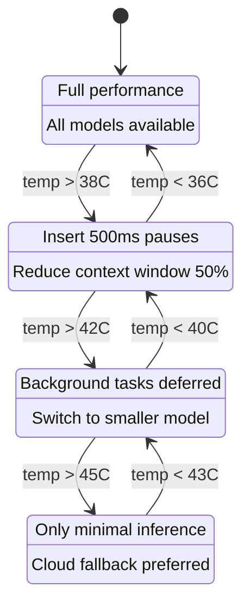

```
def thermal_aware_scheduler(task, device):
    thermal = device.get_thermal_state()  // Android: PowerManager, iOS: ProcessInfo
    battery = device.get_battery_state()
    
    if thermal == NOMINAL:
        return execute_standard(task)
    
    elif thermal == WARNING:
        if task.type == BACKGROUND:
            task.insert_inter_token_pause(500)  // reduce heat generation rate
            task.reduce_context(factor=0.5)
        return execute_standard(task)
    
    elif thermal == CRITICAL:
        if task.type == BACKGROUND:
            return defer_until(thermal < WARNING)
        // Real-time task: degrade gracefully
        task.switch_model(SMALLEST_AVAILABLE)
        task.reduce_context(factor=0.25)
        task.set_max_output_tokens(64)
        return execute_degraded(task)
    
    elif thermal == THROTTLED:
        if task.type == BACKGROUND:
            return defer_until(thermal < WARNING)
        if network_available():
            return route_to_cloud(task)
        // Last resort: minimal local inference
        task.switch_model(SMALLEST_AVAILABLE)
        task.set_max_output_tokens(32)
        return execute_minimal(task)
```

**Platform-specific thermal APIs:**

| Platform | API | States | Granularity |
|----------|-----|--------|-------------|
| Android | PowerManager.getThermalStatus() | NONE, LIGHT, MODERATE, SEVERE, CRITICAL, EMERGENCY, SHUTDOWN | 7 levels |
| Android | PowerManager.addThermalStatusListener() | Callback on state change | Event-driven |
| iOS | ProcessInfo.thermalState | nominal, fair, serious, critical | 4 levels |
| iOS | NotificationCenter (thermalStateDidChangeNotification) | Callback on state change | Event-driven |
| Linux (Jetson) | /sys/class/thermal/thermal_zone*/temp | Raw millidegrees Celsius | Continuous |

#### Background Inference Patterns

**Document indexing on-device:**
```
def background_index_documents(documents, model, device):
    for doc in documents:
        // Only process during favorable conditions
        if not device.is_charging and device.battery < 30:
            yield PAUSE_UNTIL_CHARGING
        if device.thermal_state > NOMINAL:
            yield PAUSE_UNTIL_COOL
        
        summary = model.generate(
            prompt=f"Extract key entities and summary: {doc.text[:1024]}",
            max_tokens=128,
            use_efficiency_cores=True
        )
        index_db.store(doc.id, summary, embedding=model.embed(doc.text[:512]))
        
        // Rate limit: one document per 5 seconds to avoid thermal buildup
        yield SLEEP(5000)
```

**Smart reply pre-computation:**
```
def precompute_smart_replies(messages, model):
    // Triggered when new message notification arrives but screen is off
    // Goal: have reply suggestions ready when user opens conversation
    
    if device.thermal_state > WARNING:
        return  // skip, user will wait for real-time generation
    
    context = format_recent_messages(messages, max_tokens=256)
    replies = model.generate(
        prompt=f"Generate 3 brief reply options:\n{context}\nReplies:",
        max_tokens=64,
        temperature=0.7,
        num_sequences=3,
        use_efficiency_cores=True
    )
    cache_replies(messages[-1].id, replies)
```

### 8.5 Model Update and Versioning

**Over-the-air model updates:**

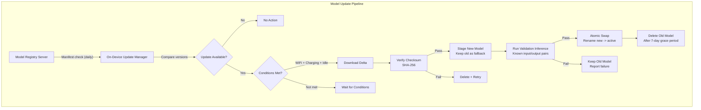

**Delta updates for large models:**

Full model re-download (1-2 GB) is expensive on cellular networks. Delta update strategies:

| Strategy | Download Size | Complexity | Applicability |
|----------|-------------|-----------|---------------|
| Full replacement | 100% of model size | Low | Major architecture changes |
| Binary diff (bsdiff) | 10-40% of model size | Medium | Minor weight updates, fine-tuning |
| Layer-granular update | Size of changed layers only | Medium | When specific layers are retrained |
| LoRA adapter download | 1-5% of model size | Low | Task-specific adaptations |
| Quantization table update | < 1MB | Very low | Recalibrated quantization parameters |

**Atomic model swap:**
```
// Ensure inference never reads a partially-written model
def atomic_model_update(new_model_path, active_model_path):
    staged_path = active_model_path + ".staged"
    backup_path = active_model_path + ".backup"
    
    // Stage: download and verify new model at staged_path
    verify_checksum(staged_path, expected_hash)
    
    // Validate: run inference on known test inputs
    if not validate_model(staged_path):
        delete(staged_path)
        report_failure()
        return
    
    // Atomic swap (rename is atomic on most filesystems)
    rename(active_model_path, backup_path)   // old -> backup
    rename(staged_path, active_model_path)   // staged -> active
    
    // Next inference will mmap the new file
    // Keep backup for 7 days in case of subtle quality regression
    schedule_delete(backup_path, delay=7_DAYS)
```

### 8.6 Multi-Model Orchestration

Complex on-device AI features often require multiple models working together:

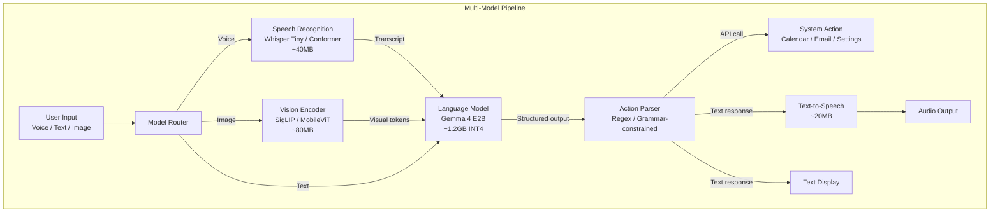

**Memory management for multi-model:**

Total available memory must be shared across all loaded models. Strategies:

| Strategy | Memory Efficiency | Latency Impact | Implementation |
|----------|------------------|----------------|----------------|
| All models resident | Worst (sum of all models) | Best (no load time) | Only feasible on 12GB+ devices |
| LRU model swapping | Good (max 2 models + swap) | Moderate (500ms-2s swap) | mmap + page cache handles naturally |
| Sequential pipeline | Best (1 model at a time) | Worst (reload per stage) | Explicit load/unload between stages |
| Shared backbone + adapters | Excellent (1 backbone + small adapters) | Good (adapter swap is fast) | Requires compatible model architecture |

**Pipeline scheduling for latency hiding:**
```
// Overlap model loading with computation
async def voice_assistant_pipeline(audio_input):
    // Start ASR immediately (small model, likely cached)
    transcript_future = async asr.transcribe(audio_input)
    
    // While ASR runs, ensure LLM pages are in cache
    prefetch_model_pages("gemma4_e2b.bin", priority=HIGH)
    
    transcript = await transcript_future
    
    // LLM inference (pages already in cache from prefetch)
    response = llm.generate(transcript, max_tokens=128)
    
    // Start TTS while streaming LLM output
    tts_future = async tts.synthesize(response.first_sentence)
    
    // Return audio as soon as first sentence is ready
    return await tts_future, response.remaining_stream
```

### 8.7 Security Considerations for Edge Deployment

**Model theft protection:**

On-device models are physically accessible to motivated attackers. Protection layers:

| Protection | Against | Strength | Performance Cost |
|-----------|---------|----------|-----------------|
| App-level encryption (AES-256) | Casual extraction | Low (key in app binary) | 5-10% load time increase |
| Hardware-backed keystore (TEE) | Rooted device extraction | Medium | < 1% runtime overhead |
| Code obfuscation (ProGuard/R8) | Reverse engineering of inference code | Low | None at runtime |
| Integrity verification (SafetyNet/App Attest) | Modified app environments | Medium | One-time check at launch |
| Watermarking (model fingerprinting) | Detecting stolen/redistributed models | High (post-hoc detection) | None |
| Federated model (no full weights on device) | Complete model extraction | High | Requires connectivity |

**Practical assessment:** A determined attacker with a rooted device can extract any locally-stored model. The goal is not perfect protection but raising the cost of extraction above the value of the model. For open-weight models (Gemma, Llama), this is less relevant. For proprietary models deployed to edge, consider:
- Only deploying quantized/distilled versions (reduced value if extracted)
- Model watermarking for post-hoc detection of unauthorized redistribution
- Legal protections (license terms) as primary defense

**Prompt injection on edge:**

Edge models are equally vulnerable to prompt injection as cloud models. Additional edge-specific concerns:
- No server-side input sanitization layer
- Limited output filtering budget (compute-constrained)
- System prompts stored locally (extractable on rooted devices)

Mitigation: structured output schemas with grammar-constrained decoding prevent injection from producing arbitrary tool calls or system actions. The model can only output tokens matching a predefined grammar, limiting the damage surface.

### 8.8 Observability and Telemetry

**What to measure in production edge deployments:**

| Metric Category | Specific Metrics | Collection Method | Privacy Consideration |
|----------------|-----------------|-------------------|----------------------|
| Performance | TTFT, ITL, total latency, tok/s | On-device instrumentation | Safe (no user content) |
| Quality | User edits/rejections, regeneration rate | Implicit feedback signals | Safe (aggregate only) |
| Reliability | Crash rate, OOM kills, delegate failures | Crash reporting (Firebase/Sentry) | Safe (stack traces only) |
| Resource | Peak RAM, thermal state, battery drain per session | System API monitoring | Safe (device metrics only) |
| Usage | Feature adoption, session length, context sizes | Analytics events | Minimal PII risk |
| Model | Token acceptance rate (speculative), cache hit rate | Runtime counters | Safe |

**Telemetry pipeline:**

```
def collect_inference_metrics(session):
    metrics = InferenceMetrics(
        session_id=anonymized_hash(session.id),
        device_class=classify_device(device.model),  // "flagship_2024", not exact model
        model_version=model.version_hash[:8],
        ttft_ms=session.time_to_first_token,
        avg_itl_ms=session.mean_inter_token_latency,
        total_tokens=session.total_generated_tokens,
        peak_memory_mb=session.peak_memory_usage,
        thermal_state_at_start=session.initial_thermal,
        thermal_state_at_end=session.final_thermal,
        delegate_used=session.accelerator,  // "npu", "gpu", "cpu"
        context_length=session.input_token_count,
        // NEVER log: prompt text, response text, user identifiers
    )
    
    // Batch and send when on WiFi + unmetered
    telemetry_buffer.append(metrics)
    if should_flush(telemetry_buffer):
        send_batch(telemetry_buffer)
        telemetry_buffer.clear()
```

**Alerting on quality regression:**
- If P95 TTFT increases >50% across a device class after a model or OS update
- If crash rate exceeds 0.1% of inference sessions
- If user regeneration rate increases >20% (proxy for quality drop)
- If average session length drops >30% (users abandoning feature)

These metrics inform decisions about model updates, routing threshold adjustments, and hardware-specific optimizations.

---

## References

- ARM KleidiAI: https://gitlab.arm.com/kleidi/kleidiai
- LiteRT (formerly TensorFlow Lite): https://ai.google.dev/edge/litert
- llama.cpp: https://github.com/ggerganov/llama.cpp
- MLX: https://github.com/ml-explore/mlx
- Flash Attention: https://arxiv.org/abs/2205.14135
- Splitwise: https://arxiv.org/abs/2311.18677
- Qualcomm QNN SDK: https://developer.qualcomm.com/software/qualcomm-ai-engine-direct
- Apple Core ML: https://developer.apple.com/documentation/coreml
- NVIDIA Jetson: https://developer.nvidia.com/embedded-computing
- Hailo: https://hailo.ai/products/ai-accelerators/
- vLLM PagedAttention: https://arxiv.org/abs/2309.06180
- GGUF Format: https://github.com/ggerganov/ggml/blob/master/docs/gguf.md
- Android Thermal API: https://developer.android.com/reference/android/os/PowerManager
- MediaPipe LLM Inference: https://ai.google.dev/edge/mediapipe/solutions/genai/llm_inference

## 9. Tooling Ecosystem

This section provides a rigorous technical breakdown of the primary inference runtimes and tooling for deploying LLMs and other models on edge devices. For each tool: architecture, model support, quantization capabilities, operational characteristics, and failure modes.

---

### 9.1 llama.cpp

**What it is:** A C/C++ inference engine purpose-built for LLM inference. Single-binary deployment. Supports 120+ model architectures. The dominant open-source tool for desktop and server LLM inference.

**Architecture: Two-Library Stack**

The codebase is organized into two distinct layers:

1. **GGML (General-purpose GPU/ML Library):** Low-level tensor computation engine.
   - Lazy evaluation graph: operations are recorded into a computation graph, then executed in a single pass. This enables backend-specific fusion and scheduling.
   - Backend vtable system: compile-time registration of compute backends. Each backend (CPU, CUDA, Metal, Vulkan, SYCL, Kompute) implements a standard interface for tensor allocation, data transfer, and kernel dispatch.
   - Quantization types implemented at the tensor level: Q4_0, Q4_1, Q5_0, Q5_1, Q8_0, Q2_K, Q3_K, Q4_K, Q5_K, Q6_K, IQ1_S, IQ2_XXS, IQ2_XS, IQ2_S, IQ3_XXS, IQ3_S, IQ4_XS, IQ4_NL. Each type defines its own block structure, dequantization kernel, and dot-product implementation.
   - Memory management: custom allocator with buffer pools per backend. Supports memory mapping (mmap) for zero-copy model loading from disk.

2. **libllama:** LLM-specific inference layer built on GGML.
   - Tokenization: BPE, SentencePiece, WordPiece implementations. Tokenizer metadata stored in GGUF model file.
   - KV cache management: pre-allocated contiguous buffer. Supports cache shifting (sliding window), cache quantization (Q8_0/Q4_0 KV), and defragmentation.
   - Sampling: temperature, top-k, top-p (nucleus), min-p, typical, mirostat v1/v2, repetition penalty, grammar-constrained sampling (GBNF grammars).
   - Chat templates: Jinja2-compatible template engine. Templates stored in GGUF metadata. Handles system prompts, multi-turn formatting, tool-call syntax.
   - Batch processing: multiple sequences processed concurrently with shared prefill. Continuous batching for server workloads.

**GGUF Format**

Self-contained binary format. Structure:

```
[Magic: "GGUF"] [Version: uint32] [Tensor Count: uint64] [Metadata KV Count: uint64]
[Metadata Key-Value Pairs...]
  - general.architecture: string (e.g., "llama", "gemma2")
  - general.name: string
  - llama.context_length: uint32
  - llama.embedding_length: uint32
  - tokenizer.ggml.model: string
  - tokenizer.ggml.tokens: string[]
  - ...
[Tensor Info Array...]
  - name: string, dimensions: uint32[], type: enum (Q4_K_M, etc.), offset: uint64
[Alignment Padding]
[Tensor Data (quantized weights)]
```

Designed for mmap: tensor data section is page-aligned. The OS loads pages on-demand as they are accessed during inference. On memory-constrained systems, the OS can evict pages and re-load them transparently, effectively using disk as an extension of RAM (at the cost of I/O latency).

**Server Mode**

Built-in HTTP server with OpenAI-compatible API endpoints:

| Endpoint | Function | Notes |
|----------|----------|-------|
| `/v1/chat/completions` | Chat completion | Streaming via SSE |
| `/v1/completions` | Text completion | Raw prompt, no template |
| `/v1/embeddings` | Embedding extraction | Requires embedding model |
| `/health` | Health check | Returns model load status |
| `/slots` | Slot management | View/modify concurrent slots |

Concurrency model: fixed number of inference slots (configurable). Each slot maintains independent KV cache and generation state. Requests are queued and assigned to available slots. Not a thread-per-request model; inference is executed on a shared thread pool.

**Quantization Type Comparison**

| Type | Bits/Weight | Block Size | Perplexity Impact | Speed (CPU) | Use Case |
|------|-------------|------------|-------------------|-------------|----------|
| Q8_0 | 8.5 | 32 | ~0.01 PPL | Baseline | Quality-critical, enough RAM |
| Q6_K | 6.5 | 256 | ~0.02 PPL | ~1.05x | High quality, moderate savings |
| Q5_K_M | 5.5 | 256 | ~0.04 PPL | ~1.1x | Good balance |
| Q4_K_M | 4.8 | 256 | ~0.08 PPL | ~1.2x | Default recommendation |
| Q4_0 | 4.5 | 32 | ~0.15 PPL | ~1.3x | Legacy, fast dequant |
| Q3_K_M | 3.9 | 256 | ~0.25 PPL | ~1.15x | Tight memory, accept quality loss |
| IQ4_XS | 4.25 | 256 | ~0.06 PPL | ~1.1x | Best quality at ~4 bits |
| IQ3_XXS | 3.06 | 256 | ~0.40 PPL | ~1.0x | Extreme compression |
| IQ2_XXS | 2.06 | 256 | ~1.0+ PPL | ~0.9x | Research only, severe degradation |

The IQ (importance-quantized) series uses non-uniform codebooks derived from lattice quantization. Higher computational cost during dequantization but better accuracy per bit than K-quant types at equivalent bit widths.

**When to use:** Desktop/laptop inference, CPU-first deployment, prototyping, any platform where a single-binary LLM server is needed. Broadest model architecture support in the ecosystem.

**Trade-offs:**
- Not a general ML framework. LLM-only. Cannot run vision-only or audio-only models (unless they are part of a multimodal LLM architecture).
- Custom op support is limited. Adding a new layer type requires C/C++ implementation in GGML.
- No official mobile SDK. Community ports (llama.cpp-android, llama.cpp-swift) exist but are not first-party maintained.
- Server mode is single-model. Running multiple models requires multiple server instances.

**Key links:**
- [llama.cpp GitHub](https://github.com/ggerganov/llama.cpp)
- [Architecture guide (Read OSS)](https://readoss.com/en/ggml-org/llama.cpp/llama-cpp-architecture-map-of-the-codebase)
- [GGUF specification](https://github.com/ggerganov/ggml/blob/master/docs/gguf.md)

---

### 9.2 TensorFlow Lite / LiteRT

**What it is:** Lightweight inference runtime originally from Google, now rebranded as LiteRT under Google AI Edge. Designed for mobile and embedded deployment with a ~1MB core binary.

**Architecture**

Interpreter-based execution model. The runtime loads a FlatBuffer-encoded model, builds an execution plan, and dispatches operations to delegates based on hardware availability and op support.

Execution flow:

```
Model (.tflite) --> FlatBuffer Deserialization --> Op Resolution --> Delegate Partitioning
--> Subgraph Execution --> Output Tensor Retrieval
```

The delegate system is the key architectural feature. Each delegate claims a subset of ops it can accelerate. The runtime partitions the computation graph: delegated subgraphs run on accelerated hardware, remaining ops fall back to the CPU reference implementation. This partitioning happens at model load time, not per-inference.

**Delegate Comparison**

| Delegate | Target Hardware | Precision | Latency Profile | Status |
|----------|----------------|-----------|-----------------|--------|
| XNNPACK | CPU (x86, ARM) | FP32, FP16, INT8 | Predictable, no warmup | Active, default CPU |
| GPU Delegate | Mobile GPU (OpenGL ES 3.1, Vulkan) | FP16, FP32 | Fast for large tensors, overhead for small | Active |
| NNAPI | Android SoC (NPU/GPU/DSP) | INT8, INT4 | Vendor-dependent | Deprecated (Android 15+) |
| Hexagon | Qualcomm DSP | INT8 | Low power, high latency for large models | Deprecated, migrate to QNN |
| Core ML | Apple ANE/GPU | FP16, INT8 | ANE: batch efficient, GPU: streaming | Active |
| QNN | Qualcomm Hexagon/Adreno | INT8, INT4 | Replaces NNAPI/Hexagon on Qualcomm | Active |

**XNNPACK details:** Optimized CPU microkernel library. Implements hand-tuned assembly for critical operations (GEMM, convolution, depthwise conv) on ARM NEON, ARM SVE, x86 AVX2/AVX-512, and WebAssembly SIMD. Indirect convolution algorithm eliminates im2col overhead. The default CPU delegate for all TFLite deployments.

**GPU Delegate details:** Two backends: OpenGL ES 3.1 (compute shaders) and Vulkan. The delegate compiles the subgraph into GPU shader programs at model initialization. First inference includes shader compilation overhead (can be significant: 2-10 seconds for large models). Subsequent inferences reuse compiled shaders. Serialized compilation cache available to avoid cold-start penalty.

**NNAPI Delegate deprecation:** NNAPI (Android Neural Networks API) is deprecated starting Android 15. Existing deployments continue to work but no new features or driver optimizations. Migration path: QNN delegate for Qualcomm SoCs, GPU delegate for other vendors. The deprecation reflects the reality that vendor-specific delegates (QNN, Samsung Eden) outperform the generic NNAPI abstraction.

**Model Format**

`.tflite` files use FlatBuffers serialization. Key properties:
- Zero-copy deserialization: model can be memory-mapped and accessed directly without parsing
- Quantization metadata embedded: per-tensor scale and zero-point for INT8, per-channel quantization supported
- Operator versioning: each op has a version number, runtime rejects models with unsupported op versions
- Model size: typically 10-50% smaller than equivalent ONNX due to FlatBuffer efficiency

**Quantization via TFLite Converter**

```python
import tensorflow as tf

converter = tf.lite.TFLiteConverter.from_saved_model("saved_model_dir")

# Post-training dynamic range quantization (weights only)
converter.optimizations = [tf.lite.Optimize.DEFAULT]

# Post-training full integer quantization (weights + activations)
converter.optimizations = [tf.lite.Optimize.DEFAULT]
converter.representative_dataset = representative_data_gen
converter.target_spec.supported_ops = [tf.lite.OpsSet.TFLITE_BUILTINS_INT8]
converter.inference_input_type = tf.int8
converter.inference_output_type = tf.int8

# FP16 quantization
converter.optimizations = [tf.lite.Optimize.DEFAULT]
converter.target_spec.supported_types = [tf.float16]

tflite_model = converter.convert()
```

**When to use:** Android-first deployment, vision/audio models on mobile, when runtime binary size is a hard constraint (<1MB), when targeting the broadest set of Android devices including low-end.

**Trade-offs:**
- Limited dynamic shape support. Most models require fixed input shapes or a small set of pre-defined shapes.
- Transformer/LLM support has improved significantly but the ecosystem historically favored CNNs and smaller models. For LLM workloads, LiteRT-LM (Section 9.3) is the recommended path.
- NNAPI deprecation requires active migration planning for existing deployments.
- Delegate partitioning can introduce unexpected performance cliffs: if a single unsupported op breaks a subgraph, the entire subgraph falls back to CPU.

**Key links:**
- [Google AI Edge LiteRT](https://ai.google.dev/edge/litert)
- [TFLite Model Optimization](https://www.tensorflow.org/lite/performance/model_optimization)
- [XNNPACK delegate](https://github.com/google/XNNPACK)

---

### 9.3 LiteRT-LM

**What it is:** LLM-specific inference layer built on the LiteRT runtime. Handles autoregressive generation, KV cache lifecycle, tokenization, and model management. This is the runtime powering on-device AI in Chrome, Chromebook Plus, and Pixel Watch.

**Architecture**

LiteRT-LM sits between the application and the LiteRT runtime, providing LLM-specific abstractions:

```
Application Code
    |
    v
LiteRT-LM API (Python / Android SDK / iOS SDK / CLI)
    |-- Tokenizer (SentencePiece, BPE)
    |-- Generation loop (autoregressive decode)
    |-- KV cache manager (allocate, update, evict)
    |-- Prompt processing (prefill with chunking)
    v
LiteRT Runtime
    |-- Delegate dispatch (GPU, NPU, CPU)
    v
Hardware (GPU via Vulkan/Metal/OpenGL, NPU via QNN/NNAPI, CPU via XNNPACK/KleidiAI)
```

**API Surface**

In-process library. No HTTP server; the application links directly against the LiteRT-LM library and calls inference functions.

Python:

```python
from litert_lm import LiteRtLm

model = LiteRtLm.from_huggingface(
    repo_id="litert-community/gemma-4-E2B-it-litert-lm",
    backend="gpu"  # or "cpu", "npu"
)

session = model.create_session(max_context_length=2048)

for token in session.generate("Explain attention mechanisms in transformers."):
    print(token, end="", flush=True)
```

Android (Kotlin):

```kotlin
val model = LiteRtLmModel.fromHuggingFace(
    repoId = "litert-community/gemma-4-E2B-it-litert-lm",
    context = applicationContext
)

val session = model.createSession(maxContextLength = 2048)

session.generateStream("Summarize this document: $text") { token ->
    appendToUI(token)
}
```

CLI:

```bash
litert-lm run \
    --from-huggingface-repo=litert-community/gemma-4-E2B-it-litert-lm \
    --backend=gpu \
    --max-context-length=2048 \
    --prompt="Hello, world"
```

**Model Format**

`.litertlm` — a packaging format containing:
- Quantized model weights (INT4 or INT8)
- Tokenizer vocabulary and configuration
- Model metadata (architecture, context length, special tokens)
- Memory mapping support for efficient loading

**Hardware Acceleration**

| Accelerator | Backend | Quantization | Platform |
|-------------|---------|--------------|----------|
| GPU | Vulkan | INT4, INT8, FP16 | Android, Linux, Windows (WSL) |
| GPU | Metal | INT4, INT8, FP16 | macOS, iOS |
| GPU | OpenGL ES | FP16 | Android (fallback) |
| NPU | QNN | INT8, INT4 | Qualcomm Snapdragon |
| NPU | NNAPI | INT8 | Android (legacy) |
| CPU | XNNPACK | INT8, FP32 | All platforms |
| CPU | KleidiAI | INT4, INT8 | ARM (optimized microkernels) |

KleidiAI is notable: ARM-developed micro-kernels specifically optimized for LLM inference patterns (large matrix-vector products during decode, large matrix-matrix products during prefill) on ARM CPUs. Delivers measurable speedups over generic XNNPACK on Cortex-A series processors.

**When to use:** On-device LLM deployment targeting Android, iOS, or embedded Linux. When the same runtime must work across mobile and desktop. When deploying Gemma-family models (first-class support with pre-converted models available on Hugging Face). When integration with Google AI Edge ecosystem is desired.

**Trade-offs:**
- Newer ecosystem than llama.cpp. Community model coverage is still growing; not all Hugging Face models have `.litertlm` conversions.
- Desktop GPU support requires Vulkan. On Windows, WSL is recommended for GPU acceleration (native Windows Vulkan support is in progress).
- No HTTP server mode. Applications must integrate the library directly. For serving use cases, a custom wrapper is needed.
- In-process execution means the model shares the application's memory space and crash domain.

**Key links:**
- [LiteRT-LM documentation](https://ai.google.dev/edge/litert/lm)
- [MediaPipe LLM Inference API](https://ai.google.dev/edge/mediapipe/solutions/genai/llm_inference)
- [Gemma 4 E2B LiteRT model](https://huggingface.co/litert-community/gemma-4-E2B-it-litert-lm)

---

### 9.4 ONNX Runtime

**What it is:** Microsoft's cross-platform inference engine. Uses the ONNX (Open Neural Network Exchange) model format with an Execution Provider (EP) abstraction layer for hardware dispatch. The most broadly cross-platform runtime available.

**Architecture**

```
ONNX Model (.onnx)
    |
    v
Session Creation
    |-- Graph loading and validation
    |-- Graph optimization (constant folding, node fusion)
    |-- EP partitioning (assign subgraphs to best available EP)
    v
Inference Execution
    |-- EP dispatches subgraphs to hardware
    |-- CPU EP handles unsupported ops (fallback)
    v
Output Tensors
```

The EP abstraction is the core architectural principle. Each EP registers the set of ONNX operators it supports. During session creation, the runtime assigns each node to the highest-priority EP that supports it. Nodes not claimed by any accelerated EP fall back to the CPU EP.

EP priority is user-configurable. Typical priority chain:

```python
import onnxruntime as ort

session = ort.InferenceSession("model.onnx", providers=[
    ("TensorrtExecutionProvider", {"device_id": 0}),   # Try TensorRT first
    ("CUDAExecutionProvider", {"device_id": 0}),        # Fall back to CUDA
    "CPUExecutionProvider"                                # Final fallback
])
```

**Execution Provider Comparison**

| EP | Target | Quantization | Binary Size Impact | Warmup | Throughput |
|----|--------|--------------|-------------------|--------|------------|
| CPU | x86/ARM | INT8, INT4 | Baseline (~5MB) | None | Baseline |
| CUDA | NVIDIA GPU | FP16, INT8 | +cuDNN/cuBLAS libs | Kernel compilation | 5-20x CPU |
| TensorRT | NVIDIA GPU | FP16, INT8, FP8, INT4 | +TRT libs (~500MB) | Engine build (minutes) | 1.2-2x CUDA |
| DirectML | Windows GPU | FP16 | +DirectML.dll (~15MB) | Shader compile | 3-10x CPU |
| Core ML | Apple ANE/GPU | FP16, INT8 | Built into macOS/iOS | Model compile | 5-15x CPU |
| QNN | Qualcomm | INT8, INT4 | +QNN libs | Context build | NPU-dependent |
| NNAPI | Android | INT8 | Built into Android | Driver init | Device-dependent |
| OpenVINO | Intel CPU/GPU/NPU | INT8, INT4 | +OpenVINO libs | Model compile | 1.5-3x CPU EP |

**Graph Optimization Levels**

| Level | Optimizations Applied | Session Creation Time | Use Case |
|-------|----------------------|----------------------|----------|
| ORT_DISABLE_ALL (0) | None | Fastest | Debugging |
| ORT_ENABLE_BASIC (1) | Constant folding, redundant node elimination, semantics-preserving rewrites | Fast | Default |
| ORT_ENABLE_EXTENDED (2) | Level 1 + transformer-specific fusions (Attention, GELU+MatMul, LayerNorm+Bias, SkipLayerNorm, EmbedLayerNorm) | Moderate | LLM/Transformer models |
| ORT_ENABLE_ALL (99) | Level 2 + layout transformations (NCHW to NHWC for CPU), all available optimizations | Slow | Production deployment |

Node fusion is the primary optimization for transformer models. The runtime recognizes patterns like:

```
MatMul -> Add -> GELU  -->  fused BiasGelu
Q -> K -> V -> MatMul -> Softmax -> MatMul  -->  fused MultiHeadAttention
LayerNorm -> Add  -->  fused SkipLayerNormalization
```

These fused nodes use hand-optimized kernels that eliminate intermediate tensor allocation and memory bandwidth overhead.

**Serializing optimized graphs:**

```python
so = ort.SessionOptions()
so.graph_optimization_level = ort.GraphOptimizationLevel.ORT_ENABLE_ALL
so.optimized_model_filepath = "optimized_model.onnx"

session = ort.InferenceSession("model.onnx", so)
# Optimized graph is saved; subsequent loads skip optimization
```

**Quantization Tooling**

Built-in post-training quantization with two modes:

| Mode | Approach | Accuracy | Speed | Calibration |
|------|----------|----------|-------|-------------|
| Dynamic | Weights: INT8. Activations: quantized at runtime per-inference | Higher | Moderate (runtime quant overhead) | None needed |
| Static | Weights + activations: INT8. Scales computed from calibration data | Lower overhead | Fastest | Required (100-500 samples) |

Calibration methods for static quantization:

| Method | Approach | Best For |
|--------|----------|----------|
| MinMax | Uses observed min/max of activations | General purpose, simple |
| Entropy | Minimizes KL divergence between FP32 and INT8 distributions | Models sensitive to outliers |
| Percentile | Clips activations at Nth percentile (default 99.999) | Models with rare extreme activations |

QDQ (Quantize-Dequantize) representation:

```
Original:    Input -> Conv -> Output
QDQ:         Input -> QuantizeLinear -> DequantizeLinear -> Conv -> QuantizeLinear -> DequantizeLinear -> Output
```

QDQ nodes explicitly represent quantization boundaries in the graph. Hardware-aware EPs (TensorRT, QNN) fuse QDQ nodes into quantized kernels. The CPU EP executes them as explicit quantize/dequantize operations.

INT4 block quantization support:

```python
from onnxruntime.quantization import quantize, QuantType

quantize(
    model_input="model.onnx",
    model_output="model_int4.onnx",
    weight_type=QuantType.QInt4,
    block_size=32,  # 32 weights share one scale factor
)
```

**When to use:** When a single model must run on Android + iOS + Windows + Linux + server. Maximum hardware coverage through the EP system. When targeting Windows desktops specifically (DirectML EP gives vendor-agnostic GPU acceleration on AMD, Intel, and NVIDIA).

**Trade-offs:**
- Binary size is significantly larger than TFLite (~5-15MB core runtime vs <1MB).
- Not all EPs support all ONNX operators. An unsupported op causes fallback to CPU, potentially creating a performance cliff where most computation runs on GPU but one op forces a GPU-to-CPU data transfer.
- ONNX opset coverage can lag behind the latest model architectures. Custom ops in PyTorch may not have ONNX equivalents, requiring manual operator registration.
- TensorRT EP requires engine building on first run (can take minutes for large models). Engine is hardware-specific and not portable across GPU architectures.

**Key links:**
- [ONNX Runtime](https://onnxruntime.ai/)
- [Graph optimizations](https://onnxruntime.ai/docs/performance/model-optimizations/graph-optimizations.html)
- [Quantization](https://onnxruntime.ai/docs/performance/model-optimizations/quantization.html)
- [Execution Providers](https://onnxruntime.ai/docs/execution-providers/)

---

### 9.5 Core ML

**What it is:** Apple's on-device ML runtime, integrated into iOS, macOS, watchOS, tvOS, and visionOS. Dispatches computation across CPU, GPU, and Neural Engine (ANE) based on compute unit availability and per-op support.

**Architecture**

Core ML operates at two levels:

1. **Model compilation:** At app install (or first load), Core ML compiles the model for the target hardware. The compilation step selects compute units, optimizes data layout, and pre-allocates buffers.
2. **Inference:** The compiled model executes predictions. The runtime manages data transfer between compute units (CPU/GPU/ANE share unified memory on Apple Silicon, eliminating explicit copies).

Compute unit selection:

| Compute Unit | Best For | Limitations |
|--------------|----------|-------------|
| Neural Engine (ANE) | INT8 inference, batch processing, energy efficiency | Limited op support, max tensor dimensions, no dynamic shapes |
| GPU | FP16 inference, large models, high bandwidth | Higher power than ANE |
| CPU | Fallback, small models, ops unsupported elsewhere | Slowest for large matrix operations |

The runtime can split a single model across compute units. Ops supported by ANE run there; unsupported ops are dispatched to GPU or CPU. This mixed execution is transparent to the application but introduces data transfer overhead at compute unit boundaries.

**Stateful Prediction (iOS 18+)**

Models can declare persistent state tensors that carry across inference calls. For LLMs, this is transformative: the KV cache becomes a model state managed by the Core ML runtime rather than explicit input/output tensors managed by application code.

Without stateful prediction (pre-iOS 18):

```
Call 1: input_ids + empty_kv_cache -> output_token + updated_kv_cache
Call 2: input_ids + updated_kv_cache -> output_token + updated_kv_cache_2
...
(KV cache copied in and out of model on every call)
```

With stateful prediction:

```
Call 1: input_ids -> output_token  (KV cache updated internally)
Call 2: input_ids -> output_token  (KV cache carried forward automatically)
...
(Runtime manages KV cache lifecycle, buffer reuse, memory pressure response)
```

Benefits: eliminates redundant memory copies, enables runtime-level optimizations (buffer pooling, automatic eviction under memory pressure), and simplifies application code.

**Conversion via coremltools**

```python
import coremltools as ct
import torch

model = load_pytorch_model()
traced = torch.jit.trace(model, example_input)

mlmodel = ct.convert(
    traced,
    inputs=[ct.TensorType(shape=input_shape, name="input_ids")],
    outputs=[ct.TensorType(name="logits")],
    convert_to="mlprogram",            # ML Program format (recommended)
    minimum_deployment_target=ct.target.iOS18,
    compute_precision=ct.precision.FLOAT16,
)

mlmodel.save("Model.mlpackage")
```

Supported source formats: PyTorch (via torch.jit.trace, torch.export, ExecuTorch), TensorFlow, ONNX. Output formats: `.mlpackage` (ML Program, recommended) or `.mlmodel` (legacy Neural Network format).

**Quantization Options**

| Method | Precision | Storage | Accuracy Impact | ANE Support |
|--------|-----------|---------|-----------------|-------------|
| FP16 | 16-bit float | 2 bytes/weight | Negligible | No (GPU only) |
| INT8 symmetric | 8-bit integer | 1 byte/weight | Low | Yes |
| INT8 affine | 8-bit integer | 1 byte/weight + zero point | Low | Yes |
| Palettization (4-bit) | 4-bit lookup table | 0.5 bytes/weight + codebook | Moderate | Yes (iOS 18+) |
| Palettization (2-bit) | 2-bit lookup table | 0.25 bytes/weight + codebook | High | Yes (iOS 18+) |
| INT4 weight | 4-bit integer | 0.5 bytes/weight | Moderate | Yes (iOS 18+) |

Palettization is unique to Core ML. Instead of uniform quantization, weights are clustered (via k-means) into 2^n centroids. Each weight is stored as an n-bit index into the codebook. This non-uniform quantization preserves accuracy better than uniform quantization at the same bit width, at the cost of a lookup table indirection during dequantization.

**Performance Benchmarks (Apple ML Research)**

Llama 3.1 8B on Apple Silicon:

| Configuration | Device | Decode Speed | Prefill Speed |
|---------------|--------|-------------|---------------|
| FP16, GPU | M1 Max | ~33 tok/s | ~250 tok/s (chunked) |
| INT8, ANE | M1 Max | ~25 tok/s | ~180 tok/s |
| FP16, GPU | M4 Pro | ~45 tok/s | ~350 tok/s |
| INT4 palettized, ANE | M4 Pro | ~35 tok/s | ~220 tok/s |

Prefill with chunked processing: splitting long prompts into chunks of 128-512 tokens reduces peak activation memory and enables ANE execution that would otherwise fail due to tensor size limits.

**When to use:** Any Apple platform deployment. When Neural Engine acceleration is required for power efficiency. When integrating with the iOS/macOS application ecosystem (SwiftUI, Xcode, on-device features).

**Trade-offs:**
- Apple platforms only. No Android, Linux, or Windows support.
- Conversion can fail on custom or unsupported PyTorch operations. Common failure points: dynamic control flow (if/else based on tensor values), complex indexing, custom CUDA kernels without CPU equivalents.
- Debugging tools (Xcode Instruments, Core ML Performance Report) are excellent but locked to the Apple development ecosystem.
- Neural Engine op support is not publicly documented in full detail. Experimentation required to determine which ops run on ANE vs GPU.

**Key links:**
- [Core ML documentation](https://developer.apple.com/documentation/coreml)
- [coremltools conversion guide](https://apple.github.io/coremltools/docs-guides/source/convert-to-ml-program.html)
- [On-device Llama 3.1 with Core ML](https://machinelearning.apple.com/research/core-ml-on-device-llama)
- [Core ML Stable Diffusion](https://github.com/apple/ml-stable-diffusion)

---

### 9.6 Hugging Face Optimum

**What it is:** Bridge library between Hugging Face Transformers and optimized inference runtimes. Not an inference runtime itself. Wraps ONNX Runtime and OpenVINO with a Transformers-compatible API, and provides model export and optimization tools.

**Architecture**

```
Hugging Face Model (Transformers)
    |
    v
Optimum Export (torch.onnx.export wrapper)
    |-- Handles dynamic axes, attention mask shapes
    |-- Applies ONNX opset-specific workarounds
    v
ONNX Model
    |
    v
Optimum Optimizer (wraps ORT graph optimization)
    |-- Transformer-specific fusions
    v
Optimized ONNX Model
    |
    v
Optimum Quantizer (wraps ORT quantization)
    |-- Static/Dynamic INT8
    |-- INT4 block quantization
    v
Quantized ONNX Model
    |
    v
ORTModelForCausalLM / ORTModelForSequenceClassification / ...
    |-- Drop-in replacement for AutoModelForXxx
    |-- Same .generate() API, backed by ORT inference
```

**Export CLI**

```bash
# Basic export
optimum-cli export onnx --model meta-llama/Llama-3.2-1B-Instruct output_dir/

# Export with optimization
optimum-cli export onnx --model meta-llama/Llama-3.2-1B-Instruct --optimize O3 output_dir/

# Export with FP16 (GPU targets)
optimum-cli export onnx --model meta-llama/Llama-3.2-1B-Instruct --optimize O4 --device cuda output_dir/
```

**Optimization Levels**

| Level | Optimizations | Output Size | Session Startup | Target |
|-------|--------------|-------------|-----------------|--------|
| O1 | Constant folding, redundant node elimination | ~Same | Fast | General |
| O2 | O1 + attention fusion, GELU fusion, LayerNorm fusion, SkipLayerNorm | Smaller (fewer nodes) | Moderate | Transformer models |
| O3 | O2 + GELU approximation (faster but less precise) | Smaller | Moderate | Latency-sensitive |
| O4 | O3 + mixed precision FP16 conversion | ~50% smaller | Moderate | GPU deployment |

O2 is the critical level for transformer models. The attention fusion combines separate Q/K/V projection, scaled dot-product, and output projection into a single MultiHeadAttention node backed by optimized CUDA/CPU kernels.

**Quantization API**

```python
from optimum.onnxruntime import ORTQuantizer
from optimum.onnxruntime.configuration import AutoQuantizationConfig

quantizer = ORTQuantizer.from_pretrained("output_dir/")

# Dynamic quantization (no calibration needed)
dqconfig = AutoQuantizationConfig.avx512_vnni(is_static=False, per_channel=True)
quantizer.quantize(save_dir="quantized_dir/", quantization_config=dqconfig)

# Static quantization (requires calibration dataset)
from optimum.onnxruntime.configuration import AutoCalibrationConfig

sqconfig = AutoQuantizationConfig.avx512_vnni(is_static=True, per_channel=True)
calib_config = AutoCalibrationConfig(
    dataset_name="wikitext",
    dataset_config_name="wikitext-2-raw-v1",
    num_samples=100,
)
ranges = quantizer.fit(
    dataset=calib_config.create_calibration_dataset(),
    calibration_config=calib_config,
)
quantizer.quantize(save_dir="quantized_dir/", quantization_config=sqconfig)
```

**When to use:** When starting from a Hugging Face model and need to export to ONNX for deployment. When automated optimization is preferred over manual graph surgery. When the Transformers API compatibility (same `.generate()`, same tokenizer) is important for code portability between development and production.

**Trade-offs:**
- Abstraction layer adds a debugging surface. Errors can originate in Transformers, Optimum, the ONNX exporter, or ORT, making root-cause analysis harder.
- Performance ceiling is determined entirely by the underlying ORT runtime and selected EP.
- Does not produce TFLite, Core ML, or GGUF models. Separate conversion pipelines are needed for those targets.
- Model architecture support depends on the ONNX exporter handling all ops correctly. Newer architectures (mixture of experts, cross-attention multimodal) may require custom export logic.

**Key links:**
- [Optimum ONNX optimization](https://huggingface.co/docs/optimum/onnxruntime/usage_guides/optimization)
- [Optimum quantization guide](https://huggingface.co/docs/optimum/onnxruntime/usage_guides/quantization)
- [Optimum GitHub](https://github.com/huggingface/optimum)

---

### 9.7 MLX / MLX-LM

**What it is:** Apple's array computation framework designed for Apple Silicon. Uses lazy evaluation, unified memory, and Metal GPU kernels. MLX-LM is the LLM-specific extension providing model loading, quantization, and generation.

**Architecture**

MLX is designed around three principles:
1. **Unified memory:** Arrays live in shared memory accessible by both CPU and GPU without explicit copies. On Apple Silicon, CPU and GPU share the same physical DRAM. MLX exploits this by never copying data between devices.
2. **Lazy evaluation:** Operations are recorded into a computation graph and only materialized when results are needed (e.g., when printing, converting to NumPy, or calling `mx.eval()`). This enables automatic fusion and eliminates intermediate allocations.
3. **Metal backend:** All GPU computation uses Metal shaders. MLX provides hand-tuned Metal kernels for matrix multiplication, attention, and quantized operations.

**MLX-LM usage:**

```bash
# Run inference
mlx_lm.generate --model mlx-community/Llama-3.2-1B-Instruct-4bit --prompt "Hello"

# Quantize a model
mlx_lm.convert --hf-path meta-llama/Llama-3.2-1B-Instruct -q --q-bits 4 --q-group-size 64

# LoRA fine-tuning
mlx_lm.lora --model mlx-community/Llama-3.2-1B-Instruct-4bit \
    --train --data ./train_data --iters 1000 --batch-size 4
```

**Quantization in MLX:**

| Bits | Group Size | Typical PPL Impact | Model Size Reduction |
|------|------------|-------------------|---------------------|
| 8 | 64 | <0.05 | ~50% |
| 4 | 64 | ~0.1-0.3 | ~75% |
| 4 | 32 | ~0.08-0.25 | ~75% |
| 3 | 64 | ~0.5-1.0 | ~81% |
| 2 | 64 | ~2.0+ | ~87% |

MLX uses symmetric linear quantization with configurable group size. Smaller group sizes improve accuracy at a slight storage overhead (more scale factors).

**Performance characteristics:**

On Apple Silicon, MLX typically achieves:
- M1 Max (32-core GPU): ~35 tok/s for Llama 3.2 1B (4-bit), ~15 tok/s for Llama 3.1 8B (4-bit)
- M4 Pro (20-core GPU): ~50 tok/s for Llama 3.2 1B (4-bit), ~22 tok/s for Llama 3.1 8B (4-bit)
- Memory efficiency: models load via mmap, lazy weight materialization reduces peak RAM during loading

**When to use:** Apple Silicon (M1-M4) inference and fine-tuning. Fastest local inference on Mac hardware for supported models. Research and prototyping on Mac. LoRA fine-tuning on consumer Mac hardware.

**Trade-offs:**
- Mac-only. No Linux, Windows, Android, or iOS support (iOS support is theoretically possible via Metal but not implemented).
- Smaller model library than llama.cpp. The `mlx-community` Hugging Face organization provides pre-converted models, but coverage is narrower.
- Python-first API. No C/C++ library for embedding in native applications.
- No server mode built-in (community projects like mlx-lm-server exist).
- No NPU (Neural Engine) support. All computation runs on GPU or CPU.

**Key links:**
- [MLX GitHub](https://github.com/ml-explore/mlx)
- [MLX-LM GitHub](https://github.com/ml-explore/mlx-examples/tree/main/llms/mlx_lm)
- [MLX documentation](https://ml-explore.github.io/mlx/build/html/index.html)

---

### 9.8 Tooling Comparison Matrix

| Feature | llama.cpp | LiteRT / LiteRT-LM | ONNX Runtime | Core ML | MLX | HF Optimum |
|---------|-----------|-------------------|--------------|---------|-----|------------|
| **Primary target** | Desktop, server | Mobile, embedded | Cross-platform | Apple platforms | Apple Silicon | Export/optimization tool |
| **Model format** | GGUF | .tflite / .litertlm | .onnx | .mlpackage | safetensors (MLX) | .onnx (export) |
| **Runtime binary size** | ~5MB | <1MB (LiteRT core) | 5-15MB | Built into OS | pip package (~50MB) | pip package |
| **LLM architecture support** | 120+ architectures | Growing (Gemma, Llama, Phi) | Via ONNX export | Via coremltools conversion | ~30 architectures | Via ONNX export |
| **Quantization** | Q2-Q8, IQ series (14+ types) | INT4, INT8 native | INT4, INT8 QDQ | FP16, INT8, palettization | INT2-INT8 linear | Wraps ORT quantization |
| **CPU acceleration** | AVX2, AVX-512, NEON, SVE | XNNPACK, KleidiAI | XNNPACK, MLAS | Accelerate framework | Not primary target | Via ORT CPU EP |
| **GPU acceleration** | CUDA, Metal, Vulkan, SYCL | Vulkan, OpenGL, Metal | CUDA, DirectML, TensorRT | Metal (GPU) | Metal | Via ORT GPU EPs |
| **NPU acceleration** | None | QNN, NNAPI, Core ML delegate | QNN, NNAPI, Core ML EP | Neural Engine | None | Via ORT NPU EPs |
| **Mobile SDK** | Community ports | Official Android + iOS | Official Android + iOS | iOS/macOS native | None | None |
| **Server mode** | OpenAI-compatible HTTP | None (in-process only) | Via Triton or custom wrapper | None | Community projects | None |
| **Fine-tuning** | None | None | None | None | LoRA via MLX-LM | None |
| **Language** | C/C++ | C++ (Java/Kotlin/Swift bindings) | C++ (Python/C#/Java bindings) | Swift/Obj-C (Python via coremltools) | Python (Metal shaders) | Python |
| **Best use case** | Desktop LLM server, prototyping | Production mobile AI | Cross-platform deployment | Apple ecosystem integration | Mac development, research | HF model export pipeline |

**Decision flowchart:**

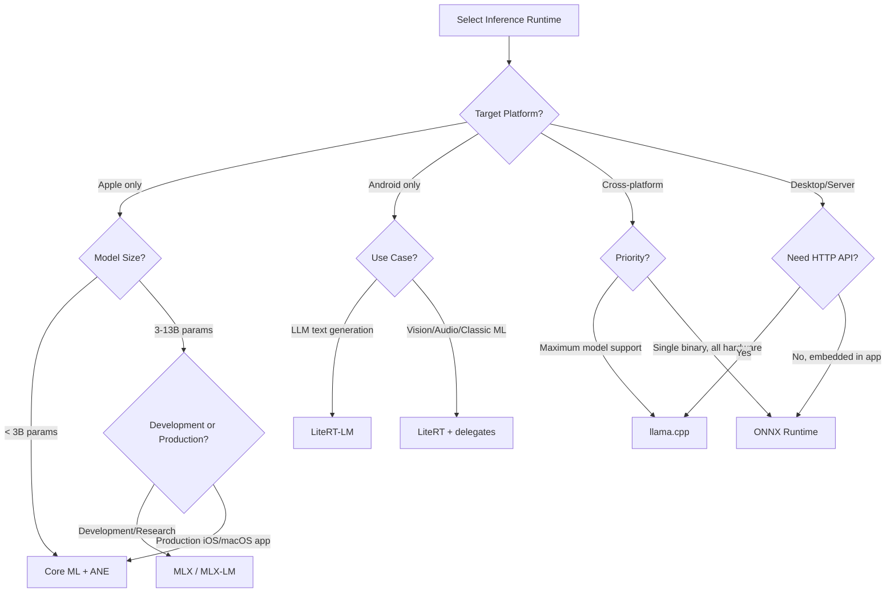

---

## 10. Monitoring and Evaluation on Edge

Inference on edge devices operates without the observability infrastructure available in cloud deployments. No Prometheus endpoints, no centralized logging, no infinite disk for traces. Monitoring must be lightweight, privacy-preserving, and resilient to connectivity gaps.

---

### 10.1 Latency Metrics

**Core metrics for LLM inference:**

| Metric | Definition | Target (Conversational) | Target (Batch/Background) | Measurement Method |
|--------|-----------|------------------------|--------------------------|-------------------|
| TTFT (Time to First Token) | Elapsed time from request submission to first output token emission | <500ms | <2s | `timestamp_first_token - timestamp_request` |
| ITL (Inter-Token Latency) | Elapsed time between consecutive output tokens | <50ms (>20 tok/s) | <200ms (>5 tok/s) | `mean(t[n+1] - t[n])` |
| TPS (Tokens Per Second) | Decode throughput (output tokens only) | >20 tok/s | >5 tok/s | `total_output_tokens / total_decode_time` |
| E2E Latency | Total elapsed time from request to final token | <5s (short responses) | Minutes acceptable | `timestamp_last_token - timestamp_request` |
| Prefill Latency | Time to process input prompt before first output | <TTFT | <TTFT | `timestamp_first_token - timestamp_prefill_start` |
| Prefill TPS | Input token processing rate during prefill | >500 tok/s | >100 tok/s | `input_tokens / prefill_time` |

TTFT is dominated by prefill computation. For a 512-token prompt on a phone GPU, prefill alone can take 200-400ms. The remaining TTFT budget covers tokenization, prompt formatting, and first decode step.

ITL variance matters more than mean ITL. A model with 40ms mean ITL but occasional 200ms spikes (due to garbage collection, thermal throttle, or OS interrupts) feels jittery to users. Track P50, P95, and P99 ITL.

**Measurement Implementation**

```python
import time


class InferenceMetrics:
    def __init__(self):
        self.itl_samples = []
        self.total_tokens = 0
        self.t_request = 0
        self.t_first = 0
        self.t_last_token = 0

    def on_request_start(self):
        self.t_request = time.monotonic_ns()

    def on_first_token(self):
        self.t_first = time.monotonic_ns()
        self.ttft_ms = (self.t_first - self.t_request) / 1e6

    def on_token(self, token_idx):
        now = time.monotonic_ns()
        if token_idx > 0:
            self.itl_samples.append((now - self.t_last_token) / 1e6)
        self.t_last_token = now
        self.total_tokens = token_idx + 1

    def on_complete(self):
        self.e2e_ms = (time.monotonic_ns() - self.t_request) / 1e6
        decode_time_s = (self.t_last_token - self.t_first) / 1e9
        self.tps = self.total_tokens / decode_time_s if decode_time_s > 0 else 0
        self.itl_p50 = percentile(self.itl_samples, 50)
        self.itl_p95 = percentile(self.itl_samples, 95)
        self.itl_p99 = percentile(self.itl_samples, 99)

    def to_dict(self):
        return {
            "ttft_ms": self.ttft_ms,
            "e2e_ms": self.e2e_ms,
            "tps": self.tps,
            "total_tokens": self.total_tokens,
            "itl_p50_ms": self.itl_p50,
            "itl_p95_ms": self.itl_p95,
            "itl_p99_ms": self.itl_p99,
        }


def percentile(data, p):
    if not data:
        return 0
    sorted_data = sorted(data)
    idx = int(len(sorted_data) * p / 100)
    return sorted_data[min(idx, len(sorted_data) - 1)]
```

**Measurement pitfalls:**
- `time.time()` has insufficient resolution on some platforms (Windows: ~15ms granularity). Use `time.monotonic_ns()` (Python), `System.nanoTime()` (Java/Kotlin), `mach_absolute_time()` (iOS/macOS).
- First inference after model load includes initialization overhead (shader compilation, delegate warmup). Exclude the first 1-3 inferences from benchmark statistics, or report them separately as "cold start" metrics.
- Tokenization time is included in TTFT but not in TPS. For applications where tokenization is slow (large vocabularies, complex pre-processing), track tokenization latency separately.

---

### 10.2 Memory Profiling

**Components of LLM memory consumption:**

| Component | Size Estimation | Lifetime | Controllable? |
|-----------|----------------|----------|---------------|
| Model weights | `params * bits_per_param / 8` (e.g., 2.3B * 4 / 8 = ~1.15GB for INT4) | Entire session | Quantization level |
| KV cache | `2 * n_layers * n_heads * head_dim * context_len * bytes_per_element` | Per conversation | Context window size |
| Activation memory | Peak during prefill, proportional to `batch_size * seq_len * hidden_dim` | Per inference call | Prefill chunk size |
| Runtime overhead | Framework buffers, thread stacks, allocator metadata | Entire session | Runtime selection |
| Application | UI, networking, other app components | Entire session | App architecture |

**KV cache sizing formula:**

```
kv_cache_bytes = 2 * n_layers * n_kv_heads * head_dim * max_context * dtype_size

# Gemma 4 E2B (2.3B params):
# 18 layers, 4 KV heads, 256 head_dim, FP16 (2 bytes)
# At 2048 context: 2 * 18 * 4 * 256 * 2048 * 2 = ~150MB
# At 512 context:  2 * 18 * 4 * 256 * 512 * 2  = ~38MB
```

Reducing context window from 2048 to 512 saves ~112MB. On a 4GB device where every MB matters, this is a significant optimization for use cases that do not require long context.

**Android Memory Monitoring**

```java
ActivityManager am = (ActivityManager) getSystemService(ACTIVITY_SERVICE);
ActivityManager.MemoryInfo memInfo = new ActivityManager.MemoryInfo();
am.getMemoryInfo(memInfo);

long availableMB = memInfo.availMem / (1024 * 1024);
long totalMB = memInfo.totalMem / (1024 * 1024);
boolean isLowMemory = memInfo.lowMemory;
long threshold = memInfo.threshold / (1024 * 1024);

// Per-process memory
Debug.MemoryInfo debugMem = new Debug.MemoryInfo();
Debug.getMemoryInfo(debugMem);
int appPssMB = debugMem.getTotalPss() / 1024;  // PSS includes proportional shared memory
int appRssMB = debugMem.getTotalRss() / 1024;  // RSS is total resident
```

**iOS Memory Monitoring**

```swift
import os

func getMemoryUsage() -> (resident: UInt64, physical: UInt64) {
    var info = mach_task_basic_info()
    var count = mach_msg_type_number_t(MemoryLayout<mach_task_basic_info>.size) / 4
    let result = withUnsafeMutablePointer(to: &info) {
        $0.withMemoryRebound(to: integer_t.self, capacity: Int(count)) {
            task_info(mach_task_self_, task_flavor_t(MACH_TASK_BASIC_INFO), $0, &count)
        }
    }
    guard result == KERN_SUCCESS else { return (0, 0) }
    return (info.resident_size, info.resident_size)
}

// Memory pressure notification
let source = DispatchSource.makeMemoryPressureSource(
    eventMask: [.warning, .critical],
    queue: .main
)
source.setEventHandler {
    let event = source.data
    if event.contains(.critical) {
        // Reduce context window, clear KV cache, or unload model
        releaseModelResources()
    }
}
source.resume()
```

**Failure Modes**

| Failure | Platform | Trigger | Recovery | Prevention |
|---------|----------|---------|----------|------------|
| OOM kill | Android | App exceeds per-process memory limit or device enters low memory state | None. Process terminated by LMK (Low Memory Killer). State lost. | Monitor `ActivityManager.MemoryInfo.lowMemory`. Reduce context window proactively. |
| OOM kill | iOS | App exceeds Jetsam memory limit (varies by device: ~1.4GB on iPhone 12, ~2.8GB on iPhone 15 Pro) | None. Process terminated by Jetsam. | Respond to `didReceiveMemoryWarning`. Use memory-mapped model loading. |
| Memory fragmentation | Both | Repeated model load/unload cycles fragment the heap | Restart process | Use mmap for model loading (OS manages page-level allocation). Avoid dynamic allocation during inference. |
| KV cache overflow | Both | Conversation exceeds allocated context window | Truncate or summarize conversation history, shift KV cache | Set hard context limit. Implement sliding window or summarization. |
| Swap thrashing | Desktop | Model exceeds physical RAM, OS pages to disk | Reduce model size or increase RAM | Profile RSS vs available RAM before loading model. |

---

### 10.3 Power and Thermal Tracking

Thermal throttling is the dominant constraint on sustained mobile inference. Peak throughput numbers are misleading; sustained throughput under thermal load determines real-world user experience.

**Thermal Benchmarks on Real Devices**

Data from empirical testing (reference: arXiv:2603.23640) of LLM inference across device categories:

| Device | Accelerator | Sustained tok/s | Peak tok/s | Power Draw | Thermal Behavior |
|--------|-------------|----------------|------------|------------|------------------|
| iPhone 16 Pro | ANE + GPU | ~15 tok/s (after throttle) | ~30 tok/s | ~8W peak | Aggressive throttling. Performance drops ~50% within 2 iterations of benchmark. ANE thermal budget shared with camera, display. |
| Samsung Galaxy S24 Ultra | Snapdragon 8 Gen 3 GPU | ~12 tok/s (floor) | ~25 tok/s | ~7W peak | Hard GPU frequency floor enforced by OS. OS terminates GPU inference if thermal ceiling exceeded. |
| Hailo-10H NPU | Dedicated NPU | 6.9 tok/s | 7.0 tok/s | <2W | Near-zero variance across hours. Dedicated thermal envelope. Gold standard for sustained workloads. |
| NVIDIA RTX 4050 (laptop) | CUDA GPU | 131.7 tok/s | 135 tok/s | 34.1W | Limited by laptop battery power ceiling. Fan noise increases. Consistent throughput on AC power. |
| Raspberry Pi 5 | CPU (Cortex-A76) | ~3 tok/s | ~4 tok/s | ~5W | Passive cooling insufficient for sustained load. External heatsink required. |
| Google Pixel 9 Pro | Tensor G4 + edge TPU | ~18 tok/s (sustained) | ~22 tok/s | ~6W | Moderate throttling. AICore manages thermal budget across apps. |

**Critical insight:** A device achieving 30 tok/s for 10 seconds but throttling to 15 tok/s after 60 seconds delivers worse user experience for sustained workloads (multi-turn conversations, document processing) than a device sustaining 20 tok/s indefinitely. Benchmark at the 5-minute mark, not the 5-second mark.

**Thermal Monitoring APIs**

Android:

```java
PowerManager pm = (PowerManager) getSystemService(POWER_SERVICE);

// Current thermal status (API 29+)
int thermalStatus = pm.getCurrentThermalStatus();
// Values: THERMAL_STATUS_NONE (0), THERMAL_STATUS_LIGHT (1),
//         THERMAL_STATUS_MODERATE (2), THERMAL_STATUS_SEVERE (3),
//         THERMAL_STATUS_CRITICAL (4), THERMAL_STATUS_EMERGENCY (5),
//         THERMAL_STATUS_SHUTDOWN (6)

// Register listener for status changes
pm.addThermalStatusListener(executor, status -> {
    switch (status) {
        case PowerManager.THERMAL_STATUS_MODERATE:
            reduceContextWindow(1024);
            break;
        case PowerManager.THERMAL_STATUS_SEVERE:
            reduceContextWindow(512);
            pauseBackgroundInference();
            break;
        case PowerManager.THERMAL_STATUS_CRITICAL:
            abortInference();
            unloadModel();
            break;
    }
});
```

iOS:

```swift
import Foundation

func monitorThermalState() {
    let state = ProcessInfo.processInfo.thermalState
    // .nominal, .fair, .serious, .critical

    NotificationCenter.default.addObserver(
        forName: ProcessInfo.thermalStateDidChangeNotification,
        object: nil,
        queue: .main
    ) { _ in
        let newState = ProcessInfo.processInfo.thermalState
        switch newState {
        case .serious:
            InferenceConfig.shared.maxContextLength = 1024
            InferenceConfig.shared.enablePrefillChunking = true
        case .critical:
            InferenceConfig.shared.maxContextLength = 256
            InferenceEngine.shared.pauseGeneration()
        default:
            break
        }
    }
}
```

**Adaptive inference strategy:**

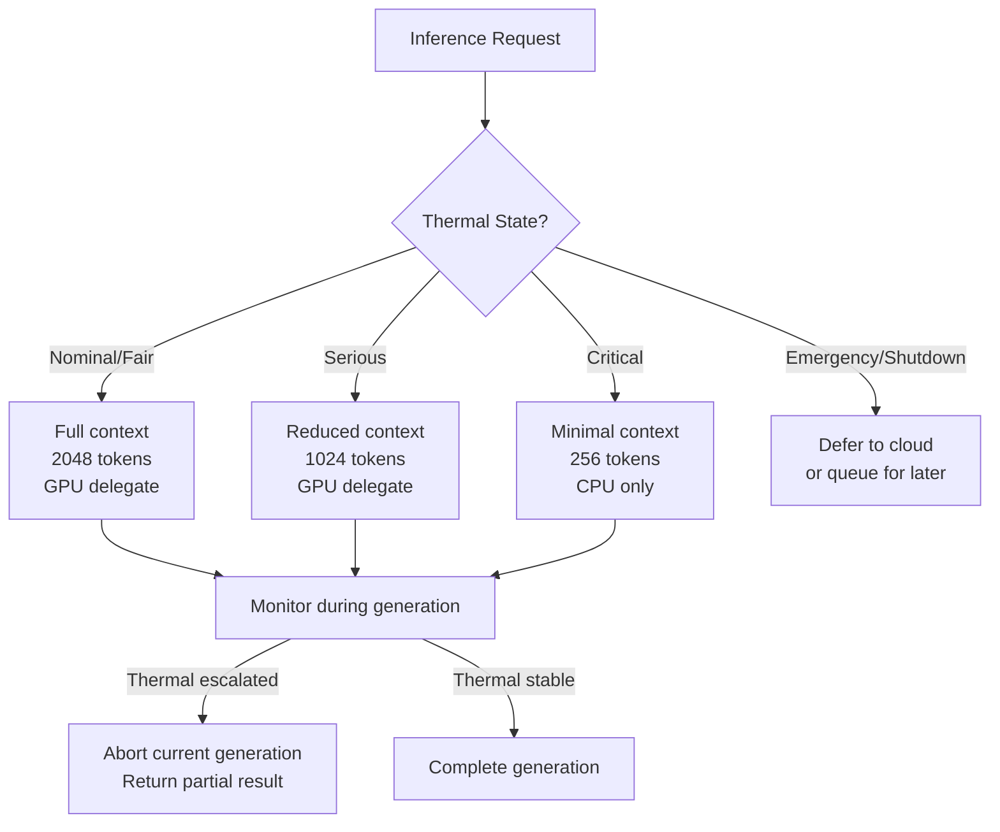

---

### 10.4 Accuracy Regression Detection

Quantization, runtime updates, OS updates, and delegate changes can all silently alter model accuracy. Unlike cloud deployments where A/B testing infrastructure catches regressions, edge deployments require proactive accuracy monitoring.

**Sources of accuracy regression:**

| Source | Mechanism | Detection Difficulty |
|--------|-----------|---------------------|
| Quantization | Weight precision reduction introduces rounding error | Easy (compare pre/post quantization) |
| Runtime update | New runtime version changes numerical behavior (kernel implementation, fusion patterns) | Medium (requires regression suite) |
| OS update | Driver changes alter GPU/NPU numerical precision | Hard (platform-specific, unpredictable timing) |
| Delegate change | Different delegate (e.g., NNAPI to QNN migration) produces different numerical results | Medium (test during migration) |
| Model update | LoRA weight update changes behavior | Easy (test before deployment) |
| Hardware variation | Different SoC revisions have different FP16 behavior | Hard (requires device-specific testing) |

**Evaluation strategy:**

1. **Golden evaluation set:** Maintain 100-500 examples from the production task domain. Not public benchmarks. Examples must represent actual usage patterns, edge cases, and known failure modes.

2. **Task-specific metrics:** Do not rely solely on perplexity. A model losing 0.5% on MMLU can lose 4% on domain-specific extraction because public benchmarks test breadth while production tasks test depth.

   | Task Type | Primary Metric | Secondary Metric | Regression Threshold |
   |-----------|---------------|-----------------|---------------------|
   | Classification | F1 (macro) | Precision, Recall | >2% drop |
   | Extraction | Exact match | Partial match F1 | >3% drop |
   | Summarization | ROUGE-L | BERTScore | >5% drop |
   | Translation | BLEU | chrF | >3% drop |
   | Open-ended generation | Human preference | Perplexity (proxy) | Case-by-case |

3. **Regression check implementation:**

```python
import json
import logging
from dataclasses import dataclass
from pathlib import Path

logger = logging.getLogger(__name__)


@dataclass
class EvalResult:
    example_id: str
    expected: str
    actual: str
    correct: bool
    score: float


def load_golden_set(path: str) -> list[dict]:
    with open(path) as f:
        return json.load(f)


def evaluate_model(model, golden_set: list[dict], task_evaluator) -> list[EvalResult]:
    results = []
    for example in golden_set:
        output = model.generate(
            prompt=example["prompt"],
            max_tokens=example.get("max_tokens", 256),
        )
        result = task_evaluator(
            expected=example["expected"],
            actual=output,
            example_id=example["id"],
        )
        results.append(result)
    return results


def regression_check(
    model,
    golden_set_path: str,
    task_evaluator,
    threshold: float = 0.95,
    previous_score: float = None,
) -> dict:
    golden_set = load_golden_set(golden_set_path)
    results = evaluate_model(model, golden_set, task_evaluator)

    accuracy = sum(r.correct for r in results) / len(results)
    mean_score = sum(r.score for r in results) / len(results)

    status = "pass"
    if accuracy < threshold:
        status = "fail_absolute"
        logger.warning(
            "Accuracy regression: %.3f < threshold %.3f", accuracy, threshold
        )
    elif previous_score and (previous_score - mean_score) > 0.02:
        status = "fail_relative"
        logger.warning(
            "Score regression: %.3f -> %.3f (delta: %.3f)",
            previous_score, mean_score, previous_score - mean_score,
        )

    return {
        "status": status,
        "accuracy": accuracy,
        "mean_score": mean_score,
        "total_examples": len(results),
        "failed_examples": [r.example_id for r in results if not r.correct],
    }
```

4. **Post-deployment drift monitoring:**

Embed a lightweight regression check in the application. Run on:
- App update (new binary may include new runtime version)
- OS update (delegate behavior may change)
- Model update (new weights deployed)
- Periodically (weekly) as a canary

```python
def on_app_start(model, config):
    if should_run_regression(config):
        result = regression_check(
            model,
            golden_set_path=config.golden_set_path,
            task_evaluator=config.evaluator,
            threshold=config.accuracy_threshold,
            previous_score=config.last_known_score,
        )
        if result["status"] != "pass":
            report_regression(result)
            if config.fallback_enabled:
                switch_to_cloud_inference()
        else:
            save_score(result["mean_score"])
```

---

## 11. Real-World Case Studies

Production edge AI deployments that demonstrate the principles, trade-offs, and failure modes discussed in previous sections.

---

### 11.1 Google Chrome On-Device AI

**System:** Gemini Nano and Gemma-family models running inside the Chrome browser for features including "Help me write," "Summarize this page," and the Prompt API for web developers.

**Architecture**

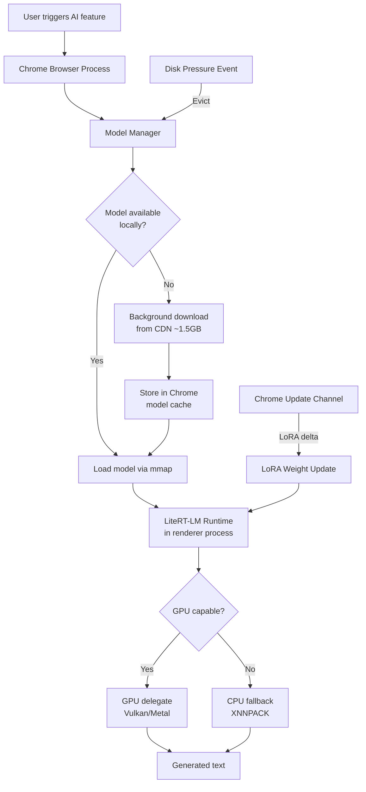

**Model lifecycle management:**

| Phase | Mechanism | Details |
|-------|-----------|---------|
| Discovery | Chrome probes GPU capabilities (VRAM, compute shader support, driver version) | Selects optimal model variant for hardware |
| Download | On-demand, background fetch when AI feature first triggered | ~1.5GB download, resumable, integrity-verified |
| Storage | Chrome-managed model cache on disk | Not accessible to web content or extensions |
| Loading | Memory-mapped (mmap) from disk | OS manages page-in/out. No full copy to RAM. |
| Update | LoRA weight deltas via Chrome update channel | Small delta (~50-100MB) avoids re-downloading full model |
| Eviction | Chrome deletes model under disk pressure | Re-downloads when feature next triggered |

**Technical details:**
- Model: Gemma-family, INT4 quantized, optimized for LiteRT-LM
- Context: limited to current page content, approximately 4K tokens
- Privacy: all inference runs locally, no page content sent to Google servers
- Acceleration: GPU delegate on supported hardware (Vulkan on Android/Linux/Windows, Metal on macOS), CPU fallback via XNNPACK

**Lessons learned:**
- Model lifecycle management (download, update, eviction, variant selection) constitutes more engineering effort than inference itself. The download and update system must handle interrupted downloads, version conflicts, disk pressure, and hardware changes.
- LoRA-based updates enable quality improvements without re-downloading the full model. A 50MB LoRA delta on a 1.5GB base model reduces update bandwidth by 97%.
- The variant system handles hardware heterogeneity without shipping multiple complete application binaries. Chrome detects GPU capabilities at runtime and selects the appropriate model variant.
- Memory-mapping the model file avoids a full copy into RAM and lets the OS evict pages under memory pressure, naturally integrating with OS memory management.

**Reference:** [Chrome built-in model management](https://developer.chrome.com/docs/ai/understand-built-in-model-management)

---

### 11.2 Google Pixel: AICore and Gemini Nano

**System:** System-level AI service on Pixel phones (Tensor G3/G4) providing shared model access to all applications via a privileged Android service.

**Architecture**

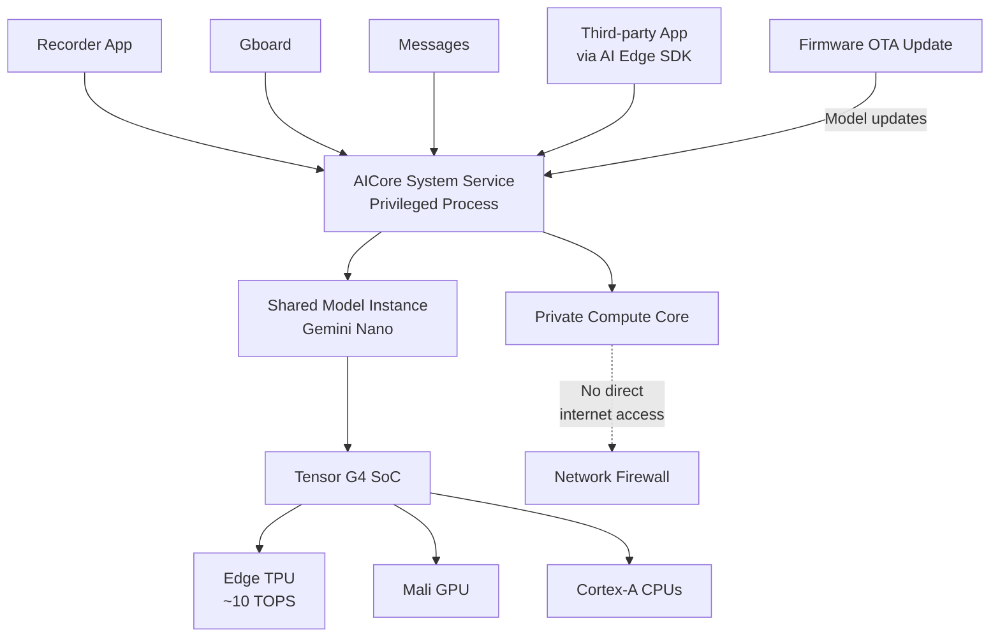

**System design:**
- AICore runs as a privileged Android system service, not an application-level process
- Single Gemini Nano model instance shared across all requesting applications. One copy in memory, not one per app.
- Applications request inference via AICore AIDL API. Applications never access model weights directly.
- Private Compute Core enforcement: AICore process has no direct internet access. Inference inputs and outputs cannot be exfiltrated by the runtime. Model updates arrive only via verified firmware OTA.
- Hardware dispatch: Tensor G4 edge TPU (~10 TOPS INT8) for primary inference, GPU and CPU as fallback/supplementary compute

**Production deployments:**

| Application | Task | Input | Context Window | Latency Requirement |
|-------------|------|-------|---------------|-------------------|
| Recorder | Transcription summarization | Audio transcript text | ~2K tokens | <5s after recording ends |
| Gboard | Smart reply suggestions | Conversation context | ~512 tokens | <300ms (inline with typing) |
| Messages | Suggested responses | Recent message thread | ~1K tokens | <1s |
| Call Screening | Real-time intent classification | Caller's speech transcript | ~256 tokens | <500ms (real-time) |
| Photos | Image description generation | Image embeddings + prompt | ~512 tokens | <3s |

**Memory architecture:**
- Single model in memory: ~1.5GB for INT4 Gemini Nano
- KV cache: per-app allocation managed by AICore. Apps get isolated cache contexts.
- Total system memory for AI: ~2-2.5GB, regardless of how many apps use AI features
- Without AICore (each app loading its own model): 1.5GB x N apps. On a 12GB device, this would limit concurrent AI apps to ~4-5 before OOM.

**Lessons learned:**
- System-level model hosting eliminates RAM duplication. This is the only viable architecture when multiple apps need LLM access on a memory-constrained device.
- Private Compute Core provides a hard privacy boundary that is verifiable by security auditors. This is stronger than application-level privacy promises.
- A single model serving multiple applications with different prompt templates demonstrates that a well-trained foundation model can handle diverse tasks via prompting alone, without per-task fine-tuning.
- Firmware-level model updates ensure all applications get quality improvements simultaneously without individual app updates.

**Reference:** [Android Gemini Nano](https://developer.android.com/ai/gemini-nano), [AI Edge SDK](https://developer.android.com/ai/gemini-nano/ai-edge-sdk)

---

### 11.3 Apple On-Device Llama 3.1 with Core ML

**System:** Apple's published research on running Llama 3.1 8B entirely on Apple Silicon via Core ML, demonstrating stateful KV cache management and compute unit optimization.

**Architecture**

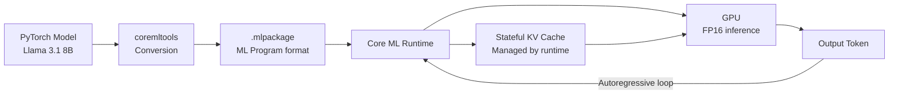

**Key architectural decisions:**

1. **GPU over Neural Engine for 8B models:** The 8B parameter model at FP16 consumes ~16GB. The GPU has higher memory bandwidth than the Neural Engine on Apple Silicon. For models above ~3B parameters, GPU targeting consistently outperforms ANE targeting. ANE is better suited for smaller models (1-3B) at INT8, where its energy efficiency advantage dominates.

2. **Stateful KV cache:** The KV cache is declared as model state in the Core ML model, not as explicit input/output tensors. The runtime:
   - Allocates KV cache buffers once at model load
   - Updates cache in-place during each decode step (no copy)
   - Handles buffer reuse and memory pressure automatically
   - Can evict cache under memory pressure and reconstruct via re-prefill

3. **Chunked prefill:** Long prompts are processed in chunks of 128-512 tokens rather than as a single sequence. This reduces peak activation memory during prefill and enables ANE execution for prefill on models that would otherwise exceed ANE tensor size limits.

**Performance (published by Apple):**

| Metric | M1 Max (GPU) | M4 Pro (GPU) | Notes |
|--------|-------------|-------------|-------|
| Decode speed (8B FP16) | ~33 tok/s | ~45 tok/s | Sustained, after warmup |
| Prefill speed (8B FP16) | ~250 tok/s | ~350 tok/s | Chunked, 256-token chunks |
| Peak memory (8B FP16) | ~17GB | ~17GB | Weights + KV cache + activations |
| Decode speed (8B INT8 ANE) | ~25 tok/s | ~30 tok/s | Lower throughput but lower power |

**Conversion considerations:**

| Concern | Details |
|---------|---------|
| Dynamic shapes | Core ML requires fixed or enumerated shapes. For LLMs, this means separate prefill (variable length) and decode (length 1) model variants, or using flexible shapes with performance trade-offs. |
| Custom ops | Rotary position embeddings (RoPE) require custom implementation or decomposition into supported ops. SwiGLU activation may need decomposition. |
| Attention mask | Causal attention masks must be constructed carefully to match Core ML's expected formats. |
| KV cache state | State tensor dimensions must be declared at conversion time. Maximum context length is fixed at conversion. |

**Lessons learned:**
- GPU targeting often outperforms Neural Engine for larger LLMs due to memory bandwidth requirements. The conventional wisdom of "use the NPU" does not apply to 8B+ models.
- Stateful prediction simplifies application code substantially. The KV cache management complexity moves from the application to the runtime, where it can be optimized with hardware-specific knowledge.
- Conversion from PyTorch requires significant attention to op support, dynamic shapes, and numerical precision. Budget 1-2 weeks for conversion and validation of a new model architecture.
- Chunked prefill is not just a memory optimization; it enables hardware targets (ANE) that would be unreachable with monolithic prefill.

**Reference:** [Apple ML Research: Core ML Llama](https://machinelearning.apple.com/research/core-ml-on-device-llama)

---

### 11.4 ASHA Healthcare Worker: Offline Gemma 4 E2B

**System:** Field healthcare application for ASHA (Accredited Social Health Activist) workers in rural India. Gemma 4 E2B deployed on Android devices for structured health data extraction during patient home visits in areas with no cellular connectivity.

**Architecture**

```mermaid
flowchart TD
    ASHA[ASHA Worker\nField Visit] --> App[React Native App\non Android device]
    App --> Voice[Voice Input\nLocal ASR]
    Voice --> Prompt[Structured Prompt\nHealth extraction schema]
    Prompt --> Gemma[Gemma 4 E2B\nINT4 via LiteRT-LM]
    Gemma --> JSON[Structured JSON Output\nPatient vitals, symptoms]
    JSON --> LocalDB[(SQLite\nLocal storage)]
    LocalDB -->|When connectivity\navailable| Sync[Background Sync\nto cloud backend]
    
    subgraph Device Memory Budget 4GB
        OS[Android OS\n~1.5GB]
        Model[Gemma 4 E2B INT4\n~1.2GB]
        RNApp[React Native App\n~300MB]
        KVCache[KV Cache\n~200MB]
        Headroom[Headroom\n~800MB]
    end
```

**Hardware and memory constraints:**

| Component | Allocation | Notes |
|-----------|-----------|-------|
| Android OS + system services | ~1.5GB | Includes SystemUI, launcher, background services |
| Gemma 4 E2B (INT4 quantized) | ~1.2GB on disk, ~1.2GB resident (mmap) | Pages loaded on-demand |
| React Native application | ~300MB | UI, local database, sync logic |
| KV cache (512 context) | ~200MB | Cleared between patient visits |
| Available headroom | ~800MB | Buffer for OS spikes, GC pressure |
| **Total** | **~3.4GB of 4GB** | **15-20% headroom** |

15-20% headroom is tight. Android's Low Memory Killer (LMK) begins terminating background processes at approximately 10% available memory. The application must avoid memory spikes that could push into LMK territory.

**Inference characteristics:**

| Parameter | Value | Rationale |
|-----------|-------|-----------|
| Model | Gemma 4 E2B (2.3B params) | Largest model fitting in 4GB RAM budget |
| Quantization | INT4 via LiteRT-LM | Required for 4GB devices |
| Context window | 512 tokens | Sufficient for structured field extraction. Saves ~112MB vs 2048-token context. |
| Accelerator | NPU (Snapdragon 8 Gen 2+), GPU fallback, CPU fallback | NPU preferred for power efficiency during field visits |
| KV cache lifecycle | Cleared between patient visits, persistent within a visit | Reduces sustained memory pressure |
| Typical prompt size | 150-250 tokens (system prompt + patient notes) | Structured extraction schema in system prompt |
| Typical output size | 50-100 tokens (JSON output) | Defined schema constrains output length |

**Thermal management:**
- Field visits last 8-10 minutes with intermittent inference (not continuous generation)
- Thermal profile: 3-5 inference calls per visit, each generating 50-100 tokens
- E2B model at INT4 stays within thermal budget on mid-range Android devices
- E4B (4.7B params) was evaluated and rejected: higher memory consumption and thermal output exceeded budget on 4GB devices during multi-visit sequences

**Privacy and compliance:**
- DPDPA 2023 (Digital Personal Data Protection Act) compliance: health data classified as sensitive personal data
- All inference runs on-device. No patient data transmitted during inference.
- Data sync occurs only when connectivity is available, over encrypted channel, to compliant cloud backend
- Model weights contain no patient data (pre-trained, not fine-tuned on patient data)

**Hybrid deployment strategy:**

| Phase | Architecture | Connectivity | Model | Trade-offs |
|-------|-------------|-------------|-------|------------|
| Phase 1 (MVP) | Cloud-only via Gemini API | Requires connectivity | Gemini Pro | Cannot function offline. Blocks field deployment. |
| Phase 2 | Hybrid: E2B local + Gemini cloud validation | Opportunistic | E2B local, Gemini cloud | Cloud validates local extraction when connected. Higher accuracy via consensus. |
| Phase 3 | Full offline: E2B only | None required | E2B local | Fully autonomous. Accuracy depends entirely on local model. |
| Phase 4 (planned) | Native audio: E4B conformer encoder | None required | E4B local | Eliminates separate ASR step. Requires 6GB+ device. |

**Lessons learned:**
- Memory budget on 4GB devices is a zero-sum game. Every MB allocated to the model is a MB unavailable for the application, KV cache, or OS headroom. The choice between 512 and 2048 context window is not a performance optimization; it is a feasibility requirement.
- Structured extraction (defined JSON schema output) tolerates quantization better than open-ended generation. The model needs to produce field names and values from a constrained vocabulary, which is more robust to quantization noise than free-form text.
- KV cache management strategy (clear between visits, persist within visit) is application-specific and cannot be determined by the runtime alone. The application must control cache lifecycle based on domain semantics.
- Hybrid deployment (Phase 2) provides a practical accuracy safety net: cloud validation catches local model errors when connectivity is available, while local-only mode ensures functionality in disconnected environments.

---

### 11.5 Hailo-10H: Sustained Low-Power Edge Inference

**System:** Dedicated NPU module for continuous, always-on inference workloads where thermal stability and power predictability are primary requirements.

**Architecture**

```mermaid
flowchart LR
    Host[Host System\nRaspberry Pi / Embedded Linux] -->|PCIe / M.2| Hailo[Hailo-10H NPU\n40 TOPS INT8]
    Hailo --> SRAM[On-chip SRAM\nWeight storage]
    Hailo --> Fabric[Dataflow Compute Fabric\nStreaming activations]
    
    subgraph Hailo10H [Hailo-10H Internal Architecture]
        SRAM --> Fabric
        Fabric --> Output[Output Tensors]
    end
    
    Host -->|Input data| Hailo
    Output --> Host
    Host --> App[Application Logic\nPost-processing, I/O]
```

**Hardware characteristics:**

| Specification | Value |
|--------------|-------|
| Compute | 40 TOPS INT8 |
| Power envelope | <2W typical |
| Interface | PCIe Gen 3.0 x1, M.2 Key B+M |
| On-chip SRAM | Sufficient for layer-level weight caching |
| Host CPU offload | Minimal: host handles I/O only |
| Thermal | Passive cooling sufficient at <2W |
| Form factor | M.2 2242 |

**Dataflow architecture:** Unlike GPU execution (which loads weights and activations into shared memory and executes kernels), the Hailo architecture streams activations through a fixed compute fabric with weights pre-loaded into on-chip SRAM. This streaming approach eliminates the memory bandwidth bottleneck that limits GPU inference and enables consistent throughput regardless of inference duration.

**Benchmark performance:**

| Workload | Throughput | Variance | Power | Duration Tested |
|----------|-----------|----------|-------|----------------|
| LLM inference (Llama-class, INT8) | 6.9 tok/s | <1% variance | <2W | 4+ hours continuous |
| Object detection (YOLOv8n) | ~30 FPS | <2% variance | ~1.5W | 8+ hours continuous |
| Image classification (ResNet-50) | ~200 FPS | <1% variance | ~1.5W | 8+ hours continuous |

Comparison with mobile phone NPUs:

| Property | Phone NPU (Snapdragon 8 Gen 3) | Hailo-10H |
|----------|-------------------------------|-----------|
| Peak INT8 TOPS | 45 TOPS | 40 TOPS |
| Peak tok/s (LLM) | ~25-30 | ~7 |
| Sustained tok/s (after 5 min) | ~12-15 | ~6.9 |
| Sustained tok/s (after 60 min) | ~10-12 | ~6.9 |
| Power during inference | 5-8W (shared with SoC) | <2W (dedicated) |
| Thermal management | Shared with CPU, GPU, modem | Independent thermal domain |
| Throughput variance (1 hour) | 30-50% | <1% |

**Use cases:**

| Application | Why Hailo-10H | Why Not Phone/GPU |
|-------------|---------------|-------------------|
| Always-on smart home assistant | Continuous inference for hours/days | Phone throttles after minutes |
| Industrial sensor monitoring | Predictable latency SLA required | GPU latency varies with thermal state |
| Edge gateway (pre-process before cloud) | Low power budget at edge | GPU power draw exceeds edge power budget |
| Surveillance / security camera | 24/7 inference at fixed frame rate | Mobile devices not designed for continuous use |
| Retail analytics | Real-time customer flow analysis | Server GPU cost prohibitive per-location |

**Lessons learned:**
- Sustained performance matters more than peak performance for continuous workloads. A 60% lower peak throughput with zero variance over hours is strictly superior to high peak throughput with thermal degradation for always-on applications.
- Dedicated AI accelerators with controlled thermal envelopes provide predictable SLAs that are impossible to guarantee on shared-silicon architectures (phone SoCs, laptop GPUs).
- The trade-off is explicit: lower peak throughput in exchange for zero variance. Applications must be designed for the sustained throughput, not the peak.
- Host CPU requirements are minimal. A Raspberry Pi 5 can drive a Hailo-10H for production workloads, keeping total system cost under $100 USD.

---

## 12. End-to-End Pipeline

A complete pipeline from model selection through production monitoring. Each step includes decision criteria, tooling, validation gates, and failure recovery paths.

---

### 12.1 Pipeline Overview

```mermaid
flowchart TD
    Train["1. Train / Fine-tune\nCloud GPU cluster"] --> Adapt["2. LoRA Adaptation\nTask-specific fine-tuning"]
    Adapt --> Merge["3. Merge Adapters\nInto base weights"]
    Merge --> Quantize["4. Quantize\nGPTQ / AWQ / GGML to INT4"]
    Quantize --> Export["5. Export\nPyTorch to target format"]
    Export --> Compile["6. Compile\nTarget-specific optimization"]
    Compile --> Benchmark["7. Benchmark\nOn physical target device"]
    Benchmark -->|Pass| Deploy["8. Deploy\nPackage and distribute"]
    Benchmark -->|"Fail: accuracy"| Quantize
    Benchmark -->|"Fail: latency"| Compile
    Deploy --> Optimize["9. Runtime Optimize\nKV cache, context, thermal"]
    Optimize --> Monitor["10. Monitor\nLatency, accuracy, power"]
    Monitor -->|Regression detected| Adapt
```

Each step has a defined input, output, validation criteria, and failure recovery path. The pipeline is not strictly linear: failures at benchmarking feed back to quantization or compilation, and production regressions feed back to adaptation.

---

### 12.2 Step-by-Step Walkthrough

**Step 1: Train or Select Base Model**

| Device Class | RAM Budget | Parameter Budget | Recommended Base Models |
|-------------|-----------|-----------------|------------------------|
| Low-end phone (4GB) | ~1.2GB for model | 1-2.5B | Gemma 4 E2B, Llama 3.2 1B, Phi-3.5 Mini |
| Mid-range phone (8GB) | ~3GB for model | 3-4B | Gemma 4 E4B, Llama 3.2 3B, Phi-3 Small |
| Flagship phone (12-16GB) | ~6GB for model | 7-8B | Llama 3.1 8B, Mistral 7B, Gemma 2 9B |
| Desktop/laptop (16-32GB) | ~12-24GB for model | 8-13B | Llama 3.1 8B/13B, Mistral 7B |
| Apple Silicon Mac (32-64GB) | ~24-48GB for model | 13-70B | Llama 3.1 70B (4-bit), Mixtral 8x7B |

Train from scratch only if no suitable pre-trained model exists (extremely rare for most applications). Prefer fine-tuning an existing model. The cost difference is orders of magnitude: pre-training a 7B model costs $100K-$1M in compute; LoRA fine-tuning costs $10-$100.

**Step 2: LoRA Adaptation**

```bash
# Using torchtune for QLoRA fine-tuning on a single GPU
tune run lora_finetune_single_device \
    --config llama3_2/1B_qlora_single_device \
    model.lora_rank=16 \
    model.lora_alpha=32 \
    dataset=custom_extraction_dataset \
    epochs=3 \
    batch_size=4 \
    lr=2e-4
```

**LoRA hyperparameter selection:**

| Parameter | Guidance | Impact |
|-----------|---------|--------|
| Rank (r) | 8-16 for simple tasks (classification, extraction). 32-64 for complex reasoning or style transfer. | Higher rank = more parameters = more capacity but higher overfitting risk |
| Alpha | Typically 2x rank (alpha=32 for rank=16) | Controls effective learning rate of LoRA weights |
| Target modules | q_proj, v_proj (minimum). Add k_proj, o_proj, gate_proj, up_proj, down_proj for more capacity. | More modules = more adaptable but slower training and larger adapter |
| Learning rate | 1e-4 to 5e-4 for LoRA. 2e-4 is a reliable starting point. | Standard fine-tuning LR guidance applies |
| Training data | 1,000-10,000 examples for domain adaptation. 100-500 for format adaptation. | More data generally helps but with diminishing returns past ~10K |
| QLoRA base precision | NF4 (4-bit NormalFloat) | Trains on single 24GB GPU for 7B models. 16-bit adapter weights on 4-bit frozen base. |

**Validation gate:** After fine-tuning, evaluate on a held-out validation set. If task-specific accuracy (F1, exact match) does not improve over the base model by at least 2%, the fine-tuning data or hyperparameters need revision.

**Step 3: Merge Adapters**

```python
from peft import PeftModel
from transformers import AutoModelForCausalLM, AutoTokenizer

base_model = AutoModelForCausalLM.from_pretrained(
    "base_model_path",
    torch_dtype=torch.float16,
    device_map="cpu",
)
tokenizer = AutoTokenizer.from_pretrained("base_model_path")

lora_model = PeftModel.from_pretrained(base_model, "adapter_checkpoint_path")
merged_model = lora_model.merge_and_unload()

merged_model.save_pretrained("merged_model_output")
tokenizer.save_pretrained("merged_model_output")
```

Merging eliminates runtime adapter overhead. The merged model is mathematically equivalent to base + adapter but executes as a single set of weights with no adapter application step during inference. This is required for edge deployment where the runtime may not support adapter application.

**Validation gate:** Run 10 test prompts through both the adapter model (base + LoRA) and the merged model. Outputs must be identical (bit-for-bit in FP16). Any difference indicates a merge error.

**Step 4: Quantize**

| Target Runtime | Quantization Method | Command / API |
|---------------|-------------------|---------------|
| llama.cpp (GGUF) | llama.cpp quantize | `./llama-quantize merged_model.gguf output_Q4_K_M.gguf Q4_K_M` |
| ONNX Runtime | Optimum / ORT quantizer | `optimum-cli export onnx --model merged_model --optimize O3 --quantize` |
| LiteRT / LiteRT-LM | AI Edge converter | `ai_edge_litert.convert(model, quantization='int4')` |
| Core ML | coremltools | `ct.models.neural_network.quantization_utils.quantize_weights(model, nbits=4)` |
| MLX | mlx_lm.convert | `mlx_lm.convert --hf-path merged_model -q --q-bits 4` |

**Calibration data requirements:**
- Use 100-500 representative examples from the production task domain
- NOT random data, NOT benchmark data (MMLU, HellaSwag)
- Include edge cases and difficult examples from your domain
- Calibration data distribution should match production input distribution

**Calibration quality directly determines quantized model accuracy.** Poor calibration data is the most common cause of unexpected accuracy degradation after quantization. A model calibrated on Wikipedia text and deployed for medical extraction will have systematically incorrect quantization scales for medical vocabulary embeddings and domain-specific attention patterns.

```python
def create_calibration_dataset(production_prompts, tokenizer, n_samples=200):
    """Create calibration dataset from production prompt distribution."""
    calibration = []
    for prompt in production_prompts[:n_samples]:
        tokens = tokenizer(
            prompt,
            return_tensors="pt",
            max_length=512,
            truncation=True,
            padding="max_length",
        )
        calibration.append(tokens)
    return calibration
```

**Validation gate:** Compare quantized model accuracy against FP16 baseline on the golden evaluation set. Acceptable degradation thresholds:

| Quantization | Acceptable Accuracy Drop | Action if Exceeded |
|-------------|------------------------|-------------------|
| INT8 | <1% | Check calibration data quality |
| INT4 (GPTQ/AWQ) | <3% | Try different calibration method, increase calibration samples |
| INT4 (GGUF Q4_K_M) | <3% | Try Q5_K_M or IQ4_XS |
| INT4 (RTN / naive) | <5% | Switch to GPTQ/AWQ |
| INT3 or lower | <10% | Likely unacceptable. Use larger quant or smaller model. |

**Step 5: Export to Target Format**

| Source | Target | Tool | Command |
|--------|--------|------|---------|
| HF/PyTorch | GGUF | convert_hf_to_gguf.py | `python convert_hf_to_gguf.py merged_model --outtype f16 --outfile model.gguf` |
| HF/PyTorch | ONNX | Optimum CLI | `optimum-cli export onnx --model merged_model onnx_output/` |
| HF/PyTorch | Core ML | coremltools | `ct.convert(traced_model, inputs=[ct.TensorType(shape=input_shape)])` |
| HF/PyTorch | LiteRT-LM | AI Edge tools | Follow Google AI Edge conversion pipeline |
| HF/PyTorch | MLX | mlx_lm.convert | `mlx_lm.convert --hf-path merged_model` |

**Export validation:**

```python
def validate_export(original_model, exported_model, test_prompts, tokenizer):
    """Verify exported model produces equivalent outputs."""
    for prompt in test_prompts[:10]:
        inputs = tokenizer(prompt, return_tensors="pt")

        with torch.no_grad():
            original_logits = original_model(**inputs).logits
        exported_logits = exported_model.run(inputs)

        max_diff = (original_logits - exported_logits).abs().max().item()

        if max_diff > 0.01:  # FP16 tolerance
            raise ValueError(
                f"Export divergence: max logit diff = {max_diff:.6f} "
                f"for prompt: {prompt[:50]}..."
            )
```

Expected numerical differences:
- FP16 export: max logit difference <0.01 (rounding only)
- INT8 export: max logit difference <0.1
- INT4 export: max logit difference <0.5 (significant but outputs should agree on top-1 token for most positions)

**Step 6: Compile for Target**

| Runtime | Compilation Step | Time | Output |
|---------|-----------------|------|--------|
| ONNX Runtime | Graph optimization (Level 2) | Seconds | Optimized .onnx with fused ops |
| TensorRT | Engine building | Minutes to hours | Hardware-specific .engine file |
| Core ML | Xcode compilation | Seconds at build | Compiled .mlmodelc in app bundle |
| TVM | MetaSchedule auto-tuning | Hours | Target-specific shared library |
| llama.cpp | None (runtime optimization) | N/A | GGUF used directly |
| LiteRT-LM | Delegate compilation at first load | Seconds | Cached delegate state |

```bash
# ONNX Runtime graph optimization
python -m onnxruntime.transformers.optimizer \
    --model_type gpt2 \
    --model_path model.onnx \
    --output optimized.onnx \
    --opt_level 2 \
    --use_gpu

# TensorRT engine building
trtexec \
    --onnx=model.onnx \
    --saveEngine=model.engine \
    --fp16 \
    --int8 \
    --calib=calibration_cache.bin \
    --workspace=4096 \
    --minShapes=input_ids:1x1 \
    --optShapes=input_ids:1x512 \
    --maxShapes=input_ids:1x2048
```

TensorRT engine building is the most expensive compilation step. The engine is optimized for the specific GPU architecture (e.g., RTX 4050) and is not portable to other GPU architectures. Budget 10-60 minutes for LLM-sized models. The resulting engine provides the fastest inference on NVIDIA hardware.

**Step 7: Benchmark on Physical Device**

Run benchmarks on the ACTUAL target device. Emulators and simulators do not accurately model thermal throttling, memory pressure, or hardware-specific delegate behavior.

```python
def full_benchmark(model, test_prompts, device, duration_minutes=5):
    """Comprehensive benchmark including thermal behavior."""
    results = []
    start_time = time.monotonic()

    while (time.monotonic() - start_time) < (duration_minutes * 60):
        for prompt in test_prompts:
            metrics = InferenceMetrics()
            metrics.on_request_start()

            for token_idx, token in enumerate(model.generate_stream(prompt)):
                if token_idx == 0:
                    metrics.on_first_token()
                metrics.on_token(token_idx)

            metrics.on_complete()
            results.append({
                "elapsed_since_start": time.monotonic() - start_time,
                "ttft_ms": metrics.ttft_ms,
                "tps": metrics.tps,
                "itl_p50_ms": metrics.itl_p50,
                "itl_p99_ms": metrics.itl_p99,
                "thermal_state": device.get_thermal_state(),
                "available_ram_mb": device.get_available_ram_mb(),
            })

    return analyze_benchmark(results)


def analyze_benchmark(results):
    """Separate early (warm) and late (thermally stressed) performance."""
    early = [r for r in results if r["elapsed_since_start"] < 30]
    late = [r for r in results if r["elapsed_since_start"] > 240]

    return {
        "peak_tps": max(r["tps"] for r in results),
        "sustained_tps": mean([r["tps"] for r in late]) if late else None,
        "tps_degradation": 1 - (mean([r["tps"] for r in late]) / mean([r["tps"] for r in early])) if late and early else None,
        "ttft_p50_ms": percentile([r["ttft_ms"] for r in results], 50),
        "ttft_p99_ms": percentile([r["ttft_ms"] for r in results], 99),
        "max_thermal_state": max(r["thermal_state"] for r in results),
        "min_available_ram_mb": min(r["available_ram_mb"] for r in results),
    }
```

**Pass/fail criteria:**

| Metric | Pass (Conversational) | Pass (Batch) | Fail Action |
|--------|----------------------|-------------|-------------|
| TTFT P50 | <500ms | <2000ms | Reduce model size, optimize prefill, try different delegate |
| Sustained TPS (5 min) | >15 tok/s | >5 tok/s | Try smaller model, different quantization, different accelerator |
| TPS degradation (peak to sustained) | <30% | <50% | Reduce context window, implement thermal adaptation |
| Peak RAM | <75% of device RAM | <85% of device RAM | Reduce context window, lower quantization bits, smaller model |
| Task accuracy (F1) | >0.90 | >0.85 | Use less aggressive quantization, more LoRA training data |
| Thermal state after 5 min | Not SEVERE or worse | Any below CRITICAL | Reduce inference rate, implement thermal scheduling |

**Failure recovery paths:**

```mermaid
flowchart TD
    BenchFail[Benchmark Failed] --> FailType{Failure Type?}
    FailType -->|Accuracy below threshold| AccFix[Accuracy Recovery]
    AccFix --> LessQuant[Try less aggressive quantization\nQ4_K_M -> Q5_K_M]
    LessQuant --> Recalib[Recalibrate with better data]
    Recalib --> MoreLoRA[More LoRA training data]
    MoreLoRA --> SmallerModel[Accept: use smaller model\nwith higher precision]
    
    FailType -->|Latency too high| LatFix[Latency Recovery]
    LatFix --> DiffDelegate[Try different delegate\nCPU -> GPU -> NPU]
    DiffDelegate --> ReduceCtx[Reduce context window]
    ReduceCtx --> MoreQuant[More aggressive quantization\nQ5_K -> Q4_K]
    MoreQuant --> SmallerModelLat[Use smaller model]
    
    FailType -->|OOM / RAM exceeded| MemFix[Memory Recovery]
    MemFix --> ReduceCtxMem[Reduce context window]
    ReduceCtxMem --> QuantKV[Quantize KV cache\nFP16 -> Q8_0]
    QuantKV --> LowerQuant[Lower weight quantization]
    LowerQuant --> SmallerModelMem[Use smaller model]
    
    FailType -->|Thermal throttling| ThermFix[Thermal Recovery]
    ThermFix --> AdaptSched[Implement adaptive scheduling]
    AdaptSched --> ReduceRate[Reduce inference rate]
    ReduceRate --> CPUOnly[Switch to CPU-only\nlower power]
    CPUOnly --> SmallerModelTherm[Use smaller model]
```

**Step 8: Deploy**

**Packaging strategy:**

| Approach | Model Delivery | APK/IPA Size Impact | Update Strategy | Best For |
|----------|---------------|--------------------|-----------------| ---------|
| Bundled in app | Included in binary | +1-4GB | App update required for model update | Small models (<100MB), guaranteed availability |
| First-run download | CDN download on first launch | Minimal | Independent model updates | Large models (>100MB) |
| System-provided | OS/system service hosts model | None | OS/firmware update | System-level features (AICore) |
| On-demand | Download when feature triggered | None | Independent model updates | Optional features |

For models >100MB, first-run download is strongly recommended:

```python
import hashlib
from pathlib import Path


def download_model(model_url: str, local_path: str, expected_sha256: str):
    """Download model with integrity verification and resume support."""
    local = Path(local_path)

    if local.exists():
        if verify_integrity(local, expected_sha256):
            return local
        local.unlink()

    temp_path = local.with_suffix(".downloading")
    resume_byte = temp_path.stat().st_size if temp_path.exists() else 0

    headers = {"Range": f"bytes={resume_byte}-"} if resume_byte > 0 else {}
    response = requests.get(model_url, headers=headers, stream=True)

    mode = "ab" if resume_byte > 0 else "wb"
    with open(temp_path, mode) as f:
        for chunk in response.iter_content(chunk_size=8192):
            f.write(chunk)

    if not verify_integrity(temp_path, expected_sha256):
        temp_path.unlink()
        raise IntegrityError("SHA256 mismatch after download")

    temp_path.rename(local)
    return local


def verify_integrity(path: Path, expected_sha256: str) -> bool:
    sha256 = hashlib.sha256()
    with open(path, "rb") as f:
        for chunk in iter(lambda: f.read(8192), b""):
            sha256.update(chunk)
    return sha256.hexdigest() == expected_sha256
```

**Model versioning:** Embed a version identifier (content hash or semantic version) in the model metadata. The application loads the model version at startup and reports it with telemetry. This enables correlating accuracy regressions with specific model versions.

**A/B testing on edge:**

```python
def select_model_variant(user_id: str, experiment_config: dict) -> str:
    """Deterministic variant selection based on user ID hash."""
    bucket = int(hashlib.sha256(user_id.encode()).hexdigest(), 16) % 100

    for variant in experiment_config["variants"]:
        if bucket < variant["traffic_percentage_cumulative"]:
            return variant["model_path"]

    return experiment_config["default_model_path"]
```

**Step 9: Runtime Optimization**

Post-deployment tuning based on real-world telemetry data:

| Optimization | Trigger | Action | Expected Impact |
|-------------|---------|--------|-----------------|
| Context window reduction | P95 prompt length < configured max | Reduce max_context to P99 of actual prompt lengths + 20% buffer | 10-50% KV cache memory savings |
| KV cache quantization | Memory pressure events in telemetry | Switch KV cache from FP16 to Q8_0 | ~50% KV cache memory reduction, <1% accuracy impact |
| Prefill chunking | TTFT > target on long prompts | Chunk prefill into 128-256 token segments | Reduces peak activation memory, enables ANE on iOS |
| Thermal scheduling | Frequent SEVERE thermal states | Implement adaptive context reduction, defer non-urgent inference | Prevents thermal shutdowns, improves sustained throughput |
| Delegate selection | Specific devices showing poor GPU performance | Add device-specific delegate override (e.g., CPU-only for specific SoC revisions) | Eliminates performance cliffs on problematic hardware |

**Step 10: Monitor in Production**

```mermaid
flowchart LR
    App[On-Device App] -->|Metrics per session| LocalStore[Local Metrics Store\nSQLite]
    LocalStore -->|Batch upload\nwhen WiFi available| Backend[Analytics Backend]
    Backend --> Aggregate[Aggregation Pipeline\nBy device model, OS version,\nmodel version]
    Aggregate --> Dashboard[Monitoring Dashboard]
    Dashboard --> AlertAccuracy[Accuracy Regression Alert\nF1 drop > 2% for cohort]
    Dashboard --> AlertLatency[Latency Regression Alert\nTTFT P95 increase > 50%]
    Dashboard --> AlertOOM[OOM/Crash Alert\nCrash rate > 0.1%]
    AlertAccuracy -->|Trigger| Retrain[Retraining Pipeline]
    AlertLatency -->|Trigger| DeviceInvestigation[Device-specific\nInvestigation]
    AlertOOM -->|Trigger| MemoryTuning[Memory Budget\nAdjustment]
```

**Metrics to collect (privacy-safe, no prompt content):**

| Metric Category | Specific Metrics | Privacy | Aggregation |
|----------------|-----------------|---------|-------------|
| Latency | TTFT, ITL P50/P95/P99, TPS, E2E latency | Safe (timing only) | By device model, OS version |
| Memory | Peak RSS, available RAM at inference start, KV cache size | Safe (system metrics) | By device RAM class |
| Thermal | Thermal state transitions during inference, throttle events | Safe (system metrics) | By device model |
| Quality | Task completion rate (user accepted/rejected output) | Safe (binary signal, no content) | By model version |
| Reliability | Crash rate, OOM kills, delegate fallbacks | Safe (error codes) | By device model, OS version |
| System | Model version, runtime version, device model, OS version, delegate used | Safe (configuration) | Primary grouping dimensions |

**What NOT to collect:**
- Prompt content (privacy violation)
- Generated text (privacy violation)
- User identifiers linked to prompt content
- Audio/image inputs
- Location data (unless explicitly consented for the application)

**Regression detection pipeline:**

```python
def detect_regression(
    current_metrics: dict,
    baseline_metrics: dict,
    thresholds: dict,
) -> list[dict]:
    """Compare current cohort metrics against baseline."""
    alerts = []

    for metric_name, threshold in thresholds.items():
        current_val = current_metrics.get(metric_name)
        baseline_val = baseline_metrics.get(metric_name)

        if current_val is None or baseline_val is None:
            continue

        if threshold["direction"] == "lower_is_better":
            regression = (current_val - baseline_val) / baseline_val
        else:
            regression = (baseline_val - current_val) / baseline_val

        if regression > threshold["max_regression"]:
            alerts.append({
                "metric": metric_name,
                "baseline": baseline_val,
                "current": current_val,
                "regression_pct": regression * 100,
                "severity": "critical" if regression > threshold["critical"] else "warning",
            })

    return alerts


REGRESSION_THRESHOLDS = {
    "ttft_p95_ms": {"direction": "lower_is_better", "max_regression": 0.50, "critical": 1.0},
    "tps_mean": {"direction": "higher_is_better", "max_regression": 0.20, "critical": 0.40},
    "task_completion_rate": {"direction": "higher_is_better", "max_regression": 0.02, "critical": 0.05},
    "crash_rate": {"direction": "lower_is_better", "max_regression": 0.5, "critical": 2.0},
    "oom_rate": {"direction": "lower_is_better", "max_regression": 0.5, "critical": 2.0},
}
```

**Cohort analysis:** Group metrics by (device_model, os_version, model_version). A regression that appears only on Samsung Galaxy S24 with Android 15 and model v2.3 points to a specific interaction between the OS update and the model version, likely a delegate behavior change. Without cohort segmentation, this regression would be averaged away in global metrics.

---

### 12.3 Pipeline Automation Checklist

| Step | Automated? | Tool | Human Review Required |
|------|-----------|------|----------------------|
| 1. Model selection | Semi-auto | Hardware profiling scripts | Yes (architecture decision) |
| 2. LoRA fine-tuning | Automated | torchtune, Hugging Face TRL | Yes (hyperparameter review) |
| 3. Adapter merge | Automated | PEFT merge_and_unload | No (deterministic) |
| 4. Quantization | Automated | llama.cpp, Optimum, coremltools | No (if calibration data is pre-prepared) |
| 5. Export | Automated | Format-specific converters | No (if validation passes) |
| 6. Compilation | Automated | ORT optimizer, TensorRT, Xcode | No |
| 7. Benchmarking | Automated | On-device benchmark harness | Yes (pass/fail decision) |
| 8. Deployment | Automated | CI/CD pipeline, CDN upload | Yes (release approval) |
| 9. Runtime optimization | Semi-auto | Telemetry-driven config updates | Yes (threshold decisions) |
| 10. Monitoring | Automated | Analytics pipeline, alerting | Yes (alert triage) |

Steps 2-6 can be fully automated into a CI pipeline triggered by a commit to the fine-tuning data repository. Step 7 requires physical device infrastructure (device farms). Steps 9-10 form a continuous feedback loop that runs for the lifetime of the deployment.
